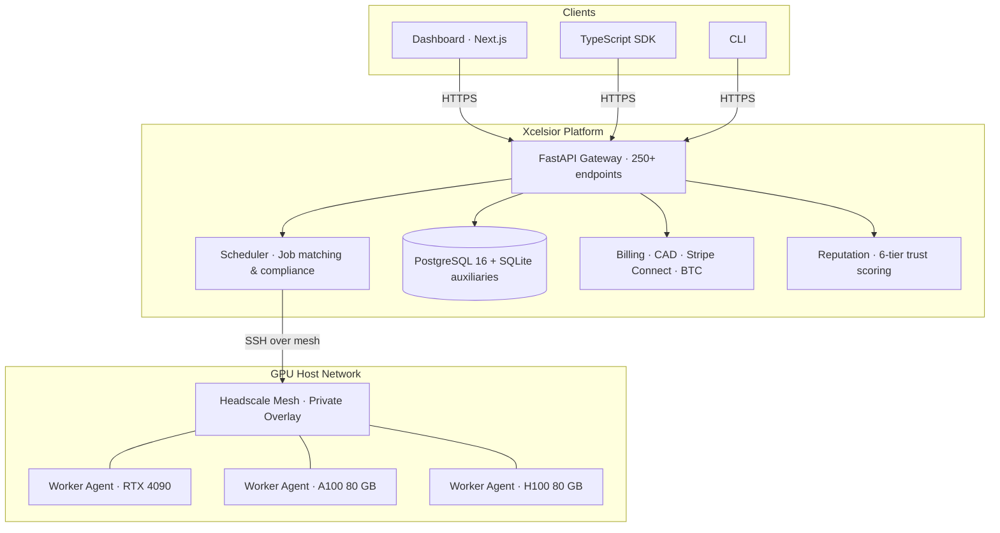
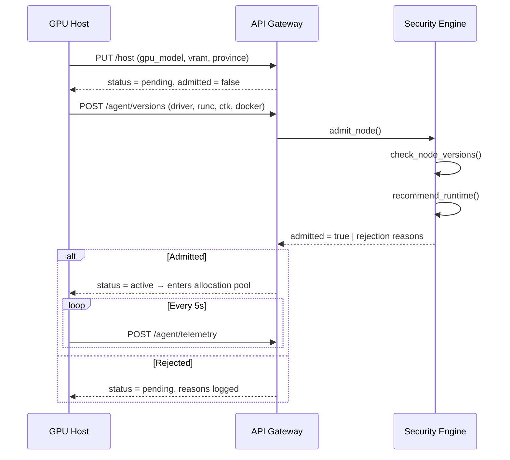

<div align="center">

# 🍁 Xcelsior

### Sovereign GPU Compute for Canada

**Route AI workloads to admission-gated GPU hosts over a private mesh —
with PIPEDA compliance, 4-layer container security, and CAD-native billing.**

[](https://github.com/aabiro/xcelsior/actions/workflows/ci.yml)
[](https://github.com/aabiro/xcelsior/actions/workflows/frontend.yml)
[](https://opensource.org/licenses/MIT)
[](https://www.python.org/downloads/)
[](https://docs.xcelsior.ca)
[](https://docs.xcelsior.ca)

[Website](https://xcelsior.ca) · [API Docs](https://docs.xcelsior.ca) · [Blog](https://xcelsior.ca/blog) · [Pricing](https://xcelsior.ca/pricing)

</div>

---

## Architecture



---

## Features

| | |
|---|---|
| **Data Sovereignty** | All compute stays in Canada. PIPEDA + Quebec Law 25 enforced at the scheduler level. |
| **4-Layer Security** | Version gating → least-privilege Docker → egress firewall → gVisor / Kata sandbox. |
| **CAD-Native Billing** | 13-province GST/HST, Stripe Connect payouts, AI Compute Fund (CAF) rebate export. |
| **Reputation Engine** | Multi-factor scoring with 7-day grace decay. Bronze → Silver → Gold → Platinum → Diamond → Sovereign tiers. |
| **Private Mesh** | Headscale overlay network — GPU workers never exposed to the public internet. |
| **Admission Gating** | Hosts must pass version checks + GPU fingerprinting before receiving any work. |

---

## Quick Start

```bash
git clone https://github.com/aabiro/xcelsior.git && cd xcelsior
python3.12 -m venv venv && source venv/bin/activate
pip install -r requirements.txt && cp .env.example .env

# API
uvicorn api:app --reload --port 8000

# Worker (separate terminal)
XCELSIOR_HOST_ID=my-gpu XCELSIOR_SCHEDULER_URL=http://localhost:8000 python worker_agent.py

# Submit a job
python cli.py run my-model 8.0
```

> **Dashboard** → `http://localhost:8000/dashboard`
> **Health** → `http://localhost:8000/healthz`
> **Worker Auth** → hosted/prod workers can use either `XCELSIOR_API_TOKEN` or `XCELSIOR_OAUTH_CLIENT_ID` + `XCELSIOR_OAUTH_CLIENT_SECRET`. If both are set, the worker prefers OAuth.

---

## Host Admission Flow



**Minimum versions** — runc ≥ 1.1.14 · nvidia-ctk ≥ 1.17.8 · Docker ≥ 24.0 · Driver ≥ 535

---

## Project Structure

```
api.py            FastAPI gateway (250+ endpoints, SSE, dashboard)
scheduler.py      Job queue, host allocation, spot pricing, preemption
worker_agent.py   Pull-based GPU agent, telemetry, Docker execution
security.py       4-layer defense: version gating → gVisor/Kata
billing.py        CAD pricing, 13-province tax, escrow, CAF export
events.py         Append-only event store, tamper-evident hashing
reputation.py     Multi-factor scoring, Bronze→Sovereign tiers
privacy.py        PIPEDA / Quebec Law 25, data retention, consent
verification.py   GPU fingerprint verification, re-verification scheduling
jurisdiction.py   Trust tiers, residency tracing, CLOUD Act analysis
artifacts.py      Two-tier B2/R2 storage, residency-aware routing
db.py             PostgreSQL ↔ SQLite dual-write, LISTEN/NOTIFY
cli.py            Full CLI for jobs, hosts, billing, marketplace
ai_assistant.py   Hexara AI assistant with tool-calling & onboarding wizards
routes/           Modular API route handlers (agent, instances, admin, etc.)
frontend/         Next.js 15 dashboard + marketing site (xcelsior.ca)
wizard/           Interactive host‑setup wizard (TypeScript)
fern/             API documentation (docs.xcelsior.ca)
scripts/          Deployment, install, and bootstrap scripts
tests/            1400+ backend tests (pytest) + 17 frontend tests (vitest)
```

---

## Deployment

### Docker Compose (production)

```bash
docker compose up --build -d    # API + Frontend + Scheduler
curl https://xcelsior.ca/healthz
```

### Systemd (alternative)

```bash
sudo cp xcelsior-*.service /etc/systemd/system/
sudo systemctl daemon-reload && sudo systemctl enable --now xcelsior-api xcelsior-health
```

See `.env.example` for all 50+ configuration variables.

---

## Testing

```bash
# Backend (1400+ tests)
python -m pytest tests/ -v              # full suite
python -m pytest tests/ -v --cov=.      # with coverage

# Frontend (17 tests)
cd frontend && npm test                 # vitest

# Linting
ruff check . && black --check *.py routes/*.py tests/
```

CI runs automatically on push to `main` and on PRs — see [CI](.github/workflows/ci.yml) and [Frontend CI](.github/workflows/frontend.yml).

---

## Contributing

1. Fork the repo
2. Create a feature branch (`git checkout -b feat/my-feature`)
3. Run the test suite — all tests must pass
4. Submit a PR with a clear description

See [docs.xcelsior.ca](https://docs.xcelsior.ca) for full API reference and integration guides.

---

<div align="center">

**MIT License** · [LICENSE](LICENSE)

Built with 🍁 in Canada — **Ever upward.**

[xcelsior.ca](https://xcelsior.ca)

</div>
