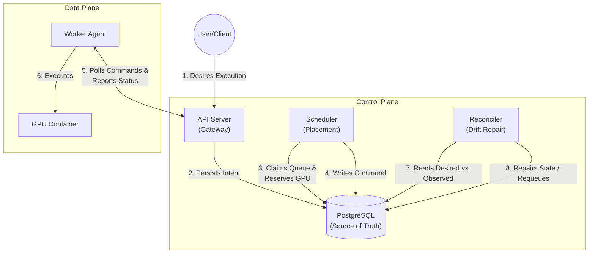
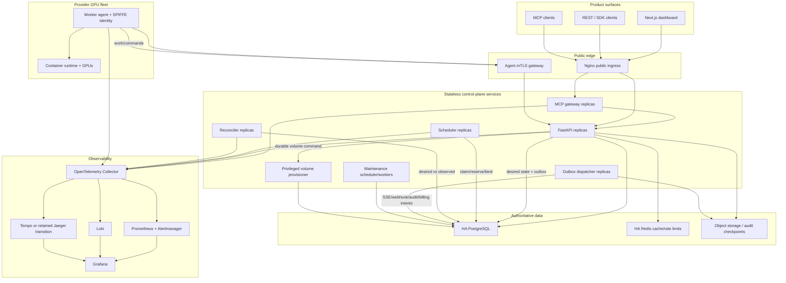

# Xcelsior Control Plane

This directory contains the production control-plane components. For full architectural details, see the [Control Plane Blueprint](../docs/xcelsior-production-control-plane-mcp-blueprint.md).

## Core Control Loop

This high-level diagram illustrates the primary operational loop of the control plane, highlighting how intent becomes execution through the database as the sole source of truth.

## Target Architecture

The full system topology, including observability, ingress, and background services.

