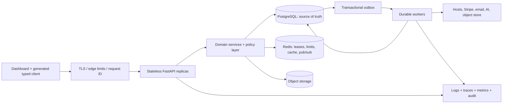

# Dashboard Backend Production Completion Plan

**Status:** execution-ready plan

**Baseline:** `main` at `fbb8203`

**Audit date:** 2026-07-13

**Scope:** the API, persistence, workers, integrations, and operational controls needed by every dashboard surface

## Branch disposition and planning assumptions

The feature branch `preserve/asus-xcelsior-platform-20260706` was assessed before this plan was written. It is intentionally **not merged** into `main`: the branch has unresolved worktree changes and its focused serverless frontend suite currently reports 6 failures and 5 passes. Its focused backend serverless route/service tests pass (55 tests), and Ruff plus `git diff --check` are clean, but that is not sufficient evidence that the branch is finished. The branch and its uncommitted work must remain intact until those frontend failures, generated/stale artifacts, and the final migration set are reconciled.

This plan is based on a clean `main` worktree. It treats the serverless branch as a future, separately qualified input—not as part of the current baseline.

“Works perfectly” is not a testable software guarantee. For this plan it means: every defined requirement has an executable acceptance test; every production-critical failure mode has a prevention, detection, and recovery control; all release gates are green; and the residual risk is explicit and accepted.

## 1. Production definition of done

The dashboard backend is complete only when all of the following are true:

1. Every dashboard read, mutation, stream, and background operation is backed by a documented, versioned API contract with validated request and response schemas.
2. Every resource is scoped to a typed user and workspace context, with automated cross-tenant and role tests proving that object-, property-, and function-level authorization cannot be bypassed.
3. PostgreSQL is the single source of truth for control-plane state. Schema changes occur only through reviewed, reversible Alembic migrations. JSON files, SQLite databases, import-time DDL, and silent schema repair are absent from production paths.
4. Money and usage accounting use exact arithmetic and an auditable ledger. Provider webhooks, job execution, provisioning, and all chargeable mutations are idempotent and reconcilable.
5. Long-running and retryable work runs in durable workers with leases, bounded retries, dead-letter handling, cancellation, and observable state transitions—not in request-process threads.
6. The API can run safely with multiple workers and multiple replicas. Rate limits, events, locks, and job state are distributed; process-local fallbacks cannot silently weaken critical controls.
7. The whole product is observable through correlated logs, traces, metrics, audit events, and actionable SLO alerts. Health checks prove dependency readiness without leaking sensitive data.
8. The release pipeline blocks contract drift, migration drift, test failures, unsafe images, critical vulnerabilities, and performance regressions. There are no `continue-on-error` quality gates.
9. A clean environment can be created, migrated, seeded, exercised end to end, backed up, restored, upgraded, and rolled back using documented automation.
10. Production rollout has succeeded through canary and soak stages without an SLO breach, reconciliation discrepancy, security finding, or unrecoverable migration issue.

### Proposed service-level objectives

These are initial release targets. Phase 0 must measure the current baseline and revise targets only through an explicit architecture decision record (ADR).

| Signal | Initial target | Measurement and release rule |
|---|---:|---|
| Core authenticated API availability | 99.9% over 30 days | Valid non-5xx responses, excluding documented client errors |
| Core read latency | p95 < 300 ms, p99 < 1 s | Server latency, excluding streaming and provider-dependent calls |
| Core mutation latency | p95 < 750 ms | Acceptance/queuing latency; long work is asynchronous |
| Job admission latency | p95 < 500 ms | Time to durable job record and acknowledgment |
| Control-plane job completion | Per-operation SLO | Provision, stop, delete, upload, inference, and payout get separate budgets |
| Error rate | < 0.5% unexpected 5xx | Per route family and workspace cohort |
| Security | 0 known critical/high exploitable findings | SAST, dependency, image, DAST, authorization, and manual review gates |
| Ledger integrity | 0 unexplained discrepancies | Daily internal/provider reconciliation |
| Data recovery | RPO <= 5 min; RTO <= 30 min | Quarterly automated restore exercise, not a paper assertion |
| Deploy safety | 100% reversible before destructive migration cleanup | Automated smoke, canary, and rollback evidence |

## 2. Evidence from the current `main` baseline

This is a large, capable backend, not a blank implementation. It already includes authentication, health endpoints, OpenTelemetry hooks, a PostgreSQL pool, background-task plumbing, extensive route coverage, webhook inbox behavior, and hundreds of tests. The completion work should harden and converge the existing system rather than rewrite it wholesale.

| Finding | Evidence on `main` | Production consequence |
|---|---:|---|
| Dashboard surface | 42 dashboard route/page files | A contract inventory must cover a broad product, not one API |
| API surface | 439 FastAPI route declarations across 35 modules | Static “route mentioned in a test” checks are insufficient |
| Route implementation size | ~25,330 lines | Split by domain/service boundaries before adding more behavior |
| Response contracts | 0 routes declare `response_model` | Responses are not runtime-validated or safely filtered by FastAPI |
| Request contracts | 124 route-local `BaseModel` classes | Request typing exists but is fragmented and not a complete API model |
| Frontend client | `frontend/src/lib/api.ts` is ~3,474 lines with 235 `apiFetch` call sites | Hand-maintained types and one monolithic client encourage drift |
| Broad exception handling | 634 `except Exception` occurrences; 159 `pass` blocks | Failures can be hidden, misclassified, or turned into plausible empty data |
| Runtime schema mutation | 54 DDL occurrences outside migrations in 5 files | Replica races, fork hazards, privilege inflation, and unverifiable schema state |
| Fresh PostgreSQL bootstrap | `alembic upgrade head` fails at `041 -> 042`: `sessions.session_type` is referenced but never created by migrations | `main` cannot currently initialize a clean production database |
| Alembic drift detection | `target_metadata = None` | `alembic check` cannot currently prove that models and migrations agree |
| Route concurrency | 35 async handlers out of 439 | Sync work mostly relies on the thread pool; boundaries and capacity are implicit |
| Money representation | CAD and usage values use `float`/`DOUBLE PRECISION` in important paths | Rounding and reconciliation risk in billing and balances |
| Test inventory | 182 backend test files; conditional skips are common | Test count is high, but production-dependency evidence and enforced coverage are weak |
| CI enforcement | frontend lint continues on error; coverage commands tolerate failure | A green workflow can coexist with known quality failures |
| Deployment privilege | API containers use root, host networking, `SYS_ADMIN`, host mounts, and SSH material | A web API compromise has an unnecessarily large blast radius |
| Multi-process state | rate limiting, SSE subscribers, and some caches are process-local | Behavior changes with worker/replica count and can fail open |
| API duplication | serverless/OpenAI-compatible paths overlap legacy inference routes | Ambiguous ownership, behavior drift, and difficult deprecation |
| Documentation drift | the priority roadmap and “untested endpoints” inventory do not match current routes | Planning and release evidence can be falsely reassuring |

### Known dashboard/backend contract defects to resolve

- Artifact expiry selected in the dashboard is not represented in the upload request.
- Artifact list and expiry paths catch broad errors and can return success-shaped empty data, masking an outage.
- Artifact ownership and quotas are not consistently expressed in active-workspace terms.
- Artifact download authorization uses a write-oriented scope instead of an explicit read policy.
- The artifact path lacks one explicit upload lifecycle: create slot, upload, complete, verify checksum/size/type, scan, publish, expire, and delete.
- The dashboard advertises a 10 GB artifact limit while environment defaults and code paths disagree.
- Settings code suppresses some MFA/session-loading failures and renders “not available” instead of distinguishing unsupported from unavailable.
- Several dashboard features bypass the central client with direct `fetch` calls, including events, compliance, preferences, pricing, analytics, HPC, and reputation paths.
- Process-local event history cannot provide durable resume/replay across workers or deploys.
- Several admin aggregates return partial values without a machine-readable completeness or freshness contract.

### P0 baseline blocker: repair the migration chain

An isolated clean-PostgreSQL rehearsal performed during this audit successfully applied migrations 001 through 041, then failed in migration 042 while creating `idx_sessions_email_type`. The `sessions` table created by migration 004 has no `session_type` or `last_active` columns; those and other session columns are currently added by `db.py` runtime DDL. This explains why an already-running environment can appear healthy while a clean install is broken.

Before feature work:

- Inventory every column, constraint, enum, and index supplied only by runtime `_ensure_*` code, not just the first failing session column.
- Choose and document a safe repair for both histories: already-deployed databases that skipped the missing migration operations, and fresh databases that must traverse migration 042. Do not assume editing migration 004 alone repairs existing installations.
- Rehearse the repair against an empty database, a schema captured at migrations 041/042/051, and a sanitized production-shaped schema. Compare schema and row checksums.
- Add a required CI job that creates a new PostgreSQL database, runs `alembic upgrade head`, verifies the revision/schema, starts the API with a DDL-forbidden runtime role, and executes a smoke request.
- Keep the runtime DDL temporarily only as a compatibility observation path; make it report drift without mutating, then delete it after all supported environments are repaired.

## 3. Target architecture

Use a **modular control-plane monolith** for this completion cycle. The immediate risk is inconsistent contracts and distributed state, not insufficient service count. Preserve simple deployment while enforcing domain boundaries inside the application. Extract a service only when independent scaling, isolation, ownership, or failure-containment evidence requires it.

### Required boundaries

- **Transport layer:** routing, authentication dependency, request validation, response serialization, conditional requests, pagination, and protocol adaptation only.
- **Policy layer:** typed `Principal`, `WorkspaceContext`, role/capability checks, resource ownership, field-level visibility, and audit intent.
- **Domain services:** business invariants, state machines, transaction boundaries, idempotency, and emitted domain events.
- **Repositories:** explicit SQL, row mapping, locking strategy, pagination, and query performance. Repositories return domain records, not HTTP responses.
- **Workers/adapters:** provider calls with deadlines, retry classification, circuit breaking, and idempotency keys. Providers never define internal state truth.
- **Read models:** precomputed or cached views for dashboard aggregates, each carrying `as_of`, completeness, and source freshness.

### State ownership

- PostgreSQL owns users, teams/workspaces, authorization relationships, resource desired/observed states, jobs, reservations, usage, ledger entries, webhook inbox, outbox, notifications, and audit records.
- Redis owns ephemeral distributed coordination only: token buckets, short leases, cache entries, stream fan-out, and deduplication windows. Critical truth must survive Redis loss.
- Object storage owns blobs; PostgreSQL owns blob metadata, lifecycle, access policy, checksum, scan state, and retention.
- External providers own their execution state; internal provider-reference records and reconciliation make that state observable and recoverable.

## 4. Non-negotiable implementation rules

1. No route is complete without explicit request and response models, documented error variants, authorization policy, idempotency behavior, pagination/limits where applicable, and automated contract tests.
2. No production code runs DDL. Application startup verifies the expected migration revision and fails readiness on mismatch.
3. No import opens a database pool, creates tables, starts a thread, or contacts a provider. Resources use application lifespan hooks and close cleanly.
4. No chargeable or destructive mutation is retry-unsafe. Accept an idempotency key, persist its request fingerprint and terminal response, and reject conflicting reuse.
5. No financial value uses binary floating point. Use integer minor units for currencies and `Decimal`/`NUMERIC` for metered quantities with an explicit rounding rule.
6. No broad exception is silently converted to an empty collection or generic success. Map known failures to stable error codes; log unexpected failures with a trace ID and return a safe problem response.
7. No unbounded list or export. Use stable cursor pagination, deterministic ordering, bounded page size, filter validation, and a supporting database index.
8. No `SELECT *` crosses a transport boundary. Select explicit columns and serialize through response models to prevent accidental data exposure.
9. No critical security control silently falls back to process memory. Authentication, mutation, payment, and expensive-compute limits fail closed or shed load with an explicit `503` and alert.
10. All timestamps are timezone-aware UTC values at persistence/API boundaries; tests use an injectable clock.
11. Every network call has connect/read/total deadlines, bounded retries with jitter for retryable operations, and metrics by provider/result.
12. Logs are structured, secrets and PII are filtered, and the same correlation ID appears in the API response, job, provider call, webhook, trace, and audit record.

## 5. Execution plan

Each phase ends in a deployable increment. Prefer small pull requests with one invariant, its migration, its tests, and its telemetry together. Do not create a long-lived “backend rewrite” branch.

### Phase 0 — Establish the executable baseline

**Goal:** replace stale inventories and implicit requirements with generated evidence.

Tasks:

- Land the P0 migration-chain repair and clean-database CI gate described above. No backend completion claim is valid while a clean database cannot reach head.
- Generate a route manifest from `app.routes` containing method, normalized path, operation ID, auth dependency, request model, response model, status codes, owner domain, and test IDs.
- Generate a dashboard-use manifest by statically finding central-client calls and direct `fetch`/WebSocket/EventSource usage. Join it to the route manifest and fail CI on an unknown or orphaned contract.
- Capture a reproducible baseline: full backend tests on PostgreSQL, frontend unit/integration tests, Playwright smoke tests, OpenAPI generation, migration from empty database, container build, and a 15-minute representative load run.
- Classify skips as `required`, `optional-integration`, or `platform-specific`. Required dependency skips fail CI.
- Delete or replace the stale `UNTESTED_ENDPOINTS.md` heuristic with generated route-to-test evidence.
- Write ADRs for: modular-monolith boundaries; database access/metadata approach; durable job mechanism; tenancy model; API versioning; error format; idempotency; Connect charge model; and storage lifecycle.
- Assign one accountable owner and one reviewer to each domain. Record dependencies and acceptance evidence in a tracking board.
- Freeze additions to legacy inference, runtime DDL, JSON/SQLite state, process-local critical controls, and new untyped frontend calls.

Exit gate:

- One command reproduces the baseline from a clean checkout.
- Every dashboard operation is marked `implemented`, `partial`, `stubbed`, `duplicated`, or `missing`, with a linked test and owner.
- Proposed SLOs, RPO/RTO, and critical user journeys are approved.

### Phase 1 — Make the API contract authoritative

**Goal:** one validated contract drives backend serialization, documentation, and frontend types.

Tasks:

- Introduce domain-organized schema modules and add `response_model` plus explicit status codes to every dashboard route. Use separate input, internal, summary, and detail types; never reuse persistence rows as public schemas.
- Adopt RFC 9457 `application/problem+json` with stable internal codes, safe detail, `trace_id`, validation errors, and optional retry metadata. Preserve backward compatibility through a transition adapter where necessary.
- Standardize collection responses: `items`, opaque `next_cursor`, `has_more`, and optional exact/estimated totals. Define maximum sizes and stable sort tie-breakers.
- Define optimistic-concurrency semantics (`version` or ETag/`If-Match`) for settings and mutable resources where lost updates matter.
- Give operation IDs stable domain names; tag deprecated endpoints and publish removal dates plus compatibility telemetry.
- Generate the TypeScript client and types from the committed OpenAPI artifact. Split it by domain and place UI convenience wrappers above, not inside, the generated layer.
- Replace direct dashboard `fetch` calls with the generated client or a reviewed streaming adapter. Centralize credentials, CSRF, request ID, retries, timeout, and problem parsing.
- Add OpenAPI semantic-diff CI: breaking removals/type changes fail; additions require review; generated artifacts must have no diff after regeneration.
- Add Schemathesis/property tests against the in-process app and a deployed test environment, including malformed input, unknown fields, bounds, and response conformance.

Exit gate:

- 100% of dashboard routes have validated response models and stable operation IDs.
- 100% of dashboard network calls resolve to the contract inventory.
- No response contains an undocumented field; all documented success and failure shapes are exercised.

### Phase 2 — Converge persistence and migration safety

**Goal:** PostgreSQL and reviewed migrations are the only production data contract.

Tasks:

- Establish canonical SQLAlchemy metadata (declarative or Core) for Alembic comparison. Keep handwritten SQL where it is valuable, but ensure every table, index, constraint, enum, and foreign key has metadata coverage.
- Move all `_ensure_*`, route-import table creation, and `CREATE/ALTER` statements into numbered Alembic migrations. Remove application schema-repair privileges.
- Make startup compare the current revision with the required head. Liveness remains process-only; readiness fails with a precise migration dependency reason.
- Add CI for migration from empty DB, upgrade from the oldest supported release, downgrade of reversible revisions, `alembic check`, and schema snapshot comparison.
- Use expand/migrate/contract changes: add nullable/new structures, deploy dual-compatible code, backfill in resumable batches, enforce constraints, then remove old structures in a later release.
- Replace production JSON and SQLite state with PostgreSQL. Provide checksumed, rerunnable import commands, row counts, reconciliation reports, and a rollback/archive path.
- Migrate currency to integer minor units and metered quantities/rates to `NUMERIC` with explicit scales. Backfill by deterministic rounding; compare every account before cutover.
- Create an append-only double-entry ledger for credits, charges, holds, refunds, payouts, provider fees, and adjustments. Enforce balanced transactions and unique external references.
- Normalize timestamps to `TIMESTAMPTZ`; define retention and partitioning for high-volume usage, events, logs, and audit data.
- Audit every query used by dashboard lists and aggregates with representative cardinality. Add composite/partial indexes based on `EXPLAIN (ANALYZE, BUFFERS)` and prohibit unindexed full scans on hot paths.
- Open Psycopg pools explicitly during lifespan, validate connections, expose pool statistics, cap waiters, and close before process termination. Remove fork-sensitive import state and reconsider Gunicorn preload only after this is proven safe.

Exit gate:

- A least-privileged runtime role cannot execute DDL.
- Empty, upgrade, rollback-compatible, and production-size backfill rehearsals are green.
- Financial migration reconciliation has zero unexplained variance.
- Pool exhaustion and database failover tests return bounded, observable failures and recover automatically.

### Phase 3 — Prove authentication, tenancy, and security

**Goal:** make cross-tenant or privilege escalation structurally difficult and exhaustively tested.

Tasks:

- Replace ad hoc user/team extraction with typed dependencies that resolve `Principal`, `Session`, `WorkspaceContext`, capabilities, and authentication strength once per request.
- Define a policy matrix for personal users, workspace owners, admins, members, viewers, providers/hosts, support operators, service accounts, and unauthenticated callers across every resource/action.
- Apply policy in services and constrain repository queries by workspace/resource identity. Consider PostgreSQL row-level security as defense in depth after explicit policy tests exist; do not use RLS to hide unclear application ownership.
- Build a generated authorization matrix test for every route and object reference: own workspace, another workspace, nonexistent object, guessed UUID, soft-deleted object, stale membership, downgraded role, and forbidden field update.
- Use allow-listed update schemas to prevent mass assignment and property-level privilege changes.
- Consolidate scopes into named capabilities and verify least privilege for cookies, bearer/API keys, worker callbacks, WebSockets, SSE, admin operations, and internal endpoints.
- Harden OAuth to the current security BCP: exact redirect matching, PKCE, state/nonce, restricted tokens, replay resistance, secure storage, key rotation, and negative tests.
- Replace process-local critical limits with an atomic Redis token-bucket/GCRA implementation. Define route/identity/workspace/IP/provider budgets and explicit fail-open/fail-closed behavior. Avoid non-atomic read-then-write pipelines.
- Add outbound URL validation and egress controls for SSRF-sensitive integrations. Resolve and revalidate DNS/IP ranges, deny metadata/private destinations unless explicitly needed, and cap redirects/response sizes.
- Run secrets detection, dependency and image scanning, SAST, DAST, TLS/header/CORS/CSRF tests, and an external penetration review before general availability.
- Separate privileged host/NFS/SSH operations from the public API. Run the API as a non-root user with a read-only filesystem, dropped capabilities, no host network, no host SSH private key, and explicit egress. Put unavoidable privileged operations in a narrow agent with mutually authenticated commands and an allow list.

Exit gate:

- The full policy matrix passes with zero cross-tenant reads, mutations, event subscriptions, or timing-based existence leaks.
- No public API container has root, `SYS_ADMIN`, host networking, or mounted host credentials.
- No critical/high exploitable finding remains; medium findings have owner, deadline, and compensating control.

### Phase 4 — Complete each dashboard domain

Domain work begins after the shared contract, persistence, and policy patterns are proven. Each slice must ship vertical behavior—route, service, repository, job, UI integration, telemetry, and tests—rather than more route-only code.

#### 4A. Overview, hosts, providers, and telemetry

- Define a dashboard snapshot/read-model endpoint with a single `as_of` time, source freshness, partial-data flags, and links to underlying details.
- Specify host/provider desired and observed state machines, heartbeat expiry, capacity reservations, drain/maintenance behavior, and conflict semantics.
- Make enrollment/bootstrap credentials one-time, short-lived, scoped, auditable, and rotatable. Never return durable host secrets after creation.
- Store time-series telemetry in the chosen metrics backend; keep only aggregation metadata/control state in PostgreSQL. Bound query ranges and downsample older data.
- Ensure offline/stale agents cannot accept work and that scheduler decisions are idempotent under duplicate heartbeats.

Acceptance scenarios: first host enrollment; duplicate enrollment; heartbeat loss; clock skew; agent version mismatch; drain with running work; provider isolation; capacity oversubscription race; partial telemetry outage; and workspace-crossing host IDs.

#### 4B. Instances, templates, scheduler, terminal, and HPC

- Define explicit instance and scheduler-job state machines with allowed transitions, desired/observed state, version, reason code, and immutable transition history.
- Place admission, reservation, ledger hold, provider command, and state event in one durable workflow. Release reservations/holds exactly once on every failure/cancel path.
- Use a unique command/idempotency identifier for provision/start/stop/delete/retry; reconcile ambiguous provider timeouts instead of blindly replaying destructive calls.
- Make templates immutable and versioned; validate images, runtime, resources, network/storage attachments, environment size, and secret references before scheduling.
- Issue short-lived, single-use terminal/WebSocket tickets bound to user, workspace, instance, origin, and protocol. Audit connect/disconnect without logging terminal content or secrets.
- Add queue position and honest progress semantics. Cancellation is durable and race-tested against start/completion.

Acceptance scenarios: concurrent capacity claim; duplicate create; provider timeout before/after execution; delete during provisioning; cancel/start race; host death; reschedule; terminal replay; unauthorized socket upgrade; quota change mid-request; and full resource cleanup.

#### 4C. Serverless inference

- First repair and qualify the preserved feature branch: fix the six frontend suite failures, distinguish product navigation changes from stale tests, remove generated data noise, rebuild `.next`, reconcile migrations 052/053, and rerun the full release matrix before merging.
- Consolidate legacy `/api/inference`, `/v1/inference`, serverless, and OpenAI-compatible surfaces behind one domain service. Publish adapters/deprecation dates rather than maintaining divergent schedulers and billing paths.
- Make job admission transactional: validate model/workspace/quota, reserve capacity/credit, persist job and idempotency record, emit outbox event, then acknowledge.
- Implement a lease-based worker protocol with fencing tokens, heartbeat, visibility timeout, retry budget, cancellation, duplicate completion handling, and dead-letter diagnosis.
- Define cold, warming, warm, draining, and unavailable endpoint states; cap concurrent warmups; prevent double assignment; and meter warm reservations separately from inference execution.
- Use atomic distributed rate limits and concurrency quotas in production. Feature flags must default safely, with readiness proving Redis is available where critical limits depend on it.
- Persist usage from trusted server/worker observations, not client claims. Reconcile tokens/runtime/cost against provider and ledger records.
- Validate OpenAI-compatible request/stream/error behavior using contract fixtures and real SDK clients. Bound prompts, outputs, stream lifetime, queue depth, and disconnected-client work.
- Prove real-host behavior with at least two independent workers and forced death/restart—not only mocked scheduler callbacks.

Acceptance scenarios: synchronous and asynchronous inference; streaming disconnect; duplicate idempotency key; conflicting reuse; warm hit/cold start; worker crash before/after output; lost heartbeat; poison job; quota exhaustion; billing failure; deploy drain; model unavailable; multi-worker race; OpenAI SDK compatibility; and rate-store outage.

#### 4D. Billing, earnings, marketplace, and payouts

- Make the internal ledger authoritative. Treat Stripe, PayPal, Bitcoin/Lightning, and host payout systems as reconcilable external ledgers.
- Decide payment surfaces through an ADR: Checkout Sessions for standard on-session purchases, PaymentIntents where a custom/off-session lifecycle truly requires them, and SetupIntents for saving a method without a charge.
- Keep webhook receipt separate from processing: verify signatures on the raw body, insert into a unique inbox, acknowledge promptly, process with `SKIP LOCKED`/leases, retry transient failures, and dead-letter/alert permanent failures. Preserve the good inbox behavior already present.
- Send idempotency keys on every retryable Stripe create/update request and persist the internal operation-to-provider-object mapping.
- Choose one Connect account model and one charge model per flow. For new Connect work use Accounts v2/controller properties; migrate or isolate legacy Account-v1 behavior. Document who is merchant of record, who bears disputes/refunds/fees, and how transfers/reversals work.
- Pin the Stripe SDK and explicit API/webhook versions; test upgrades in Workbench/sandbox before changing them. The researched current GA version at plan time is `2026-02-25.clover`; verify again at implementation time.
- Implement daily reconciliation for balances, charges, refunds, disputes, fees, transfers, payouts, usage, and host earnings. Surface discrepancy age/amount and stop unsafe payouts automatically.
- Feature-gate unfinished PayPal/Bitcoin/Lightning behavior at both UI and API. A disabled integration must be absent or return an intentional capability response—not a partial mutation.
- Protect payout destination changes and payouts with recent authentication/MFA, dual control above a threshold, cooldowns, audit events, and fraud/risk limits.

Acceptance scenarios: webhook replay/out-of-order delivery; duplicate purchase; 3DS/async payment; refund and dispute; partial refund; transfer reversal; account requirements change; provider outage; reconciliation mismatch; currency/rounding edge; payout approval race; and secret/key rotation.

#### 4E. Artifacts, volumes, uploads, and retention

- Define one workspace-aware artifact model and lifecycle: `pending_upload -> uploaded -> verifying -> scanning -> available -> expiring -> deleted`, with quarantined/failed variants.
- Change upload creation to include expiry/retention intent, declared size/type/checksum, workspace, and optional resource association. Return a short-lived, content-constrained upload target.
- Add a completion call that verifies object existence, actual size, cryptographic checksum, content type/signature, ownership, quota, and malware scan before availability.
- Reconcile advertised and enforced upload limits in UI, API schema, reverse proxy, object store, and environment. Return remaining quota and stable errors.
- Separate read/download and write/delete capabilities. Use short-lived download URLs and log access metadata without logging tokens.
- Make expiry and deletion durable jobs with legal-hold/retention rules, retry, tombstones, object-store reconciliation, and proof that DB/object deletion cannot silently diverge.
- Apply the same ownership, attachment, snapshot, resize, and deletion semantics to volumes; make instance-volume operations transactional workflows.

Acceptance scenarios: multipart retry; checksum mismatch; oversized object; MIME spoof; malware quarantine; quota race; abandoned upload; expiration race; legal hold; object missing/orphaned; cross-workspace download; and deletion during attachment.

#### 4F. Analytics, events, notifications, reputation, and admin

- Define metric names, units, dimensions, time zones, freshness, and source lineage. Keep mutable product queries out of hard-coded dashboard formulas.
- Replace process-local event history with a durable event/outbox log and distributed fan-out. SSE/WebSocket clients use cursor/last-event ID, authorization revalidation, bounded replay, heartbeat, and backpressure.
- Use materialized/read models for expensive analytics and unit economics. Every aggregate returns `as_of`, source completeness, freshness, and warning codes; never turn source failure into a plausible zero.
- Deduplicate notifications by event/user/channel; record delivery attempts; honor preferences transactionally; and rate-limit noisy sources.
- Restrict admin endpoints through an independent capability and stronger authentication. Audit searches, exports, impersonation/support access, configuration changes, and financial actions.

Acceptance scenarios: reconnect/resume; duplicate/out-of-order event; slow consumer; permission revoked during stream; partial analytics source; late-arriving usage; DST boundary; notification retry/deduplication; and admin export scope.

#### 4G. Settings, teams, sessions, MFA, compliance, and privacy

- Provide explicit capability/status responses for MFA, session management, email verification, consent, privacy export/deletion, and compliance evidence. Distinguish disabled, unsupported, unauthorized, degraded, and empty.
- Version settings and reject lost updates. Validate security-sensitive changes with recent authentication; revoke affected sessions/tokens atomically.
- Make membership invites, accept/decline, role change, ownership transfer, and removal state machines with expiry, uniqueness, last-owner protection, and complete audit records.
- Build privacy export/deletion as durable, resumable workflows with dependency inventory, legal holds, identity verification, signed download, deletion proof, and operator review for exceptions.

Acceptance scenarios: concurrent setting edit; stale CSRF/session; MFA recovery/replay; last owner removal; invite reuse; membership revoked mid-request; export expiry; deletion retry; legal hold; and audit immutability.

Exit gate for Phase 4:

- Every manifest item is `complete` or intentionally `removed`, with its required acceptance evidence.
- No user-visible feature relies on a stub, silent catch, process-local truth, legacy duplicate path, or undocumented feature flag.

### Phase 5 — Durable workflows and failure recovery

**Goal:** every multi-step side effect survives retries, deploys, crashes, and partial provider failure.

Tasks:

- Standardize `jobs`, `job_attempts`, `idempotency_records`, `outbox_events`, `inbox_events`, and `dead_letters`, including retention and sensitive-payload rules.
- Use database transactions to atomically mutate domain state and enqueue outbox work. Dispatch after commit; consumers are idempotent.
- Claim work with leases plus fencing tokens or row locks. Renew heartbeats; reject stale completions; use exponential backoff with full jitter and per-operation deadlines.
- Classify failures as user-correctable, retryable transient, dependency-degraded, permanent, or invariant violation. Only retry safe categories.
- Implement cancellation/compensation explicitly for reservations, credits, provider resources, transfers, uploads, and secrets. Avoid pretending a distributed transaction is atomic.
- Add reconciliation loops for stuck jobs, orphaned provider resources, ledger/provider differences, object metadata, host allocations, and stale locks.
- Deploy workers independently and drain them during release. Readiness reports queue connectivity and supported job-schema versions.

Exit gate:

- Kill-at-every-step tests prove no duplicate charge/resource, lost job, stuck reservation, or irreconcilable terminal state.
- Operators can inspect, retry, cancel, or quarantine work safely without direct database edits.

### Phase 6 — Observability, operability, and recovery

**Goal:** detect and diagnose customer impact before relying on customer reports.

Tasks:

- Add global request/correlation middleware and propagate W3C trace context through workers and provider adapters. Return the correlation ID on success and error.
- Emit structured JSON logs with stable event names, workspace/user pseudonymous identifiers, route/operation ID, job/provider IDs, latency, result, and retry classification. Redact by allow list and test the redactor.
- Instrument RED metrics for APIs/jobs and USE metrics for pools, queues, hosts, workers, Redis, and PostgreSQL. Keep labels cardinality-bounded.
- Create service dashboards for availability/latency/errors, job queues, provider dependencies, database/pool, Redis/limits, serverless capacity, billing/reconciliation, artifact lifecycle, and security/audit anomalies.
- Alert on user-impacting SLO burn, stuck/oldest jobs, dead letters, reconciliation variance, pool saturation, migration mismatch, rate-store loss, backup failure, and expiring credentials. Every page has a runbook and owner.
- Separate `/live`, `/ready`, and `/startup` semantics. Readiness checks required dependencies with tight deadlines; optional integrations report degraded capability without taking unrelated routes down.
- Implement PostgreSQL continuous archiving/PITR, encrypted backups, object-store versioning/retention where appropriate, secret/config backup, and tested restore automation.
- Run quarterly disaster exercises: database loss/PITR, region/node loss, Redis loss, object-store outage, compromised key, bad migration, provider outage, and rollback.

Exit gate:

- A fresh on-call engineer can identify the failing dependency and execute the runbook from one alert.
- The latest automated restore meets RPO/RTO and passes application-level integrity/reconciliation checks.

### Phase 7 — Build a release-grade test system

**Goal:** make confidence a reproducible property of the pipeline.

#### Test layers

| Layer | Required behavior |
|---|---|
| Pure unit | Invariants, state machines, rounding, policies, token/limit math, retry classification, and serialization; deterministic clock/randomness |
| Service | Domain behavior with repositories/adapters as protocol fakes; assert transactions, emitted events, idempotency, and compensations |
| Repository | Real supported PostgreSQL via Testcontainers; constraints, locks, isolation, pagination, query plans, and migrations |
| Route contract | In-process FastAPI plus real DB/Redis; auth/CSRF, request/response schema, problem details, status/headers, idempotency |
| Contract/property | Schemathesis/OpenAPI generation plus custom invariants; malformed/boundary/stateful sequences |
| Integration | Real Redis/object-store emulator and provider sandboxes or recorded protocol fakes with signature/version/error fidelity |
| End to end | Production-like Compose/Kubernetes stack plus built frontend; Playwright critical journeys and accessibility checks |
| Streaming/protocol | WebSocket/SSE/OpenAI clients; reconnect, backpressure, cancel, auth expiry, replay, and proxy timeouts |
| Concurrency | Duplicate request, competing workers, row locks, isolation anomalies, capacity/quota races, and stale fencing tokens |
| Resilience | Kill process/container, drop/delay dependency traffic, provider 429/5xx/timeouts, Redis loss, DB failover, disk/object errors |
| Performance | k6 smoke, load, spike, and soak suites with checked-in thresholds and production-size data |
| Security | Policy matrix, mass assignment, SSRF, injection, token/session abuse, CORS/CSRF, file upload, rate limit, DAST, dependency/image scan |
| Recovery | Empty migration, supported-version upgrade, rollback-compatible deploy, PITR/restore, ledger/object/provider reconciliation |

#### Critical end-to-end journeys

At minimum automate: sign-up/verification/login/logout; session revoke/MFA; workspace create/invite/role/remove; host enroll/drain/remove; instance create/terminal/stop/delete; artifact upload/download/expire/delete; volume lifecycle; credit purchase/payment webhook/balance; serverless deploy/run/stream/fail/retry/delete; events resume; settings update; privacy export; admin investigation; and provider payout.

Each journey must have happy-path, denied, boundary, duplicate/retry, dependency-failure, and cleanup assertions. Tests must verify database/provider/audit side effects, not only UI text.

#### Coverage and quality policy

- First publish accurate line/branch coverage by domain; then ratchet upward without allowing regressions.
- Release target: >= 90% line and >= 85% branch coverage for changed backend code; >= 95% branch coverage for authorization, ledger, billing, scheduler state machines, idempotency, and migrations.
- Use mutation testing on critical pure-domain packages with an initial >= 80% mutation score, then ratchet.
- Coverage does not substitute for scenario, contract, concurrency, security, or recovery evidence.
- Eliminate fixed sleeps and order dependence. Use isolated per-test schemas/data, deterministic clocks, bounded polling, and randomized execution order in a nightly job.
- Quarantine is time-boxed and blocks release for critical journeys. Every flaky test gets an owner, issue, diagnostic artifact, and deadline.

Exit gate:

- The entire required matrix passes three consecutive times from clean environments and once under randomized order.
- A 24-hour soak has no SLO breach, resource leak, unbounded queue growth, reconciliation drift, or data-integrity error.

### Phase 8 — Enforce safe build, migration, and deployment

**Goal:** make unsafe releases difficult to produce and easy to stop.

Tasks:

- Remove `continue-on-error`, `|| true`, and non-blocking coverage behavior from required checks.
- Required PR gates: formatting/lint/type check; backend/frontend tests; generated contract diff; Alembic drift/upgrade; authorization matrix; secret/SAST/dependency scans; image build/SBOM/signature; and changed-code coverage.
- Required main/nightly gates: full real-service integration, Playwright, Schemathesis, mutation subset, DAST, multi-architecture image scan, performance regression, restore rehearsal subset, and flaky-test detection.
- Build immutable minimal images as non-root, pin base images/dependencies by digest/lock, generate SBOM and provenance, sign artifacts, and deploy by digest.
- Validate configuration with a typed startup schema. Keep secrets in a secret manager, rotate them, and prevent secrets from appearing in environment dumps/logs.
- Use migration-aware blue/green or canary deployment: expand migration, compatible app, smoke, canary traffic, SLO observation, rollout, backfill/verify, and later contract migration.
- Add automated rollback criteria and a deploy lock for active irreversible migration phases. Rollback never means downgrading data blindly.
- Test configuration parity in staging with production topology, multiple API/worker replicas, TLS proxy behavior, real PostgreSQL/Redis versions, object storage, and provider sandbox accounts.

Exit gate:

- A deliberately broken contract, authorization rule, migration, lint, coverage, vulnerable image, and k6 threshold each demonstrably fail the pipeline.
- The same signed image passes staging and is promoted to production without rebuild.

### Phase 9 — Roll out with evidence

1. Rehearse production-size migration/backfill and rollback; capture duration, locks, disk/WAL growth, and reconciliation.
2. Deploy internal/staff tenants first with synthetic monitors and verbose diagnostic sampling.
3. Canary 1% of eligible traffic/workspaces; observe at least one peak cycle and all critical job types.
4. Increase to 10%, 25%, 50%, and 100% only when automated SLO, queue, ledger, authorization, and provider gates remain green.
5. Keep old code paths read-compatible through the rollback window; stop dual writes only after reconciliation.
6. Run a 24-hour full-traffic soak, then a seven-day heightened monitoring period.
7. Conduct a release review: incidents, near misses, reconciliation, latency, cost, capacity, support feedback, and residual risks.

Final completion gate:

- All phase exit gates are evidenced in CI or an attached run report.
- The restore and rollback exercises pass.
- Security approval and operational ownership are recorded.
- No unresolved P0/P1 defect, critical journey failure, unexplained financial discrepancy, cross-tenant access, or SLO breach remains.

## 6. Recommended pull-request sequence

This ordering minimizes conflict and makes every step reviewable. Parallelize only after shared contracts are stable.

| PR | Deliverable | Depends on |
|---:|---|---|
| 0 | Repair clean PostgreSQL migration history; add empty/upgrade schema gates | — |
| 1 | Generated route/dashboard-use manifest and accurate baseline commands | — |
| 2 | ADRs, SLOs, ownership map, CI skip classification | 1 |
| 3 | Problem-details/error middleware and global correlation IDs | 2 |
| 4 | Domain schema layout, first response-model slice, OpenAPI diff gate | 3 |
| 5 | Generated TypeScript client and direct-fetch migration framework | 4 |
| 6 | Canonical metadata, Alembic drift gate, startup revision check | 2 |
| 7 | Remove runtime DDL/import side effects; pool lifespan and metrics | 6 |
| 8 | Typed principal/workspace context and policy matrix harness | 3, 6 |
| 9 | Atomic distributed rate limits and stream/event foundation | 8 |
| 10 | Durable jobs/outbox/inbox/idempotency primitives | 6, 7 |
| 11 | Money/usage exact types and double-entry ledger migration | 10 |
| 12 | Artifacts/volumes vertical completion | 5, 8, 10 |
| 13 | Hosts/instances/scheduler/terminal vertical completion | 5, 8, 10 |
| 14 | Billing/Connect/webhook/reconciliation vertical completion | 8, 10, 11 |
| 15 | Serverless branch repair, rebase/reconciliation, and merge | 8–11 plus branch gates |
| 16 | Serverless real-worker, autoscale, usage, and OpenAI compatibility | 13–15 |
| 17 | Analytics/events/notifications/admin read models | 9, 10 |
| 18 | Settings/teams/MFA/privacy/compliance vertical completion | 5, 8, 10 |
| 19 | Full E2E, concurrency, resilience, security, and load gates | 12–18 |
| 20 | Non-root topology, signed images, migration-aware canary/rollback | 7, 19 |
| 21 | Restore drill, production canary, soak, and completion review | 20 |

For each PR require: linked contract/manifest items, threat/failure analysis, migration notes, test evidence, telemetry, rollback plan, and operator-facing change. Keep schema and code backward-compatible until the next deployed revision proves the new path.

## 7. Release evidence checklist

- [ ] Clean checkout bootstrap is documented and automated.
- [ ] A brand-new PostgreSQL database migrates to head and serves smoke requests with a DDL-forbidden runtime role.
- [ ] Route and dashboard-use manifests have no missing, duplicated, or ownerless operation.
- [ ] All dashboard responses validate against explicit models.
- [ ] Generated frontend client and committed OpenAPI are current.
- [ ] Runtime role cannot execute DDL; Alembic drift check is green.
- [ ] PostgreSQL is the only production control-plane store.
- [ ] Exact-money migration and double-entry reconciliation are green.
- [ ] Authorization matrix passes for every method/resource/role/workspace combination.
- [ ] Distributed rate limits and event resume work across at least two replicas.
- [ ] Durable jobs pass kill/retry/cancel/fencing tests.
- [ ] All critical end-to-end journeys pass against production-like topology.
- [ ] Required CI checks cannot be bypassed by tolerated exit codes.
- [ ] k6 thresholds pass for smoke, load, spike, and 24-hour soak.
- [ ] Container runs non-root without broad host privilege or credentials.
- [ ] Security scans and penetration review have no open critical/high exploitable issue.
- [ ] Backup/PITR restore meets RPO/RTO and passes domain reconciliation.
- [ ] Migration-aware canary and automatic rollback criteria have been exercised.
- [ ] Runbooks, alerts, on-call ownership, and support diagnostics are complete.

## 8. Principal risks and controls

| Risk | Early indicator | Primary control |
|---|---|---|
| Large route surface hides unowned behavior | manifest gaps/duplicate operations | generated inventory and domain ownership |
| Cross-tenant access | policy exceptions, unscoped repository query | typed workspace context plus exhaustive matrix/RLS defense |
| Duplicate charge or resource | retry after timeout, webhook replay | persisted idempotency, inbox/outbox, unique references, reconciliation |
| Unsafe data migration | long locks, divergent row counts | expand/contract, resumable backfill, rehearsal, checksum/reconcile |
| Multi-worker correctness | behavior changes with replica count | distributed coordination and two-replica integration tests |
| Provider ambiguity | timeouts after side effect | provider idempotency, lookup/reconcile before retry, explicit states |
| Hidden partial outage | empty/zero success responses | problem details, freshness/completeness metadata, dependency alerts |
| Privileged API compromise | root/host mounts/capabilities | isolate privileged agent and harden public API container |
| Test suite gives false confidence | tolerated failures/skips/stale inventory | required real-service gates, coverage/mutation/contract evidence |
| Performance collapse at production cardinality | slow queries, pool/queue saturation | production-size fixtures, query-plan budgets, load/soak thresholds |
| Irreversible release | destructive migration coupled to deploy | compatibility window, canary, deploy lock, restore/rollback drill |

## 9. Research basis

The design and gates above align with current primary guidance:

- FastAPI response models validate and filter output while generating OpenAPI/JSON Schema, making them both a correctness and data-exposure control: [FastAPI response models](https://fastapi.tiangolo.com/tutorial/response-model/).
- Multi-worker deployment replicates process memory, so state and resources must be deliberately externalized and lifecycle-managed: [FastAPI workers](https://fastapi.tiangolo.com/deployment/server-workers/) and [deployment concepts](https://fastapi.tiangolo.com/deployment/concepts/).
- Psycopg documents explicit pool lifecycle, health checks, statistics, queue limits, and reconnection controls used in Phase 2: [Psycopg connection pools](https://www.psycopg.org/psycopg3/docs/advanced/pool.html).
- Alembic can detect pending schema operations in CI once canonical metadata is supplied: [Alembic autogenerate and `alembic check`](https://alembic.sqlalchemy.org/en/latest/autogenerate.html).
- PostgreSQL provides row security, defined transaction-isolation behavior, continuous archiving/PITR, and restore tooling: [row security](https://www.postgresql.org/docs/current/ddl-rowsecurity.html), [transaction isolation](https://www.postgresql.org/docs/current/transaction-iso.html), [continuous archiving](https://www.postgresql.org/docs/current/continuous-archiving.html), and [`pg_restore`](https://www.postgresql.org/docs/current/app-pgrestore.html).
- The authorization and resource-consumption test matrix follows the current OWASP API risk taxonomy: [OWASP API Security Top 10 (2023)](https://owasp.org/API-Security/editions/2023/en/0x04-release-notes/).
- Standard problem responses and OAuth hardening are based on [RFC 9457](https://www.rfc-editor.org/rfc/rfc9457.html) and [RFC 9700](https://www.rfc-editor.org/rfc/rfc9700.html).
- The distributed limiting design follows the atomic server-side pattern described by [Redis rate limiter guidance](https://redis.io/docs/latest/develop/use-cases/rate-limiter/).
- Observability uses the official [OpenTelemetry FastAPI instrumentation](https://opentelemetry-python-contrib.readthedocs.io/en/latest/instrumentation/fastapi/fastapi.html) and [semantic conventions](https://opentelemetry.io/docs/concepts/semantic-conventions/).
- Performance thresholds must be executable release criteria; k6 exits non-zero when checked-in thresholds fail: [k6 thresholds](https://grafana.com/docs/k6/latest/using-k6/thresholds/).
- Contract fuzzing and real dependency fixtures use [Schemathesis](https://schemathesis.readthedocs.io/en/stable/) and [Testcontainers for Python](https://testcontainers-python.readthedocs.io/en/latest/).
- Stripe requires safe retry behavior through idempotency keys, explicit version management, and deliberate Connect/payment integration choices: [idempotent requests](https://docs.stripe.com/api/idempotent_requests), [API versioning](https://docs.stripe.com/api/versioning), [Accounts v2](https://docs.stripe.com/connect/accounts-v2), [Connect charge types](https://docs.stripe.com/connect/charges), and [go-live checklist](https://docs.stripe.com/get-started/checklist/go-live).

## 10. Immediate next actions

1. Fix and qualify the preserved feature branch independently; do not merge it merely to start backend work.
2. Land PR 0 from clean `main`: repair the fresh-PostgreSQL migration failure and make empty/upgrade schema validation mandatory.
3. Land PR 1: generated route/use manifests and one reproducible baseline command.
4. Approve the Phase 0 ADRs and service objectives before changing shared contracts or schema.
5. Implement one representative vertical slice—artifacts is a good candidate because its current contract gaps are concrete—to prove response models, policy, migrations, durable jobs, generated client, telemetry, and tests end to end.
6. Apply the proven slice pattern domain by domain in the PR order above, with production rollout only after all release evidence is attached.
