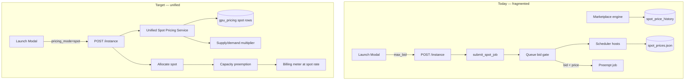

# Spot Instance Integration — Production Completion Plan

*Created: 2026-06-09*  
*Parent roadmap:* [`NEXT_PRIORITIES_ROADMAP.md`](./NEXT_PRIORITIES_ROADMAP.md)  
*Related:* [`billing-money-path.md`](./billing-money-path.md), [`INSTANCE_LIFECYCLE.md`](./INSTANCE_LIFECYCLE.md)

Track every task required to ship **production-ready spot (interruptible) GPU instances** alongside on-demand — with unified pricing, real billing, true preemption, and a polished dashboard experience. **Bidding is retired.** There is no max-bid, no bid gating, and no bid-based preemption.

**Status legend:** `[ ]` not started · `[~]` in progress · `[x]` done

---

## Executive summary

### What we are building

| Capability | On-Demand | Spot (target) |
|------------|-----------|---------------|
| Availability | Guaranteed while wallet funded | Best-effort; may queue when capacity tight |
| Price | Fixed published rate (`pricing_mode=on_demand`) | Fixed published spot rate (`pricing_mode=spot`) — **no customer bidding** |
| Preemption | Never | Yes — reclaimed when higher-priority workloads need GPUs |
| Billing | Metered at on-demand rate | Metered at spot rate locked at allocation time |
| Provider payout | Standard split | Same rails; spot rate reflected in `gpu_allocations.price_cents_per_hour` |
| UI | Launch modal “On-Demand” tab | Launch modal “Spot” tab with live rate, savings %, preemption warning |

### Core design decisions (frozen)

1. **Spot is a `pricing_mode`, not an auction.** Customers accept the published spot rate (CAD/hr) shown at launch. Rate may drift between launches as supply/demand changes, but **not mid-run via bid eviction**.
2. **Preemption is capacity-driven, not price-driven.** A spot job is reclaimed when an on-demand or premium job needs its GPU(s), or when the host is drained — **not** because “bid < spot price”.
3. **Three layers set the spot rate (in priority order at billing time):**
   - **Platform catalog** — `gpu_pricing` row where `pricing_mode = 'spot'` (canonical published rate, seeded at 40% of standard on-demand).
   - **Market dynamics** — supply/demand multiplier applied to the platform base (capped: spot never exceeds on-demand; typical discount 40–60%).
   - **Provider floor** — `gpu_offers.spot_min_cents` when allocated via marketplace; offer rejected for spot if `spot_enabled = false`.
4. **A job is “spot” when all of these are true after allocation:**
   - `jobs.payload.pricing_mode = 'spot'`
   - `jobs.payload.preemptible = true`
   - `gpu_allocations.allocation_type = 'spot'` (marketplace path) **or** scheduler tier `spot` with preemptible flag (direct-host path)
5. **Bidding is removed entirely** — `max_bid`, `submit_spot_job`, bid forms, bid-gated queue logic, bid-based `identify_preemptible_jobs`, and all API/OpenAPI/SDK references.

---

## Current state (baseline audit)

| Area | Status | Problem |
|------|--------|---------|
| `gpu_pricing` seed (`pricing_mode=spot`, 40% of on-demand) | ✅ seeded | Not wired into launch or live billing meter |
| Marketplace `spot_enabled` / `spot_min_cents` / `spot_multiplier` | ✅ migration 034 | Partially used; multiplier still named like a bid discount |
| Marketplace `spot_price_history` supply/demand engine | ✅ | Separate from scheduler JSON engine — **two price sources** |
| Scheduler `spot_prices.json` supply/demand engine | ✅ | Separate from marketplace DB — **two price sources** |
| `POST /instance` with `max_bid` → `submit_spot_job` | ⚠️ legacy | **Bidding model** — must retire |
| `routes/spot.py` `SpotJobIn.max_bid` | ⚠️ legacy | Duplicate entry point for bids |
| Queue gating `max_bid >= spot price` | ⚠️ legacy | Auction semantics |
| Preemption `max_bid < current_price` | ⚠️ legacy | Wrong eviction model |
| Launch modal spot mode + max bid field | ⚠️ partial | UX implies auction; `pricing_mode` not sent to API |
| `fetchPricingRates(mode=spot)` | ✅ | Frontend can show spot rate but launch still sends `max_bid` |
| Billing `spot_discount` on usage meters | ⚠️ partial | Ad-hoc discount field; not tied to `pricing_mode` rate |
| Worker `check_preemption` / `handle_preemptions` | ✅ infra | Trigger logic upstream is bid-based — needs capacity model |
| Dashboard spot-pricing page | ✅ basic | Uses marketplace v2 prices; not unified |
| Marketing copy (“bid on idle capacity”) | ❌ wrong | Must rewrite — no bidding |
| `templates/dashboard.html` spot bid form | ❌ legacy | Must delete |
| OpenAPI / Fern / SDK `max_bid` | ❌ legacy | Must remove in same release as migration |

### Architectural gap diagram



---

## Reference pricing (grounded, CAD/hr)

Rates below come from `db.py` `_GPU_PRICING_BASE` × `_MODE_MULT['spot']` (0.40) for **standard tier**. These are the **platform-published spot floor**; live spot may be lower when supply is abundant but **never higher than on-demand**.

| GPU Model | VRAM | On-Demand (std) | Spot (40%) | Savings | Feasible for spot? |
|-----------|------|-----------------|------------|---------|-------------------|
| RTX 3060 | 12 GB | $0.13 | **$0.05** | 62% | ✅ High supply; ideal spot SKU |
| RTX 3090 | 24 GB | $0.30 | **$0.12** | 60% | ✅ Workhorse spot tier |
| RTX 4090 | 24 GB | $0.55 | **$0.22** | 60% | ✅ Primary consumer spot |
| RTX 4090 HF | 24 GB | $0.62 | **$0.25** | 60% | ✅ If host registers HF variant |
| A100 40GB | 40 GB | $1.50 | **$0.60** | 60% | ✅ Enterprise batch jobs |
| A100 80GB | 80 GB | $2.20 | **$0.88** | 60% | ✅ LLM fine-tune spot |
| H100 80GB | 80 GB | $4.20 | **$1.68** | 60% | ⚠️ Low supply — spot queue expected |
| H200 | 141 GB | $5.50 | **$2.20** | 60% | ⚠️ Rare; spot mostly marketing |
| L40S | 48 GB | $1.80 | **$0.72** | 60% | ✅ Inference spot |
| T4 | 16 GB | $0.35 | **$0.14** | 60% | ✅ Dev/test spot |

**Provider floor guidance (`spot_min_cents`):** providers set the minimum they will accept for interruptible work. Recommended defaults at offer creation:

| GPU class | Suggested `spot_min_cents` | Notes |
|-----------|---------------------------|-------|
| RTX 30/40 consumer | 8–15¢ | Above power cost; below platform spot |
| RTX A / workstation | 20–40¢ | |
| A100 / L40S | 45–80¢ | |
| H100 / H200 | 120–180¢ | May equal platform spot when scarce |

**Dynamic band (supply/demand):** on top of platform base, apply multiplier `1.0 … 1.5×` from demand/supply ratio (existing `compute_spot_price` cap). Example: RTX 4090 spot ranges **$0.22–$0.33**/hr before provider floor clamp.

---

## How “spot” is determined — decision tree

```
Customer selects Spot in launch modal
        │
        ▼
POST /instance { pricing_mode: "spot", gpu_model, tier, ... }
        │
        ├─► Wallet preflight at SPOT rate (not on-demand)
        │
        ├─► Scheduler marks job: pricing_mode=spot, preemptible=true, priority=0
        │
        ├─► Allocation path A — direct host match
        │     • Host must have spot_capacity (new host payload flag, default true)
        │     • Bill at gpu_pricing spot row × priority × sovereignty × multi-GPU
        │
        └─► Allocation path B — marketplace offer
              • Offer must have spot_enabled=true
              • price = max(spot_min_cents, ask × spot_multiplier, platform_spot_rate)
              • gpu_allocations.allocation_type = 'spot'
        │
        ▼
Running spot instance (preemptible=true)
        │
        ├─► Billing tick uses locked spot_rate_cad from allocation snapshot
        │
        └─► Preemption when:
              • On-demand job queued AND no free GPU on host → evict lowest-priority spot
              • Admin drain / host maintenance
              • Provider disables spot on offer (grace period then evict)
        │
        ▼
On preempt: SIGTERM → grace (30s) → docker stop → status=preempted → auto-requeue (same pricing_mode)
```

**Not spot:** `max_bid`, “bid below market”, customer-entered price, auction queue.

---

## Phase 0 — Design freeze & inventory (1–2 days)

### 0.1 Codebase audit

- [ ] Run ripgrep inventory and attach to PR:
  - `max_bid`, `submit_spot_job`, `SpotJobIn`, `spot-bid`, `underbidding`, `Place Spot Bid`
  - Files: `scheduler.py`, `routes/instances.py`, `routes/spot.py`, `routes/marketplace.py`, `marketplace.py`, `billing.py`, `routes/billing.py`, `templates/dashboard.html`, `frontend/src/**`, `public/openapi.json`, `fern/**`, `tests/**`, `llms.txt`, blog MDX
- [ ] Document every API route that accepts or returns bid fields (OpenAPI diff checklist)
- [ ] Confirm no production jobs rely on `max_bid` for billing (SQL audit on `jobs.payload`)

### 0.2 Product rules sign-off

- [ ] Confirm preemption grace period: `XCELSIOR_PREEMPTION_GRACE_SEC` default **30s** (keep)
- [ ] Confirm auto-requeue on preempt: **yes**, same `pricing_mode=spot`, preserve volumes
- [ ] Confirm spot jobs cannot use premium/sovereign SLA tiers (spot = standard tier only) — or document exception
- [ ] Confirm wallet hold uses **spot rate × estimated hours** at launch (not on-demand)

**Phase 0 exit:** Signed decision doc; grep inventory attached; no open questions on bidding retirement.

---

## Phase 1 — Retire bidding (schema, API, code deletion)

### 1.1 Migration `040_retire_spot_bidding`

- [ ] Create `migrations/versions/040_retire_spot_bidding.py`
- [ ] **Data migration** on `jobs.payload` (JSONB):
  - [ ] `UPDATE jobs SET payload = payload - 'max_bid' WHERE payload ? 'max_bid'`
  - [ ] For rows where `payload->>'spot' = 'true'` OR `payload ? 'max_bid'`: set `payload = jsonb_set(payload, '{pricing_mode}', '"spot"')`
  - [ ] Set `payload = jsonb_set(payload, '{preemptible}', 'true')` for those rows
  - [ ] Remove keys: `max_bid` (done above)
- [ ] **Add column** `jobs.pricing_mode TEXT NOT NULL DEFAULT 'on_demand'` with check constraint `IN ('on_demand', 'spot', 'reserved')` — backfill from payload
- [ ] **Add column** `jobs.spot_rate_cad DOUBLE PRECISION` — nullable; set at allocation for billing snapshot
- [ ] **Add index** `idx_jobs_pricing_mode_status ON jobs(pricing_mode, status)` for scheduler queries
- [ ] **Add index** `idx_jobs_preemptible_running ON jobs((payload->>'preemptible')) WHERE status = 'running'` (partial, if supported)
- [ ] Downgrade: intentionally minimal (no restore of bids)

### 1.2 API contract changes

- [ ] **`JobIn`** (`routes/instances.py`): remove `max_bid`; add `pricing_mode: Literal['on_demand', 'spot'] = 'on_demand'`
- [ ] **Delete** `routes/spot.py` `SpotJobIn` and `POST /spot/instance` — or repoint to thin wrapper that sets `pricing_mode=spot` without bid (prefer **delete**)
- [ ] **Delete** `submit_spot_job()` from `scheduler.py`; fold into `submit_job(..., pricing_mode='spot')`
- [ ] **Remove** spot path branch `if j.max_bid is not None` in `api_submit_instance`
- [ ] Update `public/openapi.json` + `fern/openapi.json` + `scripts/generate_public_openapi.py`
- [ ] Update `frontend/sdk/**` generated types (`JobIn.ts` — remove `max_bid`)
- [ ] Update `llms.txt`, `fern/pages/jobs.mdx`, `fern/ai_examples_override.yml` — remove bid examples

### 1.3 Delete legacy UI & templates

- [ ] Remove spot bid form block from `templates/dashboard.html` (`submitSpotBid`, `.spot-bid-form`, “Place Spot Bid”)
- [ ] Remove `submitSpotInstance` deprecation path from `frontend/src/lib/api.ts`
- [ ] Remove marketing “bid” copy:
  - [ ] `frontend/src/lib/i18n/en.ts` — “Browse, bid, and rent” → “Browse and rent”
  - [ ] `frontend/content/blog/aws-comparison.mdx` — rewrite spot section
  - [ ] `docs/UI_ROADMAP.md` — update spot row (no bidding)

### 1.4 Test updates

- [ ] Rewrite `tests/test_integration.py` spot tests — use `pricing_mode=spot`, no `max_bid`
- [ ] Rewrite `tests/test_scheduler.py::TestPreemption` — capacity-based scenarios
- [ ] Update `tests/test_api.py`, `tests/test_slurm_ui.py`, `tests/test_marketplace_*.py`
- [ ] Add `tests/test_no_max_bid_references.py` — CI grep guard (fail if `max_bid` reappears outside migration 040)

**Phase 1 exit:** `pytest` green; `rg max_bid` returns only migration 040 + test guard; OpenAPI has no bid fields.

---

## Phase 2 — Unified spot pricing service

### 2.1 Consolidate price engines

Today: `scheduler.py` (`spot_prices.json`) **and** `marketplace.py` (`spot_price_history`) disagree.

- [ ] Create `spot_pricing.py` module (single source of truth):
  - [ ] `get_platform_spot_base(gpu_model, tier, vram_gb, form_factor, high_frequency) -> float` from `gpu_pricing`
  - [ ] `get_supply_demand(gpu_model) -> (supply, demand)` — merge host registry + marketplace offers + queued/running jobs
  - [ ] `compute_live_spot_rate(gpu_model, ...) -> SpotQuote` dataclass: `{ rate_cad, on_demand_cad, savings_pct, supply, demand, as_of }`
  - [ ] `record_spot_history(quote)` → write only to `spot_price_history` (PostgreSQL)
- [ ] **Delete** `spot_prices.json` read/write from scheduler; migrate `load_spot_prices` callers to service
- [ ] Deprecate duplicate `marketplace.compute_spot_price` — delegate to `spot_pricing.py`
- [ ] Wire `bg_worker.py` / `start_spot_price_monitor` to call unified service every `XCELSIOR_SPOT_UPDATE_INTERVAL` (600s)
- [ ] SSE event `spot_prices_updated` payload uses unified quotes

### 2.2 Rate locking at allocation

- [ ] When job assigned to host or marketplace allocation created:
  - [ ] Persist `jobs.spot_rate_cad` = quoted rate at assignment time
  - [ ] Persist `jobs.pricing_mode = 'spot'`
  - [ ] Marketplace: `gpu_allocations.price_cents_per_hour` already set — ensure formula uses unified quote, not stale multiplier-only math

### 2.3 API surface

- [ ] `GET /api/v2/marketplace/spot-prices` — returns unified quotes (keep path, change implementation)
- [ ] `GET /api/pricing/rates?mode=spot` — must match unified quote for same GPU (±rounding)
- [ ] **Delete** duplicate `GET /spot-prices` or make it alias v2 (one public route)
- [ ] Add `GET /api/pricing/spot-quote?gpu_model=RTX+4090&num_gpus=1&province=ON` — launch-modal helper with tax breakdown

### 2.4 Tests

- [ ] `tests/test_spot_pricing_unified.py` — supply/demand edge cases (zero supply, surge cap, provider floor)
- [ ] Property test: `spot_rate <= on_demand_rate` always
- [ ] Property test: `spot_rate >= provider spot_min_cents` when offer-bound

**Phase 2 exit:** One price engine; scheduler and marketplace return identical spot for same GPU; history in one table.

---

## Phase 3 — Scheduler & allocation (real spot instances)

### 3.1 Job submission

- [ ] Extend `submit_job(..., pricing_mode='on_demand'|'spot')`:
  - [ ] `pricing_mode=spot` → `tier='spot'`, `preemptible=True`, `priority=0` (keep tier mapping)
  - [ ] Reject `pricing_mode=spot` with `tier in ('premium', 'sovereign')` → 400
  - [ ] Wallet preflight uses spot quote × num_gpus
- [ ] Remove queue skip logic `max_bid >= spot price`
- [ ] Replace with: spot jobs queue normally; scheduled when host has **spot capacity** (see 3.2)

### 3.2 Host spot capacity

- [ ] Add host payload fields (no migration — JSONB payload):
  - [ ] `spot_enabled: bool` (default `true`)
  - [ ] `spot_gpu_slots: int` (default = total GPUs; allows provider to reserve GPUs for on-demand only)
- [ ] Scheduler host matching:
  - [ ] On-demand jobs may use any free GPU
  - [ ] Spot jobs may only use hosts where `spot_enabled` and `free_gpus_in_spot_pool > 0`
- [ ] Provider dashboard: toggle spot + set spot slot count (Phase 6 UI)

### 3.3 Marketplace allocation integration

- [ ] `api_submit_instance` with `pricing_mode=spot` calls `marketplace.allocate_gpu(..., allocation_type='spot')` when routing through offers
- [ ] Ensure `process_queue` respects `spot_enabled` on offers (already partial — verify end-to-end)

### 3.4 Instance lifecycle states

- [ ] Add status `preempted` (if not present) with transitions: `running → preempted → queued` (auto-requeue)
- [ ] `INSTANCE_LIFECYCLE.md` — document spot/preempted paths
- [ ] Instance detail API returns: `pricing_mode`, `spot_rate_cad`, `preemptible`, `preempted_at`, `preemption_count`

**Phase 3 exit:** Launch with `pricing_mode=spot` creates genuinely preemptible jobs; no bid fields anywhere in path.

---

## Phase 4 — Billing integration (money path)

### 4.1 Metering

- [ ] `billing.py` usage tick for running jobs:
  - [ ] If `pricing_mode=spot`: use `job.spot_rate_cad` (locked) × duration — **not** host `cost_per_hour` × generic `spot_discount`
  - [ ] If on-demand: existing path unchanged
- [ ] Remove ad-hoc `spot_discount` field from new meters (migration: keep column, always 0 for new rows)
- [ ] `usage_meters` insert includes `pricing_mode` column (migration 040 or 041)

### 4.2 Wallet holds & insufficient balance

- [ ] Launch preflight: estimate cost at spot rate
- [ ] Low-balance stop: spot instances same as on-demand (stop_container) — no special case
- [ ] On preemption: **stop billing** at preempt timestamp; partial hour billed pro-rata

### 4.3 Provider payouts

- [ ] `payout_splits` / marketplace bill uses `gpu_allocations.price_cents_per_hour` for spot allocations
- [ ] Platform fee (`PLATFORM_CUT`) applies identically to spot and on-demand
- [ ] Verify PayPal + Stripe payout paths with spot-priced job (extend `tests/test_billing_endpoints_coverage.py`)

### 4.4 Invoices & analytics

- [ ] Invoice line items show `Spot — RTX 4090` vs `On-Demand — RTX 4090`
- [ ] Analytics dashboard: split spend by `pricing_mode`
- [ ] AI assistant `estimate_job_cost` tool: `spot=True` uses unified quote, not multiplier guess

### 4.5 Tests

- [ ] `tests/test_billing_spot_metering.py` — spot job billed at locked rate for partial hour
- [ ] `tests/test_billing_math_properties.py` — extend: spot < on-demand for same job shape
- [ ] `tests/test_billing_security_sweep.py` — spot launch cannot bypass wallet auth

**Phase 4 exit:** End-to-end: spot launch → meter → wallet debit → provider payout row; amounts match published spot rate.

---

## Phase 5 — Frontend (sleek, professional UI)

### 5.1 Launch Instance Modal (`launch-instance-modal.tsx`)

- [ ] Remove `maxBid` state, input, and validation
- [ ] Spot mode panel:
  - [ ] Live spot rate from `fetchPricingRates(..., mode: 'spot')` — large monospace price
  - [ ] Savings badge: `Save X%` vs on-demand (emerald accent)
  - [ ] **Interruptible warning** callout (amber): “Can be reclaimed at any time when capacity is needed. Auto-restarts when GPUs are available.”
  - [ ] Sparkline or mini chart (optional): 24h spot history from `fetchSpotHistory`
- [ ] Submit sends `pricing_mode: 'spot'` (not `max_bid`)
- [ ] Confirm step shows spot rate locked-at-launch disclaimer
- [ ] Loading/error states for spot quote fetch (retry button)

### 5.2 Instances list & detail

- [ ] List badge: `Spot` (emerald outline) vs `On-Demand` (neutral)
- [ ] Detail page (`instances/[id]/page.tsx`):
  - [ ] Pricing card: mode, rate/hr, accumulated cost, preemption count
  - [ ] Preemption banner when status=`preempted` or WebSocket `job_preempted` event
  - [ ] “Requeue position” when queued after preempt

### 5.3 Spot Pricing dashboard page (upgrade)

- [ ] Redesign `dashboard/spot-pricing/page.tsx`:
  - [ ] Hero stats: avg savings, models with spot capacity, lowest current rate
  - [ ] Per-GPU cards: on-demand strikethrough, spot price, savings %, supply/demand indicator
  - [ ] 48h area chart per model (existing — polish tooltip, CAD formatting)
  - [ ] CTA: “Launch spot instance” → opens modal with model pre-selected
- [ ] Match design system: `Card`, `Badge`, `StatCard`, ice-blue/emerald accents, dark mode

### 5.4 Marketing surfaces

- [ ] `pricing/page.tsx` + `content.tsx` — spot column from live API, not hardcoded 0.6×
- [ ] `gpu-availability/content.tsx` — spot_cad from unified API
- [ ] `home-below-fold.tsx` / features — remove “bid”; emphasize interruptible savings
- [ ] i18n: `en.ts`, `fr.ts`, `en-dashboard.ts`, `fr-dashboard.ts` — spot strings without bid language

### 5.5 WebSocket & notifications

- [ ] `useInstanceWebSocket` / `NotificationBell` — handle `job_preempted` with user-friendly copy
- [ ] Optional email: “Your spot instance {name} was reclaimed — requeued”

### 5.6 Tests

- [ ] Playwright or RTL: launch modal spot flow selects mode, shows rate, submits without bid field
- [ ] Visual regression snapshot for spot pricing page (if project uses chromatic/playwright screenshots)

**Phase 5 exit:** No bid UI anywhere; spot launch is 3-click with clear preemption warning; marketing matches product.

---

## Phase 6 — Provider controls

### 6.1 Host onboarding & dashboard

- [ ] Wizard (`wizard/src/steps.tsx`): “Enable spot instances” toggle + `spot_min_cents` input with suggested defaults per GPU class
- [ ] Provider hosts page (`dashboard/hosts/page.tsx`):
  - [ ] Spot enabled toggle
  - [ ] Spot GPU slots (int ≤ total GPUs)
  - [ ] Spot min price floor (¢/hr)
  - [ ] Live preview: “Your spot rate: $X/hr” from unified quote + floor

### 6.2 Marketplace offers API

- [ ] `GPUOfferCreate`: keep `spot_enabled`, `spot_min_cents`; document `spot_multiplier` as **platform-managed discount factor** (or remove from provider API and set server-side from catalog)
- [ ] Offer search: filter `spot_available=true`

### 6.3 Provider earnings

- [ ] Earnings breakdown: spot vs on-demand revenue
- [ ] Tooltip: spot jobs may be interrupted; payout is for actual runtime

**Phase 6 exit:** Provider can opt in/out of spot and set floor; scheduler respects flags.

---

## Phase 7 — Preemption & reclamation runtime

### 7.1 Capacity-based preemption algorithm

Replace `identify_preemptible_jobs` bid logic:

- [ ] New `identify_preemption_candidates(host_id)`:
  - [ ] Trigger: on-demand job J needs GPU on host H, no free GPU
  - [ ] Select running jobs on H where `preemptible=true`, ordered by `priority ASC`, then `started_at ASC`
  - [ ] Preempt enough spot jobs to free GPUs for J
- [ ] Admin drain: preempt all spot on host, then on-demand with notice
- [ ] Remove `max_bid < current_price` branch entirely

### 7.2 Control plane → worker

- [ ] `GET /agent/preempt/{host_id}` — returns job IDs selected by new algorithm (keep contract)
- [ ] `POST /agent/schedule-preemption` — admin override (keep)
- [ ] `worker_agent.py` `handle_preemptions`:
  - [ ] Send SIGTERM to container; wait `PREEMPTION_GRACE_SEC`
  - [ ] Checkpoint optional: flush logs, save state marker in job payload
  - [ ] `docker stop` → report status `preempted`

### 7.3 Requeue

- [ ] `preempt_job()` → set status `queued`, clear `host_id`, increment `preemption_count`, preserve `spot_rate_cad` as **hint** but re-lock on next assignment
- [ ] Optional: exponential backoff if repeated preempts (env `XCELSIOR_SPOT_REQUEUE_BACKOFF`)

### 7.4 Tests

- [ ] `tests/test_preemption_capacity.py`:
  - [ ] Host with 1 GPU: on-demand launch preempts running spot
  - [ ] On-demand never preempted by spot
  - [ ] Multiple spot: lowest priority preempted first
- [ ] Live agent test (optional): `tests/test_e2e_live.py` spot preempt path

**Phase 7 exit:** Preemption happens in staging when on-demand contends; worker gracefully stops container.

---

## Phase 8 — Observability & operations

### 8.1 Metrics & logs

- [ ] Structured logs: `spot.allocated`, `spot.preempted`, `spot.requeued`, `spot.price_updated`
- [ ] Metrics (if Prometheus): `xcelsior_spot_jobs_running`, `xcelsior_spot_preemptions_total`, `xcelsior_spot_rate_cad{gpu_model}`
- [ ] Admin endpoint `POST /spot/preemption-cycle` — rename doc to “capacity preemption dry-run” (keep for ops)

### 8.2 Runbook (`docs/SPOT_RUNBOOK.md` — create at rollout)

- [ ] On-call: spike in preemptions
- [ ] On-call: spot price stuck at on-demand cap (supply exhaustion)
- [ ] Provider complains about spot payouts — verify `gpu_allocations.price_cents_per_hour`

### 8.3 Feature flags

- [ ] `XCELSIOR_SPOT_ENABLED=true` (default true in prod after rollout)
- [ ] Kill switch disables launch `pricing_mode=spot` with 503 + UI banner

**Phase 8 exit:** Dashboards/alerts exist; runbook reviewed by ops.

---

## Phase 9 — Documentation & API finalization

- [ ] Update `README.md` — spot instances section (no bidding)
- [ ] Update `docs/billing-money-path.md` — spot metering paragraph
- [ ] Regenerate SDK: `frontend/sdk` from OpenAPI
- [ ] Postman/curl examples in Fern docs
- [ ] CHANGELOG entry: **BREAKING** — removed `max_bid`; use `pricing_mode=spot`

**Phase 9 exit:** Public docs match implementation; breaking change announced.

---

## Phase 10 — E2E validation & production rollout

### 10.1 Staging checklist

- [ ] Migration 040 applied on staging DB
- [ ] Launch spot RTX 4090 → runs → meter debits wallet at spot rate
- [ ] Launch on-demand on same host → spot preempted → worker stops container
- [ ] Spot job requeues and reschedules when GPU free
- [ ] Marketplace offer with `spot_enabled=false` → spot launch skips that offer
- [ ] Provider floor: spot price never below `spot_min_cents`
- [ ] Frontend: no bid fields in network tab

### 10.2 Production rollout

- [ ] Maintenance window: run migration 040 (brief API restart)
- [ ] Deploy API + worker agent + frontend in lockstep
- [ ] Smoke: `scripts/billing_prod_smoke.py` + manual spot launch
- [ ] Monitor preemption rate first 24h
- [ ] Enable `XCELSIOR_SPOT_ENABLED` after smoke pass

### 10.3 Rollback plan

- [ ] If critical bug: set `XCELSIOR_SPOT_ENABLED=false` (disable new spot launches)
- [ ] Running spot jobs continue or drain gracefully (document choice: **drain** recommended)
- [ ] Migration 040 is not reversible for bid data — acceptable per product decision

**Phase 10 exit:** Production spot + on-demand coexist; bidding fully absent.

---

## File change matrix (quick reference)

| File / area | Action |
|-------------|--------|
| `migrations/versions/040_retire_spot_bidding.py` | **Create** |
| `spot_pricing.py` | **Create** — unified engine |
| `scheduler.py` | Remove `submit_spot_job`, bid queue gate, bid preemption; add capacity preemption |
| `routes/instances.py` | `pricing_mode` in `JobIn`; remove `max_bid` branch |
| `routes/spot.py` | **Delete** or reduce to admin preemption-only |
| `marketplace.py` | Delegate pricing to `spot_pricing.py` |
| `billing.py` | Spot metering at `spot_rate_cad` |
| `routes/billing.py` | Estimate endpoint uses unified quote |
| `templates/dashboard.html` | Remove spot bid form |
| `frontend/.../launch-instance-modal.tsx` | Spot UI without bid |
| `frontend/.../spot-pricing/page.tsx` | Premium redesign |
| `public/openapi.json`, `fern/**`, `frontend/sdk/**` | Remove `max_bid` |
| `tests/**` | Rewrite spot/preemption tests; add grep guard |

---

## Success criteria (production ready)

1. Customer launches spot instance in **&lt; 60 seconds** with published rate visible and preemption warning acknowledged.
2. Spot instance is **actually preemptible** — demonstrated by on-demand contention test in staging.
3. Wallet debits match **locked spot rate** ± tax; provider payout row matches allocation price.
4. **`rg max_bid` and `rg bid`** (spot context) return zero hits in application code.
5. Spot and on-demand **coexist** on same host with correct priority behavior.
6. UI is **sleek, consistent**, dark-mode polished, no auction metaphors.
7. All prices **traceable** to `gpu_pricing` base × dynamics × provider floor — no magic numbers in frontend.

---

## Suggested PR stack (execution order)

| PR | Scope | Depends on |
|----|-------|------------|
| PR-1 | Phase 0 audit + Phase 1 migration & bid deletion | — |
| PR-2 | Phase 2 unified `spot_pricing.py` | PR-1 |
| PR-3 | Phase 3 scheduler + allocation | PR-2 |
| PR-4 | Phase 4 billing | PR-3 |
| PR-5 | Phase 7 preemption runtime | PR-3 |
| PR-6 | Phase 5 + 6 frontend & provider UI | PR-4 |
| PR-7 | Phase 8–10 ops, docs, rollout | PR-6 |

---

*This document is the single source of truth for spot instance integration. Update checkboxes in-place as work completes.*