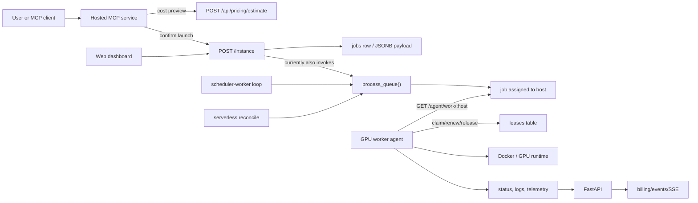
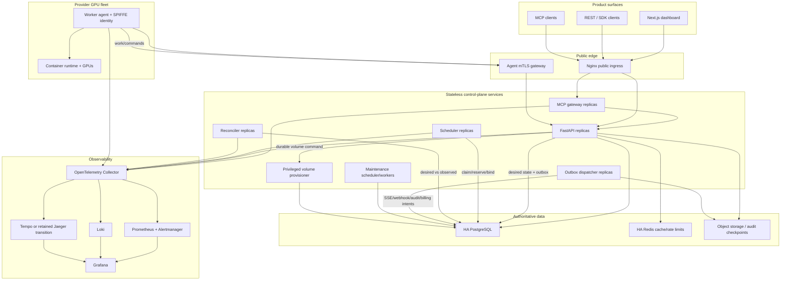

# Xcelsior production control-plane and MCP blueprint

**Repository assessed:** `xcelsior-latest` at commit `05bb0db4eacb266cffe207bfc7e145da20fba6d8`
**Assessment date:** 2026-07-16  
**Scope:** scheduler, GPU worker agent, reconciliation, serverless, billing, events, telemetry, MCP, auth, PostgreSQL, Redis, migrations, Nginx, deployment, CI, observability, and operator UI  
**Change status:** architecture and implementation plan only; no repository source files were edited

**Implementation status (live cross-reference):** this blueprint is
delivered under two tracks. The production data-model view is in
[`xcelsior-production-data-architecture-companion.md`](./xcelsior-production-data-architecture-companion.md).
The §-references throughout this document are the authoritative anchors
both checklists cite.

- [`track-a-implementation-checklist.md`](./track-a-implementation-checklist.md)
  — the **transactional-authority core**, complete as of 2026-07-21:
  migrations 054–065 applied; the transactional scheduler (shadow +
  canary machinery), fenced `/agent/v2` worker protocol, durable
  command/outbox delivery, observation ingest, the reconciler with three
  enforceable findings, wallet holds, attempt-scoped metering, per-service
  database roles, per-host agent tokens, the SPIRE identity contract, and
  the production startup validator. Several operator flips remain open and
  are listed there.
- [`track-b-implementation-checklist.md`](./track-b-implementation-checklist.md)
  — **the current source of truth for all remaining work**, and the
  authority on migration numbering. §13.5, §13.6, and §13.7 assign
  revisions `058`, `059`, and `060`; the repository has since spent those
  numbers on other content, so Track B §B1 records the binding
  renumbering map. Track B owns §3, §10.7–§10.8, §11.8, §13.5–§13.7, §14,
  §15.3–§15.4, §16.2–§16.3, §17, §18.1–§18.3, §18.5, §20, §21.1–§21.2,
  §21.4–§21.5, §22.1–§22.2, §22.4, §23, §24, §25, §26.3–§26.7, §27, §30,
  §32, and Phases 0/2/8/9/11/12, with a full coverage map in its §B19.

---

## 1. Executive answer

Xcelsior already has a real scheduler, a real worker agent, and a real hosted MCP product surface. The MCP `create_instance` flow is not hypothetical: it previews cost through `/api/pricing/estimate`, launches through `/instance`, and feeds the same jobs the continuously running scheduler consumes. Serverless endpoints and jobs also have real MCP tools and backend services. These capabilities must remain first-class and become safer and more observable; they should not be replaced with an operator-only MCP or an LLM-driven scheduler.

The project is best described as a **feature-rich early production control plane whose breadth is ahead of its distributed-systems correctness**. It has most of the right pieces—PostgreSQL, leases, agent polling, host telemetry, queue processing, serverless reconciliation, billing, events, OAuth, blue/green API deployment, and a polished MCP UI—but several pieces are only locally or best-effort coordinated.

The most important issue is not that the scheduler is absent. It is that the scheduler's current concurrency guarantee is narrower than the number of processes that can schedule:

- `scheduler.py` serializes a queue pass with a module-level `threading.Lock`.
- That lock protects only threads inside one Python process.
- The API runs multiple Gunicorn workers, the scheduler runs in another container, and both invoke scheduling paths.
- Queue selection, host selection, assignment, capacity reservation, lease creation, and dispatch are not one PostgreSQL transaction.
- Two writers can therefore observe the same queued job or the same apparent free GPU capacity and make conflicting decisions.

The worker lease protocol is real, but it is not yet a hard execution fence: `worker_agent.py::run_job` continues starting a container when `claim_lease()` fails. A stale worker can also report status without an attempt-specific fencing token. Commands are currently removed from PostgreSQL when fetched rather than acknowledged after execution. Reconciliation exists, but it is spread across scheduler health/failover loops, a generic reaper, serverless reconcile/reaper logic, billing cleanup, VRAM correction, and worker restart adoption. There is no single desired-versus-observed workload model.

The target design should therefore preserve the current product and replace the internals in controlled layers:

1. Make PostgreSQL the production source of truth and coordination mechanism.
2. Normalize jobs, attempts, GPU devices, allocations, leases, commands, observations, and action plans with Alembic migrations.
3. Make placement a transactional `claim -> filter -> score -> reserve -> bind` protocol that is safe with multiple scheduler replicas.
4. Bind every worker action and status update to `job_id + attempt_id + host_id + lease_id + fencing_token`.
5. Add a durable reconciler that compares desired state with worker-reported reality and repairs drift idempotently.
6. Keep MCP as a stateless, separately deployed API adapter. It must call authenticated control-plane APIs only—never PostgreSQL or a worker directly.
7. Preserve and improve `create_instance`, serverless launch, cost checks, watch flows, and the existing Xcelsior UI. Add diagnostic and operator tools alongside them.
8. Make migrations, MCP, scheduler, reconciler, worker protocol, and smoke tests mandatory deployment gates instead of warning-only extras.

The recommended implementation is incremental. It does not require Kafka, Temporal, Celery, or Kubernetes to establish correctness. PostgreSQL row locking, constraints, an outbox, idempotency records, and periodic anti-entropy loops are enough for the current control-plane scale. Kubernetes can become the HA deployment target only after services are safe to replicate; moving the current singleton assumptions into Kubernetes first would multiply races rather than solve them.

---

## 2. What “scheduler internal concurrency guarantees” means

This phrase describes the promises the scheduler can make when several things happen at once—not whether a scheduler process is running.

### 2.1 The guarantees Xcelsior needs

For any number of API workers, scheduler replicas, reconciler replicas, retries, worker restarts, and delayed messages, the system must guarantee:

1. **A job has at most one active execution attempt.** Two schedulers cannot both bind the same job.
2. **A physical GPU cannot be over-allocated.** Two jobs cannot both reserve exclusive ownership of one GPU. Fractional allocations cannot exceed the configured allocatable VRAM or share quota.
3. **A multi-GPU placement is all-or-nothing.** A four-GPU request gets four compatible devices in one commit or gets none.
4. **Only the current attempt can mutate a job.** A delayed status update from an old worker or an expired lease is rejected.
5. **A worker cannot launch without a valid lease.** Lease claim failure is a hard stop, not a warning.
6. **Lease expiry does not immediately create split brain.** Reassignment increments a fencing token; the old worker loses authority even if it temporarily keeps running.
7. **Commands are at-least-once delivered and idempotently executed.** A command is deleted only after a durable ACK, not when fetched.
8. **State and side effects are recoverable.** Assignment state, capacity reservation, command creation, billing intent, audit intent, and user event intent are committed together or not at all.
9. **Retries are safe.** Repeating the same API request or scheduler transaction does not create another job, allocation, wallet hold, meter, or command.
10. **Every non-placement has a durable reason.** A queued job records which hard constraints failed and when it will be reconsidered.

A database fencing token can prevent stale control-plane updates, routing, secret retrieval, storage attachment, and billing. It cannot magically stop CPU/GPU instructions on a physically partitioned host. The architecture must therefore distinguish **one authoritative attempt** from an absolute claim of exactly-once physical execution. Strict/non-idempotent workloads are not reassigned until the old host is definitively fenced (agent confirms stop, provider control powers/isolate it, storage/network fence succeeds, or an operator accepts the risk). Restartable/idempotent workloads may use a documented grace-and-reassign policy. This distinction must be visible in workload policy and reconciliation state.

### 2.2 Why a Python lock is insufficient

`scheduler.py:72` defines `_scheduler_lock = threading.Lock()`, and `scheduler_tick()` uses it around `process_queue()`. This prevents two threads in that one interpreter from entering the assignment pass simultaneously. It does not coordinate:

- another scheduler container;
- another Gunicorn worker;
- an API request that calls `process_queue()` after submission;
- the serverless reconciler calling `process_queue()` after scale-up;
- an admin scheduling endpoint;
- a process restarted while another is still alive.

The current queue flow at `scheduler.py:2104` reads all queued jobs, reads hosts, calculates a candidate, and later calls `update_job_status(..., "assigned")`. The job row is not claimed with `FOR UPDATE SKIP LOCKED`, the selected GPU device is not locked, and assignment/capacity/lease/command are not committed atomically. The state transition helper at `scheduler.py:1904` logs an invalid transition but still persists it. VRAM is reserved when the job becomes `running`, not when capacity is assigned, and a failed reservation explicitly proceeds.

An example race is:

```text
Scheduler A                         API worker B
-----------                         ------------
reads job J as queued               reads job J as queued
reads GPU 0 as free                 reads GPU 0 as free
chooses host H / GPU 0              chooses host H / GPU 0
writes J assigned to H              writes J assigned to H
dispatches attempt A                dispatches attempt B
```

A second form uses two different jobs:

```text
Scheduler A chooses J1 -> GPU 0
Scheduler B chooses J2 -> GPU 0
both saw the same pre-reservation free_vram value
```

The solution is not a larger in-memory lock. The guarantee must live at the shared source of truth—PostgreSQL—using row locks, compare-and-swap predicates, constraints, and a single reservation transaction.

### 2.3 The intended placement transaction

The final protocol is:

```text
Claim queued work
  -> evaluate hard constraints
  -> score eligible candidates
  -> lock job + selected GPU rows in canonical order
  -> revalidate job, host generation, capacity, policy, funding
  -> create attempt + GPU allocations + placement lease + start command
  -> update job projection
  -> append outbox records
  -> commit
```

The expensive, pure calculation can happen outside a long transaction. The reservation transaction revalidates every fact on which the decision depends. A conflicting scheduler loses cleanly and retries another candidate.

### 2.4 Isolation level and lock policy

Use PostgreSQL `READ COMMITTED` with explicit row locks for the normal path. It is easier to reason about than relying on whole-transaction `SERIALIZABLE`, and it avoids excessive serialization failures under a busy queue.

- Claim queue rows with `FOR UPDATE SKIP LOCKED`.
- Lock a job row before creating its attempt.
- Lock selected `host_gpu_devices` rows in stable `(host_id, gpu_uuid)` order.
- For fractional allocation, calculate the sum of active allocations while the device row is locked.
- Use partial unique indexes to prevent more than one active attempt and more than one exclusive active allocation.
- Use `version` columns for API compare-and-swap and stale operator actions.
- Use PostgreSQL time for lease deadlines, not host clocks.
- Retry only known transient SQLSTATEs (`40001`, `40P01`, bounded connection errors) with jitter and a hard attempt limit.
- Never retry validation failures, policy denials, insufficient funds, or permanent constraint failures.

### 2.5 Advisory-lock correction

The serverless repository has a good atomic queue claim at `serverless/repo.py:517-536`, using `FOR UPDATE SKIP LOCKED`. However, `try_advisory_lock()` at `serverless/repo.py:1542` obtains a **session-level** `pg_try_advisory_lock` inside a pooled connection context, then returns that connection to the pool. `release_advisory_lock()` checks out a potentially different connection. Session advisory locks belong to the physical PostgreSQL session, so this can leak a lock on one pooled connection and attempt to unlock on another.

Correct options are:

- hold the same checked-out connection for the complete reconcile operation and unlock on that exact connection; or
- preferably, reconcile one endpoint per transaction using `pg_try_advisory_xact_lock(stable_64_bit_key(endpoint_id))`, which releases automatically at transaction end and is compatible with PgBouncer transaction pooling. Derive the key with a documented stable UUID/cryptographic mapping; never use Python's process-randomized `hash()`.

Do not retain a global serverless lock. Per-endpoint transactional locks allow unrelated endpoints to reconcile concurrently.

---

## 3. What operator and diagnostic MCP tools mean

They are additional, scoped views and actions over the same control plane. They do not replace customer launch tools and they do not become the scheduler.

### 3.1 Product tools that remain flagship

These names and outcomes remain stable:

- `create_instance`
- `list_instances`
- `get_instance`
- `get_instance_logs`
- `watch_instance`
- `cancel_instance`
- `terminate_instance`
- `list_available_gpus`
- `get_spot_prices`
- `estimate_job_cost`
- `should_i_run_this`
- `schedule_under_budget`
- `run_training_job`
- `list_serverless_endpoints`
- `create_serverless_endpoint`
- `should_i_run_pel_job`
- `run_serverless_job`
- `get_serverless_job_status`
- billing and invoice tools

Their implementation should improve, but an operator API must not displace them.

### 3.2 Diagnostic tools

Diagnostic tools explain persisted control-plane facts. They do not ask an LLM to invent a reason.

| Tool | Default scope | Result |
|---|---|---|
| `explain_instance_placement` | `instances:read` | Selected host/GPU, hard constraints, score components, policy version, alternatives, and rejected reasons, with sensitive host fields redacted. |
| `simulate_instance_placement` | `instances:read gpu:read` | Read-only placement simulation against a capacity snapshot; creates no allocation or lease. |
| `get_instance_timeline` | `instances:read` | Desired state, attempts, leases, commands, observations, billing transitions, and reconciliation actions. |
| `get_active_lease` | `instances:read` | Current lease health, expiry, last renewal, attempt, and host alias—not raw credentials or private IP. |
| `get_scheduler_health` | `control_plane:read` | Queue latency, claim age, placement rate, conflict rate, reconcile lag, and replica heartbeats. |
| `get_host_capacity` | `hosts:read` | GPU inventory, allocatable/allocated capacity, health conditions, and observation freshness. |
| `list_reconciliation_findings` | tenant `instances:read`; global admin scope | Durable drift findings and actions, tenant-filtered by default. |
| `get_mcp_action_status` | owning principal | Approval, execution, idempotency, and resulting resource state for a launch/action plan. |

### 3.3 Operator mutation tools

Mutation tools are deliberately narrower and separately authorized:

| Tool | Scope | Safety requirements |
|---|---|---|
| `retry_instance` | `instances:operate` | Expected job version, idempotency key, terminal/retryable state validation. |
| `reconcile_instance` | `instances:operate` | Enqueues reconcile; never performs direct SQL repair from MCP. |
| `drain_host` | `hosts:operate` | Action plan, reason, deadline, expected host version; stops new placement only. |
| `undrain_host` | `hosts:operate` | Expected version and healthy/admitted preconditions. |
| `evict_host_workloads` | `hosts:evict` | Separate destructive action plan; never implied by `drain_host`. |
| `retry_agent_command` | `control_plane:operate` | Only dead-letter/retryable commands; preserves idempotency key and audit history. |

The split between `drain_host` and `evict_host_workloads` matters. Draining should be reversible and should not surprise an operator by terminating workloads.

### 3.4 MCP safety boundary

The MCP service must:

- remain a separate, horizontally scalable Node service;
- authenticate and authorize every tool call;
- call versioned FastAPI endpoints through the public/internal API contract;
- never import scheduler Python, connect to PostgreSQL, call Docker, SSH to hosts, or contact a worker agent;
- attach actor, tenant, MCP client, tool name, idempotency key, and W3C trace context;
- expose structured MCP outputs with `outputSchema` and `structuredContent`;
- label tools with accurate read-only, destructive, idempotent, and open-world annotations;
- redact secrets, tokens, private host addresses, environment variables, and raw init scripts;
- persist a tool audit record in the API through an outbox-backed path;
- use Redis-backed per-principal and per-tool limits rather than process memory;
- return RFC 9457-compatible machine errors as structured tool failures.

### 3.5 Why MCP does not schedule directly

An LLM call is nondeterministic, slow relative to placement, and difficult to audit as a hard policy decision. MCP is the human/agent interface. The control plane remains deterministic:

```text
MCP client -> Xcelsior MCP -> FastAPI command/query -> PostgreSQL desired state
                                                   -> scheduler/reconciler
                                                   -> worker agent
```

MCP may ask for an explanation or simulation. It may submit an approved command. It cannot bypass tenant, runtime, capacity, wallet, lease, or fencing rules.

---

## 4. Non-negotiable product contracts

The implementation must treat these as acceptance criteria, not suggestions.

### 4.1 `create_instance`

- Keep the tool name and its simple natural-language usability.
- Preserve preview-before-launch and make the preview more accurate.
- Preserve interactive, image, repository, init script, GPU model, VRAM, GPU count, host preference, and spot/on-demand inputs.
- Return an immediate job/action identifier and a useful next step.
- Continue supporting `watch_instance` without requiring the user to leave MCP.
- Never silently switch requested security, region, storage, GPU, or price semantics.
- Make duplicate tool retries idempotent.

### 4.2 Serverless

- Keep endpoint discovery/creation, PEL suitability checks, job invocation, status, streaming, autoscaling, warm workers, token metering, and cost views.
- Share allocation and fencing primitives with instance scheduling without forcing serverless requests into an unsuitable batch UX.
- Keep serverless endpoint reconciliation independently scalable per endpoint.
- Do not introduce an approval click for every inference call; enforce server-side endpoint/client budgets and rate policies instead.

### 4.3 Cost safety

- Cost preview, wallet balance, pricing mode, quote expiry, and expected burn must be first-class structured data.
- Recheck price, wallet, spending policy, and capacity at execution.
- If price changes beyond the approved tolerance, require reapproval rather than silently charging the new amount.
- Concurrency-safe wallet holds must prevent simultaneous launches from each passing the same balance check.
- Billing starts only when the current fenced attempt is accepted as running.

### 4.4 User experience

- Reuse Xcelsior's existing dark/light tokens, cyan/violet accents, typography, glass surfaces, cards, Recharts, Lucide iconography, Framer Motion, Sonner feedback, and responsive dashboard shell.
- Do not add a second visual component framework.
- Add observability without turning the customer dashboard into an infrastructure console.
- Operator pages may be dense, but must remain legible, keyboard accessible, mobile-aware, and understandable through plain-language reasons.

---

## 5. Evidence-backed current-state assessment

### 5.1 Current execution flow



This is a legitimate control plane. The concern is coordination between the arrows, not their absence.

### 5.2 Scheduler evidence

- `docker-compose.yml` runs `scheduler-worker` continuously with `scheduler_main()`.
- `scheduler.py:2104` implements the main queue pass.
- `scheduler.py:2247` protects the pass with `_scheduler_lock`.
- `scheduler.py:1904` centralizes broad status mutation, VRAM updates, and lifecycle side effects.
- `routes/instances.py` submits jobs and invokes queue processing after a non-pinned launch; its explicit-host branch can assign directly and still reaches legacy scheduler-side execution behavior.
- `serverless/service.py::reconcile_all` invokes queue processing after scale-up.
- `scheduler.py::process_assigned` and `run_job` retain a scheduler-side SSH/container-start path alongside worker-agent polling, so there are two execution-control pathways to retire deliberately.
- Alternative scheduling functions for bin-packing, filtered placement, and other modes still exist in the large `scheduler.py` module, increasing the chance that one path bypasses a new invariant unless all callers are routed through one reservation service.
- The generic billing worker also has correctly used `SKIP LOCKED` patterns, showing the codebase already understands the primitive.

**Maturity:** broad functionality and real deployment, but single-writer assumptions are implicit rather than guaranteed. Safe for controlled scale with one effective scheduling writer; not yet safe for active-active schedulers or all current API-triggered races.

### 5.3 Worker-agent evidence

- `worker_agent.py` inventories GPUs, polls work, pulls and starts images, handles interactive and serverless modes, configures runtime/network/volumes, streams logs and telemetry, renews leases, meters usage, adopts containers after restart, and cleans up.
- `routes/agent.py` exposes work, command, lease, telemetry, status, log, and key routes.
- `worker_agent.py:2584` claims a lease before startup, but `worker_agent.py:2628+` continues when no lease is returned.
- Restart adoption can reclaim leases for already running work, but the protocol is job/host based rather than attempt/fence based.
- A gVisor auto-install failure at `worker_agent.py:5351` falls back to `runc`; managed NFS and encrypted-volume paths have other continue-on-error behavior.

**Maturity:** operationally sophisticated, but its authority model is not strong enough for failover under partition. It is a capable beta/limited-production agent, not yet a hard-fenced execution substrate.

### 5.4 Leases and commands

- `events.py` has a real `leases` table abstraction with grant, renew, expiry, and release.
- Lease grant and job transition occur in separate transactions and emit events separately.
- `routes/agent.py:726` releases by `job_id` and authenticates without binding the request body to host, attempt, lease, or fencing token.
- `routes/agent.py:276` drains agent commands with `DELETE ... RETURNING`. A worker crash after fetch loses the command.
- `agent_preempt.py` uses process memory, so a preemption enqueued in one process is not guaranteed to be visible to the worker-facing process.

**Maturity:** useful liveness mechanism, not a complete distributed lease/fencing protocol.

### 5.5 Reconciliation evidence

Reconciliation exists in several forms:

- scheduler health monitoring marks hosts alive/dead;
- failover monitoring requeues orphaned jobs;
- lease expiry checks run in `scheduler_main()`;
- VRAM drift reconciliation derives expected free capacity from running jobs;
- root `reaper.py` finds stuck jobs;
- `bg_worker.py` runs maintenance and billing cleanup;
- `serverless/service.py::reconcile_all` is an explicit serverless control loop;
- `serverless/reaper.py` repairs serverless jobs/workers;
- worker restart logic discovers and adopts existing containers.

The generic reaper and some cleanup paths perform direct status SQL or broad mutations, bypassing a single attempt/allocation/lease/billing transition service. The scheduler computes expected VRAM from job state, while the worker reports real GPU state; neither is a complete desired-versus-observed inventory.

**Verdict:** Xcelsior has **implicit distributed reconciliation** plus an **explicit serverless reconciler**, but not a unified general reconciler.

### 5.6 Database and migration evidence

- Production compose defaults to PostgreSQL, and CI runs PostgreSQL 16 with Alembic.
- `db.py` still supports SQLite, PostgreSQL, and dual-write modes and creates/alters many tables at runtime.
- `.env.example` defaults `XCELSIOR_DB_BACKEND=sqlite`, while compose defaults to PostgreSQL.
- Jobs and hosts use top-level columns plus large JSONB payloads.
- Alembic has migrations through `053_serverless_endpoint_cleanup.py`.
- `migrations/versions/013_telemetry_history.py` defines telemetry persistence, but latest host telemetry is still held in a module-level dictionary in `routes/agent.py`.

Important current models and queues are:

| Current model/table | Current purpose | Control-plane implication |
|---|---|---|
| `jobs` | Top-level ID/status/priority/time/host plus JSONB workload payload | Operational job truth, but no attempt, generation, version, claim, or concrete device columns. |
| `hosts` | Top-level ID/status/registration plus JSONB inventory/capacity | Host and capacity truth is coarse and mutable; no normalized per-GPU lock target. |
| `leases` | Job/host lease grant, renewal, expiry, release | Real liveness mechanism, but not attempt/fence bound and not atomic with assignment. |
| `agent_commands` | Host command queue | PostgreSQL durable at insertion, but current fetch deletes before ACK. |
| `events` / archives/snapshots | Audit/lifecycle history | Global hash-chain lock and non-atomic relation to job state. |
| `job_logs` | Buffered instance logs | Useful product stream source; should gain durable cursor/attempt correlation. |
| `telemetry_snapshots` | Historical host/job/GPU samples | Existing migration foundation; latest values still need shared persistence. |
| `gpu_allocations` | Marketplace offer/job/count/price allocation | Commercial allocation and anti-double-sell record, not a concrete physical GPU-device reservation; preserve it and add a distinct device-allocation model. |
| `gpu_offers`, `reservations`, `gpu_pricing` | Marketplace capacity, commitments, and rates | Inputs to policy/price/funding; must be revalidated inside launch/placement boundaries. |
| `billing_cycles`, wallet/ledger/usage-meter tables | Wallet, accrual, invoicing, provider/customer money flows | Mature financial base; bind new holds/meters idempotently to plans and attempts. |
| `serverless_endpoints` | Desired endpoint configuration | Explicit desired resource already suited to a controller model. |
| `serverless_workers` | Endpoint worker lifecycle and linked scheduler job | Bridge between serverless and general scheduler; should link to a fenced attempt/allocation. |
| `serverless_jobs` | Queued/in-flight inference work | Its repository already uses an atomic `SKIP LOCKED` claim. |
| `serverless_job_stream_events` | Persisted serverless output stream | Good durable-stream pattern to retain and align with cursor semantics. |
| `oauth_clients`, refresh tokens, team/user auth models | Interactive and machine authorization | Quick Connect/machine principal tenant/team context needs complete normalization. |

**Maturity:** PostgreSQL and Alembic foundations are present, but schema ownership is split between migrations and application startup; important coordination fields remain unnormalized.

### 5.7 Events and billing evidence

- `events.py` provides append-only events, a job state machine, leases, and a hash chain.
- `events.py:293` takes `LOCK TABLE events IN EXCLUSIVE MODE` for every chained event, making a global serialization point.
- Job rows—not events—are actually read as operational truth, despite the event-store docstring saying events are the sole source of truth.
- State mutation and event append are often separate; an event failure can leave state committed without the event.
- Billing contains mature wallet, usage, invoice, provider, spot, serverless token, and `SKIP LOCKED` processing logic.
- Multiple lifecycle paths can still bypass the expected billing hook.

**Maturity:** commercially substantial billing and audit intent, but lifecycle coupling needs an outbox and idempotent attempt-scoped meters.

### 5.8 Telemetry and observability evidence

- Worker telemetry is rich and frequent.
- `/metrics` and OpenTelemetry packages exist; Jaeger is deployed in compose.
- Latest telemetry is process-local in a multi-worker API.
- There is no complete Prometheus scraper, Alertmanager, Grafana, durable log backend, or OTel Collector deployment in the main compose topology.
- Process health checks often prove only that PID 1 contains a string, not that a worker can reach PostgreSQL or make progress.

**Maturity:** instrumented beginnings, not yet a production observability system.

### 5.9 MCP evidence

- `mcp/src/tools/compute.ts` implements the real launch path.
- `mcp/src/tools/serverless.ts`, `guardrails.ts`, `monitoring.ts`, `billing.ts`, and workflows provide meaningful product tools.
- Hosted Streamable HTTP and stdio entry points exist.
- Bearer validation introspects through the API.
- Quick Connect has backend and dashboard support.
- Current `confirm:true` is a model-supplied boolean, not a server-bound proof of human approval or standing policy.
- `mcp/src/auth/scopes.ts` grants access when the principal has no scopes, which is an unsafe legacy default.
- MCP rate limiting is process-local, and the API client supports a narrow method/timeout model.
- Tests cover only a small subset of scopes/guardrails; there is no real hosted MCP -> API -> PostgreSQL launch concurrency suite.
- `scripts/deploy.sh:1382` treats MCP startup failure as a warning, even though MCP launch is a flagship feature.

**Maturity:** a genuine v1 product integration, not merely a demo; needs production auth, approval, distributed limits, contracts, telemetry, and release gates.

### 5.10 Deployment and security evidence

- API blue/green deployment and Nginx upstreams exist.
- API uses two Gunicorn workers.
- Scheduler and background worker are separate services.
- MCP and frontend are separate containers.
- API containers run with `SYS_ADMIN` to provision LUKS volumes.
- Most services use host networking.
- MCP's Dockerfile uses `npm ci || npm install`, concealing a lock/build problem rather than failing.
- Agent identity is generally a shared bearer/API identity plus host checks, not a unique cryptographic workload identity.
- Several hard capability failures can degrade to weaker behavior, including secure runtime fallback.

**Maturity:** thoughtful single-host production deployment, but privileged boundaries, fail-open paths, identity, and HA need redesign.

### 5.11 Current deployment boundaries

| Boundary | Current deployment | Evidence and implication |
|---|---|---|
| Public edge | Host Nginx in `nginx/xcelsior.conf` | Terminates TLS, routes API/frontend, switches exact `/mcp` between marketing and protocol, carries SSE/WebSocket routes, and exposes worker routes. |
| API | `api` plus profile-based `api-blue` in `docker-compose.yml` | Gunicorn with two workers; blue/green capable; host network; broad shared environment and data/export mounts; `SYS_ADMIN`. |
| Scheduler | `scheduler-worker` container | Separate long-running `scheduler_main()` process, host network, SSH key/known-host access, no HTTP service. This proves the scheduler is running independently, but it is still a single declared service and shares direct host-access concerns. |
| Background work | `bg-worker` container | Billing, webhooks, retention, notifications, serverless/other periodic work share one operational boundary, so unrelated failures and scaling needs are coupled. |
| MCP | `mcp` container on port 8770 | Separate Node/TypeScript Streamable HTTP gateway calling the API; currently one compose service and warning-only deploy startup. |
| Frontend | `frontend` container | Separate Next.js deployment using the existing Xcelsior dashboard/design system. |
| Interactive access | `ssh-gateway` and `ssh-gateway-blue` | Separately drainable long-lived connection services; depend directly on PostgreSQL and host networking. |
| Tracing | Jaeger in compose | Trace UI/collector beginning, but not a complete metrics/logs/alerting pipeline. |
| PostgreSQL | Host-installed or externally supplied DSN; no main-compose database service | Correctly treated as persistent infrastructure, but HA, TLS, role separation, pooling, backups, and failover need an explicit production contract. |
| Redis | Host/external URL; no main-compose Redis service | Used for auth and optional serverless features; multi-replica MCP rate limiting is not yet backed by it. |
| GPU worker | `worker_agent.py` deployed to provider hosts, managed outside control-plane compose | Correct execution boundary, but fleet identity is bearer/host based and the protocol needs attempt fencing. |
| Provider network | Headscale/Tailscale reachability and SSH paths | Useful private connectivity; should remain transport, not the authority model. Scheduler SSH dependence disappears after durable agent command cutover. |

### 5.12 Overall maturity scorecard

| Area | Current level | Reason |
|---|---:|---|
| Product breadth | 4/5 | Instances, serverless, marketplace, billing, MCP, telemetry, UI, and agent lifecycle are real. |
| Scheduler placement quality | 3/5 | Filtering/scoring/preemption/bin-packing logic exists, but is spread through a monolith. |
| Scheduler concurrency correctness | 1.5/5 | Process-local lock, non-atomic assignment/capacity/dispatch, multiple writers. |
| Worker execution features | 4/5 | Rich lifecycle and GPU operations. |
| Worker authority/fencing | 2/5 | Lease exists, but failed claim does not stop execution and stale updates lack fence validation. |
| Reconciliation | 2.5/5 | Many useful loops; no shared desired/observed model. |
| PostgreSQL/migrations | 3/5 | Real production PG and Alembic; runtime DDL and JSONB state remain. |
| Billing | 4/5 | Extensive real logic; needs atomic lifecycle hooks and concurrent holds. |
| MCP product | 3.5/5 | Real flagship flow and polished UI; approval/auth/contracts/deploy gates need hardening. |
| Security boundaries | 2.5/5 | Good intent and some hardening; shared identity, privilege, and fail-open paths remain. |
| Observability | 2.5/5 | Metrics/traces/telemetry beginnings; missing complete collection, SLOs, and durable latest state. |
| Deployment HA | 2/5 | API blue/green; scheduler/MCP/reconciler not yet active-active safe. |

---

## 6. Target control-plane architecture



### 6.1 Service responsibilities

#### API

- authenticates users, clients, teams, and agents;
- validates requested desired state;
- creates launch/action plans, wallet holds, jobs, endpoint specs, and operator commands;
- serves tenant-filtered queries and control-plane diagnostics;
- never performs placement inline;
- never SSHes to a provider host;
- never directly starts a GPU container;
- emits an outbox row in the same transaction as every durable mutation.

#### Scheduler

- claims queued jobs safely;
- applies hard filters and policy versions;
- calculates deterministic scores;
- transactionally reserves concrete GPU devices;
- creates a fenced attempt, placement lease, and durable bind/start command;
- persists a complete placement explanation;
- does not launch containers itself.

#### Reconciler

- reads desired resources and recent worker observations;
- converges jobs, attempts, leases, commands, allocations, billing meters, and host conditions;
- expires stale claims/leases using fencing;
- repairs missing commands or outbox work idempotently;
- handles unknown/orphan containers under explicit policy;
- records every finding and action.

#### Outbox dispatcher

- claims outbox rows with `SKIP LOCKED`;
- delivers SSE/event fan-out, webhooks, notifications, audit projection, and optional external sinks;
- retries with bounded exponential backoff and dead-letter state;
- never owns primary job transitions.

#### Maintenance scheduler

- stores periodic tasks durably;
- claims due tasks with `SKIP LOCKED`;
- replaces process-local timers for reaping, retention, billing sweeps, and consistency scans;
- invokes domain services rather than direct SQL status changes.

#### Worker agent

- reports signed identity, capabilities, GPU inventory, conditions, and observed workload inventory;
- long-polls/polls durable commands;
- claims a specific attempt/lease/fence;
- executes only while authoritative;
- ACKs command outcomes idempotently;
- reports transitions with attempt and fence;
- terminates or quarantines work after definitive fence loss according to policy.

#### MCP

- turns agent intent into versioned API requests;
- presents quotes, approvals, progress, diagnostics, and safe operations;
- contains no placement or billing truth.

---

## 7. Architecture decisions

### ADR-001: PostgreSQL is the production source of truth and coordination layer

Use PostgreSQL for jobs, attempts, allocations, leases, commands, observations, action plans, wallet holds, scheduled tasks, idempotency, and outbox records.

Why:

- it is already deployed and understood;
- `FOR UPDATE SKIP LOCKED`, constraints, transactions, advisory transaction locks, and `LISTEN/NOTIFY` cover current needs;
- one commit can preserve state/side-effect intent invariants;
- adding a broker now would create dual-write and operational complexity without eliminating the database transaction.

Redis remains a cache and distributed rate limiter, never the durable queue or allocation truth.

### ADR-002: Event notification improves latency; periodic scanning preserves correctness

After commit, publish a PostgreSQL `NOTIFY` to wake scheduler/reconciler loops. Consumers still scan for eligible work on startup and periodically. `NOTIFY` is a hint, not a durable message queue. Lost notifications therefore affect latency only.

### ADR-003: No global scheduler leader

Normal scheduling uses work stealing and row-level coordination. Multiple replicas may run active-active. A global leader would reduce availability and throughput and would still need database correctness.

Singleton work is avoided. Where one resource needs serialized reconcile, use a transaction-scoped advisory lock keyed to that resource.

### ADR-004: Deterministic filter-score-reserve-bind pipeline

Adopt the proven scheduler shape used by mature orchestration systems:

1. normalize and validate;
2. queue/fair-share ordering;
3. filter hard constraints;
4. score eligible candidates;
5. reserve concrete resources;
6. permit/admission check;
7. bind through a durable worker command;
8. observe and reconcile.

No LLM is in this path.

### ADR-005: Attempt IDs and fencing tokens are the authority boundary

`job_id` identifies user intent. `attempt_id` identifies one execution. A monotonically increasing `fencing_token` identifies which attempt is currently authoritative. Every worker write includes all three.

### ADR-006: Relational projection is operational truth; outbox-backed audit is historical truth

Do not call an event log the sole source of truth while operational code reads mutable job rows. Make the distinction explicit:

- normalized relational state is authoritative for current control decisions;
- append-only audit events are authoritative for historical accountability;
- the transactional outbox guarantees audit intent accompanies each state mutation.

### ADR-007: Fail closed for hard requirements

Hard requirements include:

- tenant;
- requested isolation/runtime tier;
- image verification policy;
- encrypted/persistent volume attachment;
- host identity/admission;
- GPU capacity and topology;
- valid current lease/fence;
- wallet/spending policy.

If a hard capability cannot be satisfied, keep the workload queued with a reason or fail it explicitly. Do not silently substitute `runc`, skip a volume, ignore a reservation failure, accept an unbound host, or launch without a lease.

Optional conveniences may degrade only when the resource spec explicitly allows it. The resulting condition must state `Degraded`, the reason, the chosen alternative, and user impact.

### ADR-008: Keep MCP stateless and API-only

MCP scales independently, follows the MCP authorization specification, and exposes product plus diagnostic tools. It never owns durable state or bypasses FastAPI policy.

### ADR-009: Expand-contract migrations; no runtime production DDL

Alembic owns production schema. Services refuse readiness when the database is behind the compatible migration range. Schema changes are additive, backfilled, shadow-read/verified, cut over, then contracted in a later release.

### ADR-010: Correctness before orchestration migration

Harden the current Compose/Nginx topology first. Once scheduler/reconciler/MCP are replica-safe, deploy them as multiple replicas. A managed Kubernetes migration is an availability project, not a prerequisite for transactional correctness.

---

## 8. Formal invariants

These should be written as database constraints where possible and as executable invariant tests everywhere else.

### 8.1 Job and attempt invariants

- `jobs.active_attempt_id` is null or references an attempt for that same job.
- At most one `job_attempts` row per job has an active status.
- A terminal job has no active placement lease or active GPU allocation after reconciliation grace.
- A job transition is accepted only if `expected_version = jobs.version` when initiated by API/operator action.
- Worker transitions are accepted only when attempt, host, lease, and fence all match the current records.
- `observed_generation <= generation`; a resource is converged when they are equal and ready conditions are true.

### 8.2 Capacity invariants

- An exclusive GPU has at most one active allocation.
- Active fractional allocation on a GPU never exceeds `allocatable_vram_mb` or `max_shares`.
- A host marked `draining`, `not_ready`, `untrusted`, or observation-stale receives no new allocation.
- Multi-GPU allocations for one attempt share one host unless a future explicit gang-placement type permits otherwise.
- Allocations are created before bind and released exactly once.

### 8.3 Lease and command invariants

- One active placement lease exists per active attempt.
- Lease renewal cannot reduce the fencing token or change host.
- A released/expired/fenced lease can never return to active.
- A worker command has one immutable idempotency key and a durable terminal result.
- Fetching a command changes `pending -> claimed`; it does not delete it.
- Claim expiry makes a command redeliverable.
- A duplicate command ACK returns the original result.

### 8.4 Billing invariants

- A wallet hold is owned by one launch/action plan and consumed or released once.
- One active compute meter exists per attempt and pricing component.
- Billing starts only after the current fenced attempt reports running and admission is accepted.
- Terminal/reconciled-lost transition creates a stop-meter outbox event in the same transaction.
- Every charge mutation has an idempotency key and immutable ledger entry.

### 8.5 MCP invariants

- Every mutating tool call has an authenticated principal, tenant, scope, idempotency key, and audit record.
- A launch executes the exact canonical spec that was quoted/approved.
- An action plan cannot be replayed after consumption, expiry, revocation, client change, tenant change, or argument hash change.
- Empty or missing scopes grant no access.
- Diagnostic tools cannot cross tenant boundaries unless an explicit platform-admin principal and scope are present.

### 8.6 Partition and host-fencing invariants

- The control plane recognizes at most one authoritative attempt and accepts no mutation, billing heartbeat, secret request, route registration, or storage operation from an older fence.
- A host with uncertain execution state enters `suspect`/`isolating`; it is not treated as safely empty merely because its lease expired.
- Strict or non-idempotent jobs are not automatically restarted until host, network, storage, and identity fencing policy reports sufficient proof that the old attempt cannot continue causing side effects.
- Restartable jobs may opt into grace-and-reassign, but the job records `duplicate_execution_possible` until the old host is observed stopped/fenced.
- Serverless routing removes an old fence from new request selection immediately; in-flight requests follow a bounded drain/timeout policy.
- Persistent single-writer volumes have their own attachment generation/fence. A new attempt cannot mount read-write until the previous attachment is released or storage-level fencing succeeds.
- External side effects initiated by workloads should use attempt-scoped idempotency/fencing tokens where Xcelsior controls the downstream interface; otherwise the product must not claim exactly-once workload semantics.

---

## 9. State models

### 9.1 Separate desired state, phase, and conditions

Avoid making one `status` string carry user intent, scheduling progress, runtime observation, and terminal outcome.

For a job:

- `desired_state`: `running | stopped`
- `phase`: `pending | scheduled | starting | running | succeeded | failed | stopped`
- `reason_code`: machine-readable current reason
- `conditions`: durable rows or a bounded JSON projection such as `Scheduled`, `LeaseValid`, `RuntimeReady`, `VolumesReady`, `BillingActive`, `Observed`
- `generation`: increments when user-desired spec changes
- `observed_generation`: latest generation reconciled
- `version`: increments on every mutation for optimistic concurrency

Keep the legacy `status` as a compatibility projection during migration, then document one mapping and stop allowing direct writes to it.

### 9.2 Attempt state machine

```text
created
  -> reserved
  -> command_pending
  -> lease_offered
  -> lease_claimed
  -> starting
  -> running
  -> succeeded | failed | cancelled | preempted | lost | fenced
```

Rules:

- `created -> reserved` occurs in the placement transaction.
- Bind command and offered lease exist before worker claim.
- `lease_claimed` requires exact host/attempt/fence.
- A failed attempt never returns to an active state.
- Retry creates a new attempt and a higher fence; it never rewinds the old attempt.

### 9.3 Host state and conditions

- Administrative state: `admitted | draining | disabled`.
- Observed availability: `ready | not_ready | unknown`.
- Conditions: `IdentityVerified`, `HeartbeatFresh`, `InventoryFresh`, `RuntimeReady`, `StorageReady`, `NetworkReady`, `TemperatureHealthy`, `ClockSane`, `AgentVersionSupported`.
- Scheduler eligibility requires all policy-mandated conditions; it does not infer readiness from one `active` flag.

### 9.4 Command state machine

```text
pending -> claimed -> acknowledged
                   -> failed -> pending (bounded retry)
                   -> dead_letter
pending -> cancelled
claimed -> pending (claim timeout)
```

### 9.5 Action-plan state machine

```text
quoted -> awaiting_approval -> approved -> executing -> succeeded
                                 |             |-> failed_retryable
                                 |             |-> failed_terminal
                                 |-> revoked
quoted/awaiting_approval -> expired
```

---

## 10. Transactional scheduler design

### 10.1 Stage A: durable enqueue

The launch service creates in one transaction:

- canonical job spec and spec hash;
- tenant/team/owner columns;
- desired state and generation;
- queue priority/fair-share attributes;
- valid wallet hold reference when required;
- initial condition/reason;
- idempotency response record;
- `job.created` and `job.enqueue_requested` outbox records.

The API returns after commit. It may `NOTIFY scheduler_wakeup`, but it does not call `process_queue()`.

### 10.2 Stage B: short queue claim

Use a short transaction so scoring does not hold a row lock:

```sql
WITH candidate AS (
    SELECT job_id
    FROM jobs
    WHERE phase = 'pending'
      AND desired_state = 'running'
      AND next_schedule_at <= clock_timestamp()
      AND (schedule_claim_expires_at IS NULL
           OR schedule_claim_expires_at < clock_timestamp())
    ORDER BY effective_priority DESC,
             fair_share_finish ASC,
             queued_at ASC
    FOR UPDATE SKIP LOCKED
    LIMIT 1
)
UPDATE jobs j
SET schedule_claim_owner = :replica_id,
    schedule_claim_token = gen_random_uuid(),
    schedule_claim_expires_at = clock_timestamp() + interval '15 seconds',
    schedule_attempt_count = schedule_attempt_count + 1,
    version = version + 1
FROM candidate c
WHERE j.job_id = c.job_id
RETURNING j.*;
```

The claim is not an execution lease. It only grants one scheduler a short opportunity to calculate placement. A maintenance/reconcile sweep clears expired claims.

### 10.3 Stage C: normalize and filter

Pure, versioned hard filters include:

- job still desires running;
- wallet hold/spending policy valid;
- tenant/provider relationship permitted;
- host admitted and not draining;
- heartbeat and inventory fresh;
- requested GPU model/family/count/MIG profile available;
- sufficient allocatable VRAM and share mode;
- topology requirements satisfiable;
- region, for latency preference only;
- compliance/trust tier;
- required runtime installed and healthy;
- required image architecture/runtime support;
- required volume zone/backend/encryption support;
- network and egress profile support;
- price <= approved/maximum price;
- serverless image/model and endpoint compatibility;
- spot/preemption eligibility;
- owner/team concurrency quota.

Each filter returns a typed reason, attributes, and remediation—not just boolean. Persist aggregated failure reasons for queued jobs.

### 10.4 Stage D: deterministic scoring

Score only eligible candidates. Store component values and policy version.

Recommended components:

- warm image/model affinity;
- lower expected cold-start time;
- lower approved cost;
- GPU fragmentation minimization;
- fewer residual unusable VRAM gaps;
- data/volume locality;
- provider reliability and recent failure penalty;
- thermal/power health;
- network latency/region affinity;
- serverless endpoint affinity;
- spot interruption risk;
- fairness and reservation preference.

Normalize component values to stable ranges, use integer/fixed-point totals rather than floating-point tie ambiguity, and break ties with a deterministic hash of `(job_id, host_id, inventory_generation)`.

Never call an external service while holding a database lock. Pricing, policy, and reliability inputs must be available in PostgreSQL/cache snapshots with explicit versions and freshness.

### 10.5 Stage E: reservation transaction

For each ranked candidate:

1. Begin transaction with `lock_timeout` and `statement_timeout`.
2. Lock job row `FOR UPDATE`.
3. Verify claim owner/token, phase, desired state, generation, wallet hold, and scheduling deadline.
4. Lock host row and concrete GPU device rows in canonical order.
5. Verify host administrative/observed states and inventory generation have not changed.
6. Recalculate active allocation totals under the device locks.
7. Re-run all mutable hard constraints.
8. Allocate a monotonically increasing fencing token.
9. Insert `job_attempts` row.
10. Insert one `gpu_device_allocations` row per device/share.
11. Insert a `placement_leases` offer bound to attempt/host/fence.
12. Insert durable `agent_commands` start command with immutable spec hash.
13. Update job active attempt, phase, selected host, observed condition, version, and clear scheduling claim.
14. Insert outbox rows for placement, audit, UI event, billing preparation, and worker wake hint.
15. Commit.

If any constraint fails, roll back completely. Record conflict metrics and try the next candidate. If all candidates fail, update the job's queue reason and bounded backoff in a short transaction.

### 10.6 PostgreSQL constraints as the last line of defense

Examples:

```sql
CREATE UNIQUE INDEX uq_job_one_active_attempt
ON job_attempts(job_id)
WHERE status IN ('reserved','command_pending','lease_offered','lease_claimed','starting','running');

CREATE UNIQUE INDEX uq_gpu_one_exclusive_allocation
ON gpu_device_allocations(gpu_device_id)
WHERE status = 'active' AND allocation_mode = 'exclusive';

CREATE UNIQUE INDEX uq_attempt_one_active_lease
ON placement_leases(attempt_id)
WHERE status IN ('offered','active');

CREATE UNIQUE INDEX uq_command_idempotency
ON agent_commands(host_id, idempotency_key);
```

Fractional capacity cannot be represented by a simple aggregate check constraint. Lock the GPU row and sum active allocation rows in the reservation transaction. Add an invariant audit query and alert as defense in depth.

### 10.7 Queue fairness and starvation

Replace only-priority/FIFO sorting with weighted fair share:

- administrative priority class;
- reservation/commitment entitlement;
- per-team virtual finish time;
- age boost capped at a defined ceiling;
- explicit preemptibility;
- quota and concurrency limits.

Persist the calculated queue key so all replicas order work identically. Operators should see the components, not a mysterious score.

### 10.8 Preemption

Preemption becomes a plan, not an in-memory message:

1. scheduler identifies victims under a versioned policy;
2. transaction creates a `preemption_plan`, victim stop commands, and a nominated job condition;
3. victims receive grace deadline and checkpoint policy;
4. scheduler does not allocate the freed GPU until observations or a fence prove the victim no longer owns it;
5. after deadline, a force-stop command may be issued under explicit policy;
6. allocation transfers only in a new reservation transaction.

Remove `agent_preempt.py` process-memory ownership after durable command cutover.

### 10.9 Multi-GPU and MIG

- Inventory each physical GPU by stable UUID.
- Model MIG instances as allocatable child devices with parent/topology references.
- Lock all selected devices in sorted UUID order to avoid deadlocks.
- Enforce homogeneous model/topology where required.
- Create all allocation rows in one transaction.
- Treat fractional/MIG capability as an explicit host condition; never infer from model name.

---

## 11. Worker protocol redesign

### 11.1 Work delivery

Keep outbound worker polling because it works through provider NAT and Headscale boundaries. Upgrade the payload:

```json
{
  "command_id": "cmd_...",
  "command_type": "start_attempt",
  "job_id": "job_...",
  "attempt_id": "att_...",
  "lease_id": "lease_...",
  "fencing_token": 48217,
  "spec_hash": "sha256:...",
  "claim_expires_at": "...",
  "idempotency_key": "start:att_...",
  "traceparent": "00-..."
}
```

The full immutable execution spec may be embedded or fetched from an attempt endpoint using these credentials. It must be hash-verified.

### 11.2 Claim is a hard gate

Change the worker sequence to:

1. claim command;
2. claim exact placement lease;
3. verify response matches host, attempt, fence, spec hash, and not-before/deadline;
4. persist local attempt journal;
5. prepare runtime;
6. start container;
7. report starting/running with fence;
8. ACK command.

If lease claim fails, the worker must not report `starting`, create a container, attach a volume, or consume a GPU. It NACKs the command with a typed reason.

### 11.3 Local idempotency journal

The worker needs a small durable local journal, preferably SQLite under its managed data directory, containing:

- command ID/idempotency key;
- attempt/fence/spec hash;
- local container ID/name;
- preparation steps completed;
- terminal result and ACK state.

This is local execution recovery, not control-plane truth. A redelivered command can return the existing result or resume safe preparation instead of launching a duplicate.

### 11.4 Container identity

Label and name containers with attempt authority:

- `xcelsior.job_id`
- `xcelsior.attempt_id`
- `xcelsior.fencing_token`
- `xcelsior.spec_hash`
- `xcelsior.managed=true`

Use an attempt-specific name such as `xcl-<job-prefix>-<attempt-prefix>` rather than only `xcl-<job_id>`. Never kill an arbitrary same-name container without validating labels.

### 11.5 Lease loss

Differentiate transient API failure from definitive authority loss:

- temporary network failure: continue for a short, explicitly bounded disconnected grace period while retrying;
- API says lease expired/fenced/wrong attempt: immediately stop accepting new traffic, checkpoint if policy allows, and terminate;
- disconnected grace expires: quarantine/stop according to workload policy;
- report the local final observation when connectivity returns, but stale state updates are rejected.

The grace period belongs to the signed execution policy and cannot be extended by the worker.

The reconciler must not equate “renewal missing” with “container physically stopped.” It marks the host uncertain, revokes routable authority and secrets, attempts host/provider/storage fencing, and applies the workload's restart policy. A strict job waits for definitive fencing; an explicitly restartable job may receive a new attempt/fence after grace with a visible duplicate-risk condition until the old observation is resolved.

### 11.6 Restart adoption

On restart, report the complete labeled inventory before adopting anything.

- Adopt only if the API confirms the exact attempt/fence remains current.
- A container with an older fence is terminated.
- A managed container unknown to PostgreSQL becomes a reconciliation finding and is quarantined/terminated under policy.
- An unmanaged container is never silently adopted.
- Reclaim does not delete and recreate lease history; it renews the current active lease if still authoritative.

### 11.7 Runtime and storage capability enforcement

At agent startup, probe capabilities and report conditions. Required package absence makes the relevant condition false.

- If a job requires gVisor, no healthy gVisor means no placement/start.
- If encrypted volume attachment fails, the job does not launch without its volume.
- If NFS is required and mount validation fails, fail preparation.
- If image signature verification is required and verifier/package/key is unavailable, fail preparation.
- If GPU runtime/NVML is unavailable, host is not schedulable.

Do not catch `ImportError` and continue in production for declared capabilities. Install the package in the image/agent bundle, lock it, and fail the startup/readiness check.

### 11.8 Modularization

Keep `worker_agent.py` as the signed/deployed entry point initially, but extract behavior incrementally into:

```text
agent/
  config.py
  identity.py
  api_client.py
  protocol.py
  command_journal.py
  inventory.py
  leases.py
  runtime.py
  containers.py
  volumes.py
  networking.py
  telemetry.py
  reconciliation.py
```

Every extraction must preserve signature generation and rollout compatibility through `scripts/deploy_worker_agent.sh`.

---

## 12. Explicit reconciler design

### 12.1 Desired versus observed

The database contains desired resources. Worker heartbeats contain observed reality.

```text
Desired: job J, attempt A, fence 17 should run on host H with GPU G
Observed: host H reports container C labeled J/A/17, GPU G, runtime ready
```

The reconciler evaluates differences and performs idempotent actions through domain services.

### 12.2 Observation protocol

Each heartbeat carries:

- host identity and agent version;
- monotonic boot/session ID;
- inventory generation;
- GPU devices, MIG children, health, temperature, memory, utilization;
- runtime/storage/network capabilities and conditions;
- observed managed containers with job/attempt/fence/spec hash/state/container ID;
- command journal watermark;
- local timestamp plus API receipt timestamp.

Persist the latest observation transactionally and retain sampled history. API receipt time determines freshness; worker time is diagnostic only.

### 12.3 Reconcile queue

Create a durable `reconciliation_queue` keyed by `(resource_type, resource_id)` with coalescing:

- state mutation, heartbeat, lease expiry, command failure, billing anomaly, or operator request upserts one due reconcile item;
- replicas claim due rows with `FOR UPDATE SKIP LOCKED`;
- each reconciliation runs under a transaction-scoped advisory lock keyed to the resource;
- success records observed generation and next periodic check;
- failure records typed reason, retry class, and bounded backoff;
- a periodic full scan guarantees anti-entropy.

### 12.4 Controllers

#### Job controller

- desired running + no attempt -> enqueue scheduling;
- desired stopped + active attempt -> create stop command;
- active attempt + no fresh matching observation -> evaluate lease/grace/fence;
- matching observed running -> update conditions and ensure meter active;
- terminal observation -> close attempt, release allocation/lease, stop meter;
- old-fence observation -> issue fenced stop and record finding.

#### Host controller

- derive conditions from heartbeat/capabilities;
- mark unknown after threshold, not immediately dead;
- prevent placement while stale;
- reconcile allocations with observed GPU/container usage;
- manage drain progress;
- trigger job reconciliation for affected attempts.

#### Lease controller

- expire offered lease after claim deadline;
- expire active lease after renewal deadline plus grace;
- increment fence only when creating a replacement attempt;
- release allocations through the attempt terminal service.

#### Command controller

- redeliver claim-expired commands;
- retry typed transient failures;
- dead-letter after policy limit;
- alert on aged pending/claimed commands;
- never infer success solely from fetch—the observation or ACK proves it.

#### Billing controller

- ensure one meter for accepted running attempt;
- close orphaned meter after attempt terminal;
- repair missing outbox delivery idempotently;
- surface, not conceal, ledger invariant violations.

### 12.5 Reaper consolidation

Root `reaper.py`, serverless reaper paths, lease expiry loops, VRAM correction, and billing stop redelivery should call the same domain transition services. Direct SQL that changes lifecycle status must be removed after cutover.

The final reaper is a policy/scheduling mechanism for reconcile work, not an alternative state machine.

### 12.6 Enforceable reconciler findings (Phase 6)

To backstop critical platform invariants under distributed-systems failure modes (e.g., partial crashes, network partitions, and partial settlement leaks), the per-host reconciliation loop implements three enforceable findings. By default, these findings operate in a safe **report-only** mode. To enable automatic remediation, they must be explicitly configured to **enforce** via their respective environment variables.

#### 1. Stale Fence Container (`stale_fence_container`)
- **Condition:** A managed container is observed running on a host but its associated attempt has been fenced or its fence has been revoked (§11.5).
- **Remediation:** Enqueues a durable, idempotency-keyed `stop_container` command for the worker by container name. 
- **Safety Guarantee:** Idempotent and harmless to any active authority on the host since the old fence has already been revoked.

#### 2. Missing Attempt Container (`attempt_container_missing`)
- **Condition:** An active attempt's lease is being renewed by the worker, but the corresponding container is completely missing from the host's observation payload (a "zombie" attempt).
- **Remediation:** Expedites the active attempt's lease expiry by stamping the `expires_at` field in the database into the past.
- **Safety Guarantee:** The reconciler does not directly alter the attempt lifecycle state itself. Instead, it relies on the authoritative, heavily tested lease controller's next periodic sweep to handle terminal settlement (attempt $\rightarrow$ lost, releasing allocations and enqueuing a higher-fenced retry).

#### 3. Orphaned Allocation (`orphaned_allocation` — P6.3c)
- **Condition:** A `gpu_device_allocation` row is left `active` in the database after its associated attempt has already reached a terminal state (e.g., `completed`, `failed`, or `lost`). This represents a capacity leak backstopping the §8.2 capacity invariant, leaving GPUs permanently un-schedulable while no workload is running on them.
- **Remediation:** Releases the stale allocation by setting its database status to `'released'`, stamping `released_at = clock_timestamp()`, and writing `release_reason = 'reconciler_orphan'`. This immediately frees the GPU for scheduler placement.
- **Safety Guarantee:** 
  - **Authoritative DB-Internal Checks:** The detection logic relies purely on direct database-internal state checks (joining allocations with terminal attempt states) and is completely independent of the untrusted worker observation payload, preventing false releases due to stale heartbeats.
  - **Strict Idempotency:** Because the underlying attempt is already confirmed terminal in the database, releasing the allocation is entirely safe and cannot disrupt a running workload.

#### Configuration and Orchestration Passthrough

Remediation behavior is controlled via environment variables. Each variable supports `report_only` (default, fail-safe) or `enforce` postures. If a malformed value is provided, it falls back safely to `report_only`.

- `XCELSIOR_RECONCILE_ACTION_STALE_FENCE_CONTAINER`
- `XCELSIOR_RECONCILE_ACTION_ATTEMPT_CONTAINER_MISSING`
- `XCELSIOR_RECONCILE_ACTION_ORPHANED_ALLOCATION`

These variables are exposed in `docker-compose.yml` and fully documented in `docker-compose/.env.example` to ensure robust operations and visibility.

---

## 13. PostgreSQL schema and Alembic migration plan

Migration numbers below assume `053` remains the repository head when implementation starts. Recheck the actual Alembic head and renumber if another branch has landed. Never create parallel heads accidentally.

### 13.1 Migration 054: normalized job/host control columns

**File:** `migrations/versions/054_control_plane_core_columns.py`

Add to `jobs`:

- `tenant_id UUID/TEXT NOT NULL` after backfill;
- `team_id`, `owner_id`;
- `desired_state TEXT` with check constraint;
- `phase TEXT` with check constraint;
- `reason_code TEXT`, `reason_details JSONB`;
- `generation BIGINT NOT NULL DEFAULT 1`;
- `observed_generation BIGINT NOT NULL DEFAULT 0`;
- `version BIGINT NOT NULL DEFAULT 1`;
- `active_attempt_id UUID NULL` added FK later;
- `spec JSONB`, `spec_hash TEXT`;
- `queued_at`, `next_schedule_at`, `updated_at` as `TIMESTAMPTZ`;
- `effective_priority`, `fair_share_finish`;
- `schedule_claim_owner`, `schedule_claim_token`, `schedule_claim_expires_at`;
- `schedule_attempt_count`, `last_schedule_conflict_at`;
- `wallet_hold_id` added FK later.

Add to `hosts`:

- normalized tenant/provider/owner and region fields;
- `administrative_state`, `availability_state`;
- `generation`, `observed_generation`, `version`;
- `inventory_generation`;
- `last_observed_at`, `observation_session_id`;
- `drain_deadline`, `drain_reason`;
- `capabilities JSONB`, `conditions JSONB` as transitional projections.

Indexes:

- queue composite partial index on pending/running-desired jobs;
- claim expiry index;
- tenant/owner/phase indexes;
- active host freshness/admin index;
- GIN only where real query plans justify it.

Backfill canonical values from payload in bounded batches. Verify counts and unmappable records. Do not set `NOT NULL` until the verification query is zero.

### 13.2 Migration 055: attempts, GPU inventory, allocations, and fenced leases

**File:** `migrations/versions/055_attempts_allocations_fenced_leases.py`

Create `job_attempts`:

- `attempt_id UUID PK`;
- `job_id FK`;
- `attempt_number` unique per job;
- `status`, `host_id`, `fencing_token BIGINT`;
- `job_generation`, `spec_hash`, `policy_version`;
- `placement_score`, `placement_explanation JSONB`;
- `failure_code`, `failure_details JSONB`;
- reservation/command/claim/start/end timestamps;
- `created_by` and trace ID.

Create `host_gpu_devices`:

- stable device UUID and host FK;
- parent device for MIG;
- index/PCI bus/model/vendor/architecture;
- total and allocatable VRAM MB;
- allocation mode and max shares;
- topology/NVLink group;
- health and condition details;
- inventory generation and last observed time;
- unique `(host_id, gpu_uuid)`.

Create `gpu_device_allocations`:

- allocation UUID;
- attempt/job/host/device FKs;
- `allocation_mode` and requested VRAM/shares;
- `status active|released|fenced`;
- allocation/release timestamps and reason;
- unique active semantics through partial indexes.

The repository already has a commercial/marketplace table named `gpu_allocations` from migration 005. It represents offer, job, count, price, and payout allocation—not concrete physical GPU-device occupancy. Do not overload or recreate that table. Link the new physical `gpu_device_allocations` to the existing marketplace allocation where relevant, and consider a later, separately reviewed rename of the legacy table to `marketplace_gpu_allocations` only during contract cleanup.

Create `placement_leases`:

- lease UUID;
- job/attempt/host FKs;
- fencing token;
- status `offered|active|released|expired|fenced`;
- offered/claim/renew/expiry/release timestamps;
- claim and renewal durations;
- last worker session ID;
- partial unique active lease per attempt.

Create a sequence for fencing tokens. Backfill only current active legacy leases as transitional records; retain the old `leases` table read-only until protocol cutover.

Add `jobs.active_attempt_id` FK after table creation.

### 13.3 Migration 056: durable commands, outbox, idempotency, reconcile, scheduled work

**File:** `migrations/versions/056_durable_control_work.py`

Replace/evolve `agent_commands` with:

- immutable command ID/type/payload/spec hash;
- job/attempt/host/fence references;
- status, priority, not-before, expiry;
- claim owner/session and claim expiry;
- attempts/max attempts/next attempt;
- idempotency key;
- ACK/result/error fields;
- created actor and trace context;
- terminal retention timestamp.

Create `outbox_events`:

- event UUID, aggregate type/id/version;
- event type, payload, headers;
- destination class;
- created/available/claimed/published timestamps;
- attempt/error/dead-letter fields;
- unique aggregate event idempotency key.

Create `api_idempotency_keys`:

- principal/tenant/route/key unique;
- canonical request hash;
- status and serialized response reference;
- creation/expiry.

Create `reconciliation_queue` and `reconciliation_findings`.

Create `scheduled_tasks` for recurring durable work.

### 13.4 Migration 057: observations and telemetry

**File:** `migrations/versions/057_observations_telemetry.py`

Create:

- `host_observations` latest immutable-per-session/generation records;
- `observed_workloads` keyed by host/session/attempt/fence;
- `telemetry_latest` one row per host/GPU with upserted current sample;
- partitioned `telemetry_samples` for retained history;
- host/service heartbeat tables for scheduler/reconciler/outbox replicas.

Define retention and partition creation ahead of time through maintenance tasks. Do not create partitions ad hoc in request handlers.

### 13.5 Migration 058: action plans, policies, MCP audit, and wallet holds

**File:** `migrations/versions/058_mcp_action_plans_and_spend_policy.py`

Create `action_plans`:

- plan ID, action type, principal/client/tenant/team;
- canonical argument JSON and hash;
- quote ID, pricing version, estimate, currency, tolerance;
- required scopes and approval mode;
- status, expiry, approval/consumption timestamps;
- approved by/session/method;
- resulting resource and idempotent response;
- revocation/failure details.

Create `mcp_client_policies`:

- client/principal/tenant;
- allowed tool classes;
- per-action and hourly/daily spend limits;
- maximum runtime and concurrency;
- permitted GPU/region/security modes;
- whether launch can auto-approve inside policy;
- version and audit fields.

Create `mcp_tool_audit` with redacted request hash, tool version, outcome, latency, trace, action plan, and result resource.

Create `wallet_holds`:

- wallet/tenant/action plan/job;
- amount/currency/purpose;
- status held/consumed/released/expired;
- expiry and idempotency.

Add tenant/team fields and constraints to OAuth machine-client/principal records so Quick Connect and client-credentials tokens cannot lose workspace context.

### 13.6 Migration 059: audit/event scalability

**File:** `migrations/versions/059_partitioned_audit_events.py`

Create a new partitioned `audit_events_v2` rather than rewriting the live event table in place:

- tenant, stream type/id, stream sequence;
- aggregate version and event type;
- actor/client/request/trace IDs;
- redacted immutable payload;
- per-stream previous/event hash;
- created timestamp partition key;
- unique `(stream_id, stream_sequence)` and event ID.

Use per-stream sequence allocation/locking rather than a global `LOCK TABLE`. Periodically build a Merkle root over event IDs/hashes, sign it with a managed key, and store the checkpoint in versioned/WORM-capable object storage. This gives meaningful tamper evidence without serializing every platform event behind one table lock.

### 13.7 Migration 060: contract cleanup

Only after all services use the new model and verification has run for a defined period:

- make required normalized columns non-null;
- prevent direct legacy status writes;
- remove old active lease reads;
- remove obsolete process-memory command/preemption state;
- drop runtime DDL paths;
- remove production dual-write/JSON file state;
- retain legacy JSONB payload fields only for API compatibility with a documented deprecation date;
- archive/drop old event and telemetry structures only after retention/export validation.

### 13.8 Migration execution policy

- A one-shot migrator role owns DDL; app roles do not.
- Deploy expand migrations before code that requires them.
- Every service reports minimum/maximum compatible schema revision.
- `/readyz` fails on incompatible revision.
- Backfills are resumable, bounded, observable, and use `SKIP LOCKED` or key ranges.
- Indexes on large tables use `CREATE INDEX CONCURRENTLY` in Alembic autocommit blocks.
- Constraints are added `NOT VALID`, verified, then validated where appropriate.
- Set `lock_timeout` and monitor lock waits.
- Database rollback uses forward-compatible code and forward-fix migrations; do not assume destructive `downgrade` can safely restore data.

---

## 14. One launch service for every surface

Create a domain service that all launch surfaces call:

```text
control_plane/launch/
  canonicalize.py
  validation.py
  quoting.py
  spend_policy.py
  action_plans.py
  service.py
```

Inputs from MCP, dashboard, REST, training workflows, and serverless provisioning are canonicalized into versioned specs. No surface performs its own wallet/concurrency/image/volume checks and then calls `submit_job` independently.

### 14.1 Preview

`POST /api/v1/launch-plans`:

1. validate schema and tenant ownership;
2. canonicalize defaults;
3. validate image, volume, region, runtime, and policy without side effects;
4. calculate price from a versioned pricing snapshot;
5. calculate expected hourly burn, minimum wallet runway, and worst-case approved amount;
6. simulate current placement feasibility;
7. persist action plan and argument hash;
8. return plan, estimate, queue/availability insight, expiry, approval mode, and next action.

### 14.2 Approval

Do not rely solely on `confirm:true`. Preserve the simple two-step UX while making approval server-bound:

- `create_instance` without confirmation creates/returns an action plan.
- If the MCP client has a user-configured standing policy and the plan is within it, the plan can be server-approved automatically.
- Otherwise return an approval URL and use MCP URL elicitation when the client supports it.
- The dashboard approval endpoint authenticates the human, displays the exact canonical spec/cost/security, and marks the plan approved.
- A second `create_instance` call with `confirm:true` and `plan_id` executes it.
- Clients without elicitation still receive a compact approval link and can continue the same MCP conversation after approval.

MCP's experimental task feature may later improve long-running progress, but launch correctness must not depend on experimental negotiation.

### 14.3 Execute

`POST /api/v1/launch-plans/{plan_id}/execute`:

- authenticate same principal/client/tenant or allowed delegated actor;
- lock action plan;
- verify approved/not expired/not consumed;
- verify canonical argument hash;
- recheck quote version/tolerance, wallet, spend policy, quotas, image/volume validity;
- atomically create wallet hold, job, idempotency response, and outbox;
- consume plan;
- return job ID and current phase.

A repeated execute returns the original job and does not create another.

### 14.4 Existing `/instance` compatibility

Keep `/instance` during migration, but make it a compatibility adapter over the launch service. It must stop invoking `process_queue()` inline. Add a deprecation header only after all official clients use `/api/v1/launch-plans`.

Do not keep two independent launch implementations.

---

## 15. Billing and cost-control redesign

### 15.1 Concurrency-safe funds

The current wallet preflight can race: two concurrent launches can both observe enough balance. Introduce transactional holds.

- Preview is informational and does not hold funds.
- Execution computes a configurable minimum runway or authorized maximum and creates a hold under a locked wallet/account row.
- Available balance is `ledger balance - active holds`.
- Placement requires a valid hold where policy requires one.
- Running consumes/adjusts the hold into usage liability.
- Terminal/expiry releases unused hold.
- Every hold change is an immutable ledger/audit event.

### 15.2 Attempt-scoped metering

- Key compute meters by `attempt_id`, not only job/host.
- Start only after the API accepts `running` from the current fence.
- Use database receipt times and monotonic accrued intervals.
- Heartbeats advance meters idempotently.
- Lease loss, terminal observation, or hard wallet stop closes the meter once.
- A stale worker cannot restart billing.

### 15.3 Serverless billing

Keep token/request metering and worker warm-time accounting, but attach scheduler-backed workers to attempt/allocation/fence records. Endpoint invocation uses endpoint/client budgets rather than per-request human approval.

### 15.4 Price changes

Action plans bind:

- pricing catalog/version;
- currency and taxes/fees shown;
- hourly/second/token estimate;
- allowed price tolerance;
- expiry.

Execution outside tolerance returns `quote_changed` with a replacement plan. Never silently use a more expensive host because the quoted one vanished.

---

## 16. Event, audit, and notification design

### 16.1 Transactional outbox

Every state mutation inserts one or more outbox rows in the same transaction. Consumers include:

- audit projector;
- SSE/websocket broadcaster;
- notification/webhook worker;
- billing projector where not handled synchronously;
- analytics/telemetry event exporter;
- PostgreSQL `NOTIFY` wakeups.

Consumer delivery is at least once; consumer effects are idempotent.

### 16.2 Domain events

Use versioned event names and schemas, for example:

- `job.v1.created`
- `job.v1.placement_reserved`
- `job.v1.lease_claimed`
- `job.v1.running_observed`
- `job.v1.terminal`
- `host.v1.condition_changed`
- `command.v1.dead_lettered`
- `billing.v1.meter_started`
- `mcp.v1.action_approved`

Do not place secrets or full user init scripts in event payloads.

### 16.3 User event streams

SSE reads a persisted cursor/sequence and then tails new outbox/audit projections. A client can reconnect with `Last-Event-ID` without losing transitions. Process-local broadcast may remain as a latency optimization only after persistence.

---

## 17. MCP architecture in detail

### 17.1 Deployment boundary

Keep `mcp/` as its own package and container. Run at least two stateless replicas behind a canonical `mcp.xcelsior.ca/mcp` endpoint. Retain `https://xcelsior.ca/mcp` as a compatibility route and the browser marketing page separately.

### 17.2 Internal module structure

```text
mcp/src/
  server.ts
  config.ts
  auth/
    bearer.ts
    jwks.ts
    scopes.ts
    principal.ts
  client/
    generated/
    api.ts
    errors.ts
  tools/
    compute.ts
    serverless.ts
    billing.ts
    monitoring.ts
    diagnostics.ts
    operator.ts
    actions.ts
  schemas/
    common.ts
    action-plan.ts
    placement.ts
  observability/
    logging.ts
    metrics.ts
    tracing.ts
  rate-limit/
    redis.ts
  audit/
    context.ts
```

Generate types from FastAPI OpenAPI. Keep hand-authored MCP descriptions and presentation schemas, but stop duplicating API payload shapes manually.

The API client must support all required HTTP methods, per-route deadlines, abort/cancellation signals, connection reuse, RFC 9457 decoding, idempotency and trace headers, and bounded retry. It may retry safe reads and explicitly idempotent writes on known transient failures; it must never blindly replay a mutating request.

### 17.3 Tool contracts

Every tool defines:

- stable tool name;
- semantic version in metadata/audit;
- Zod input schema with bounded strings/arrays;
- MCP `outputSchema`;
- `structuredContent` plus a concise text summary;
- annotations for read-only/destructive/idempotent/open-world behavior;
- required scopes and tenant class;
- idempotency behavior;
- timeout and retry policy;
- redaction policy;
- typed API problem mapping.

### 17.4 `create_instance` v2 behavior

Keep the name. Extend input without making normal use verbose:

```json
{
  "name": "training",
  "gpu_model": "H100",
  "num_gpus": 1,
  "image": "...",
  "pricing_mode": "on_demand",
  "confirm": false,
  "plan_id": null,
  "idempotency_key": null
}
```

First call returns:

```json
{
  "preview": true,
  "plan_id": "plan_...",
  "approval_state": "awaiting_approval",
  "canonical_spec": {},
  "estimate": {},
  "availability": {},
  "approval_url": "https://xcelsior.ca/dashboard/mcp/actions/plan_...",
  "expires_at": "..."
}
```

After standing-policy or human approval, `confirm:true, plan_id:...` executes and returns the job. The API remains the authority; the MCP boolean expresses caller intent only.

### 17.5 Backward compatibility

- Preserve tool name and original fields.
- Add `plan_id` and `idempotency_key` as optional during rollout.
- Initially preview always returns a plan.
- A confirmed call without a plan returns a structured `approval_required` response with an automatically prepared plan, rather than launching unsafely or failing opaquely.
- Publish the behavior change in MCP resources/docs and UI.
- Do not keep an indefinite hidden “legacy confirmation” branch.

### 17.6 Serverless MCP behavior

- `create_serverless_endpoint` uses an action plan because it creates persistent spend/capacity policy.
- `run_serverless_job` remains low-friction under endpoint/client spending limits and returns job/stream identifiers.
- `should_i_run_pel_job` remains a read-only decision aid and incorporates current endpoint cost/queue limits.
- Streaming results stay on the established serverless stream endpoint with trace correlation.

### 17.7 Auth standards

Implement the current MCP authorization model:

- OAuth protected-resource metadata at `/.well-known/oauth-protected-resource` for the MCP resource;
- authorization-server metadata discovery;
- Authorization Code + PKCE for interactive clients;
- device flow only where client UX requires it;
- client credentials for approved machine agents;
- RFC 8707 resource indicators and an MCP-specific audience;
- short-lived access tokens, refresh rotation, revocation, and replay detection;
- asymmetric token signing and JWKS rotation;
- least-privilege scopes;
- optional DPoP or mTLS sender-constrained machine tokens for high-value automation.

Quick Connect remains as a polished compatibility/onboarding path, but generated clients must be tenant-bound, short-lived or revocable, scope-visible, and governed by spend policy. The principal returned to MCP must include workspace/customer/team/client context.

### 17.8 Scope model

Add scopes:

```text
instances:read
instances:write
instances:operate
inference:read
inference:write
billing:read
gpu:read
hosts:read
hosts:operate
hosts:evict
control_plane:read
control_plane:operate
mcp_actions:approve
```

`api` may remain a broad legacy scope temporarily, but new clients request explicit scopes. Missing scopes deny access.

### 17.9 Distributed rate and spend limits

Use Redis atomic operations/scripts for:

- principal + client + tool request rate;
- concurrent long watches;
- launch attempts;
- serverless invocation bursts;
- daily/hourly spend policy counters;
- abuse lockout.

The durable spend decision remains in PostgreSQL; Redis limits protect traffic, not money correctness.

### 17.10 Audit

For each tool call record:

- timestamp, tool/version, transport, client, actor, tenant/team;
- scopes evaluated;
- redacted canonical argument hash;
- action plan/idempotency key;
- API route/status/problem type;
- resource IDs created/affected;
- latency and trace ID;
- approval method;
- no bearer token, secret, image registry password, environment values, or raw init script.

### 17.11 Resources, prompts, progress, and cancellation

Keep tools as the authoritative way to query or mutate live state, but improve the rest of the MCP surface:

- expose versioned read-only resources for pricing methodology, GPU/runtime capability definitions, scope documentation, queue-reason catalog, and launch policy—not mutable database internals;
- use resource templates for tenant-owned instance timelines or endpoint documentation only when access checks run for every read;
- keep playbook prompts for “choose a GPU under budget,” “diagnose a queued instance,” and “deploy serverless inference,” but ensure prompts invoke the same tools rather than embedding stale pricing/policy;
- report bounded progress for launch/watch workflows where the client supports progress notifications;
- honor MCP cancellation by stopping the MCP wait/poll operation, not by cancelling the underlying GPU job unless the user separately calls `cancel_instance`;
- paginate large instance, event, queue, and finding results with opaque cursors;
- make `watch_instance` resumable from a durable event cursor and return on a configurable phase/timeout, so one MCP process does not need to own an unbounded in-memory watch;
- expose protocol/server capability versions in health and audit data so client incompatibility is diagnosable.

This keeps the flagship conversation fluid while preserving the crucial distinction between cancelling a wait and destroying compute.

---

## 18. Versioned API contracts

### 18.1 Launch/action endpoints

- `POST /api/v1/launch-plans`
- `GET /api/v1/launch-plans/{plan_id}`
- `POST /api/v1/launch-plans/{plan_id}/approve`
- `POST /api/v1/launch-plans/{plan_id}/revoke`
- `POST /api/v1/launch-plans/{plan_id}/execute`

### 18.2 Instance control-plane queries

- `GET /api/v1/instances/{job_id}/control-plane`
- `GET /api/v1/instances/{job_id}/attempts`
- `GET /api/v1/instances/{job_id}/timeline`
- `GET /api/v1/instances/{job_id}/placement-explanation`
- `POST /api/v1/placements/simulate`
- `POST /api/v1/instances/{job_id}/retry`
- `POST /api/v1/instances/{job_id}/reconcile`

### 18.3 Host/operator endpoints

- `GET /api/v1/control-plane/health`
- `GET /api/v1/control-plane/queue`
- `GET /api/v1/control-plane/reconciliation-findings`
- `GET /api/v1/hosts/{host_id}/capacity`
- `GET /api/v1/hosts/{host_id}/observations`
- `POST /api/v1/hosts/{host_id}/drain`
- `POST /api/v1/hosts/{host_id}/undrain`
- `POST /api/v1/hosts/{host_id}/evictions`

### 18.4 Worker endpoints

Version separately under `/agent/v2`:

- register/attest session;
- heartbeat/observation;
- long-poll and claim commands;
- claim/renew/release lease by attempt/fence;
- report transition;
- ACK/NACK command;
- reconcile inventory.

Keep `/agent/*` v1 during staged worker rollout. Do not switch old agents to v2 payloads without version negotiation.

### 18.5 Error shape

Use `application/problem+json` with:

```json
{
  "type": "https://docs.xcelsior.ca/problems/placement-conflict",
  "title": "Placement changed before reservation",
  "status": 409,
  "detail": "The selected GPU was allocated by another scheduler.",
  "code": "placement_conflict",
  "retryable": true,
  "retry_after_ms": 80,
  "trace_id": "...",
  "errors": []
}
```

No broad `except Exception` should convert programming errors into successful/degraded responses. Catch known domain and infrastructure errors, log unexpected exceptions with trace context, and return a 500 problem.

---

## 19. Authentication, worker identity, and safety boundaries

### 19.1 Public principals

Represent a principal consistently:

- actor/user ID;
- tenant/workspace/customer ID;
- team ID if selected;
- OAuth client ID;
- token subject, audience, scopes, JWT ID;
- auth method and session assurance;
- platform-admin flag/role from authoritative DB claims.

Tenant filtering must be in repository/query methods, not left to each route.

### 19.2 Worker identity

Target SPIFFE/SPIRE for unique, rotating workload identity:

- each admitted host receives a SPIFFE ID tied to provider and host;
- SPIRE node attestation establishes host identity;
- worker obtains short-lived X.509-SVIDs;
- an agent gateway validates mTLS and maps SPIFFE ID to host ID;
- API trusts only gateway-authenticated identity headers on a private network and strips external copies;
- bearer tokens remain only during migration, scoped to one host and rotated.

Do not use one platform API token for the fleet long term.

### 19.3 Agent ingress

Use a separate `agent.xcelsior.ca` or private gateway path. Public Nginx can terminate normal TLS; an Envoy gateway integrated with SPIRE is preferred for dynamic SVID/SDS verification. If Nginx is used first, configure client certificate validation, a managed trust bundle, certificate fingerprint/SPIFFE mapping, and safe reload automation.

### 19.4 Privilege separation

The FastAPI container should not have `SYS_ADMIN` or host export mounts. Create a narrow volume-provisioner service:

- consumes durable volume commands;
- has only required devices/capabilities/mounts;
- validates tenant/volume/action ID;
- performs LUKS/NFS operations idempotently;
- reports result through command ACK;
- is inaccessible from public ingress;
- has an AppArmor/SELinux/seccomp profile and audit logs.

### 19.5 Secrets

- Store production secrets in a managed secret store or Docker/Kubernetes secrets, not broad shared environment blocks.
- Use separate database credentials per service role.
- Rotate OAuth signing keys through KMS-backed/asymmetric keys and JWKS.
- Do not emit secrets in MCP, events, logs, traces, or telemetry baggage.
- Pass only workload-specific secrets to the selected attempt, encrypted in transit and short lived.

### 19.6 Supply-chain and image policy

- Pin base images by digest after controlled update automation.
- Generate SBOMs with Syft.
- Scan with Trivy/Grype and block critical exploitable findings under policy.
- Sign images and worker artifacts with Cosign using CI OIDC.
- Verify worker script signature and image signature before execution where policy requires.
- Remove `npm ci || npm install`; `npm ci` and a committed lockfile are mandatory.

---

## 20. Operator and customer UI

### 20.1 Design system direction

Build on the existing design in:

- `frontend/src/app/globals.css`
- `frontend/src/components/ui/card.tsx`
- `frontend/src/components/ui/button.tsx`
- `frontend/src/components/ui/stat-card.tsx`
- `frontend/src/app/(dashboard)/dashboard-shell.tsx`
- current MCP and serverless pages.

Do not add Material UI, Ant Design, Chakra, or another competing kit. Extend the existing tokenized primitives and document them in Storybook.

### 20.2 Admin control-plane page

Create `/dashboard/admin/control-plane` with:

#### Overview

- scheduler/reconciler/outbox replica health;
- queue depth and p50/p95/p99 queue latency;
- placements/sec, conflicts, retries, failures;
- GPU capacity allocated/free/draining/stale by model/region;
- reconcile lag and open finding severity;
- command pending/claimed/dead-letter counts;
- MCP launch and serverless success rate.

#### Queue

- virtualized table for large queues;
- priority/fair-share key;
- requested resources and policy;
- durable queue reason and failed constraints;
- age, retry time, scheduling-attempt count;
- placement simulation/explanation drawer.

#### Placements

- active attempt timeline;
- score waterfall and candidate comparison;
- allocation/lease/command chain;
- stale/fenced attempts clearly separated;
- trace link.

#### Hosts

- GPU capacity matrix by physical UUID/MIG child;
- allocatable vs active allocations;
- freshness and capability conditions;
- drain progress;
- temperatures/utilization trends;
- command delivery and worker version.

#### Reconciliation

- findings feed grouped by resource/reason/severity;
- desired/observed diff;
- automatic action and result;
- safe reconcile/retry controls;
- no raw “fix SQL” button.

#### MCP activity

- connected client identity, scopes, expiry, and revoke;
- action-plan approvals and spend policy;
- tool success/error/latency trends;
- created resource links;
- redacted audit table.

### 20.3 Instance detail improvements

Add a “Control plane” section to the existing instance page:

- plain-language current reason: “Queued because no healthy H100 with 80 GB is available in Ontario”;
- phase and conditions;
- attempt timeline;
- selected host/GPU aliases and score;
- lease health;
- desired vs observed badge;
- cost quote, wallet hold, live meter;
- retry/reconcile actions when authorized.

Customers see only their resources and redacted infrastructure details.

### 20.4 Host detail improvements

Add:

- inventory topology;
- allocation list and tenant-safe identifiers;
- conditions with remediation;
- last heartbeat/observation session;
- agent version and rollout status;
- drain dialog that explicitly separates “stop new placements” from “evict workloads.”

### 20.5 MCP dashboard improvements

Preserve the current polished Quick Connect flow and add:

- standards-based OAuth connect as primary;
- client card with scopes, expiry, last used, revoke, and spend policy;
- action approval inbox;
- `create_instance` live demo showing preview -> approval -> launch -> watch;
- serverless tool examples;
- tool audit and failures with actionable fixes;
- no token shown again after initial creation.

### 20.6 Components

Create reusable components:

```text
SchedulerHealthHero
QueueLatencyChart
GpuCapacityMatrix
PlacementScoreWaterfall
ConstraintMatrix
AttemptTimeline
LeaseStatusBadge
DesiredObservedDiff
ReconciliationFeed
CommandDeliveryBadge
McpActionAuditTable
ActionPlanReviewDialog
SpendPolicyEditor
```

### 20.7 UX quality gates

- WCAG 2.2 AA color contrast and focus visibility;
- keyboard-accessible tables, dialogs, tabs, and charts;
- icon + text + color for status, never color alone;
- reduced-motion support;
- dark/light visual snapshots;
- 375 px mobile through wide operations displays;
- skeleton, empty, stale, partial, permission-denied, and error states designed explicitly;
- chart summaries available to screen readers;
- no raw IDs without copy affordance and human label;
- destructive confirmations state exact impact.

---

## 21. Deployment topology

### 21.1 Hardened current-host topology

Before a platform migration, run:

- API: two blue/green instances, unprivileged;
- MCP: two blue/green/stateless instances;
- scheduler: at least two active replicas only after transactional placement is enabled;
- reconciler: at least two replicas;
- outbox dispatcher: at least two replicas;
- maintenance worker: one or multiple row-claiming replicas;
- volume provisioner: isolated privileged service;
- frontend: blue/green or rolling;
- SSH gateway: separately drained;
- external/HA PostgreSQL and Redis;
- OTel Collector, Prometheus, Alertmanager, Grafana, Loki, and Tempo/Jaeger.

Use private Docker networks for ordinary service communication. Retain host networking only where Headscale/host-route requirements are proven and documented. Scheduler itself should no longer need SSH to workers after the legacy launch path is removed.

### 21.2 Kubernetes target

After active-active tests pass, a managed Kubernetes control plane in the required Canadian region is a sensible HA target:

- Deployments for API, MCP, scheduler, reconciler, outbox, frontend;
- migration Job with strict pre-deploy gate;
- CronJobs only for triggers; durable task claims remain in PostgreSQL;
- PodDisruptionBudgets, topology spread, anti-affinity, requests/limits;
- HPA on request/queue/claim metrics where useful;
- NetworkPolicies and separate service accounts;
- external managed PostgreSQL/Redis/object storage;
- NGINX Ingress or Gateway API at public edge; Envoy for SPIFFE-aware agent gateway;
- no GPU workloads in the control-plane cluster unless explicitly managed as providers.

Do not migrate until the same integration suite passes with multiple replicas in Compose/staging.

### 21.3 Health semantics

- `/livez`: event loop/process is alive; no dependency calls.
- `/readyz`: schema compatible, DB reachable, required Redis/identity/config ready, service can do its role.
- `/startupz`: migrations/config/key material initialized.
- scheduler readiness: can claim a synthetic/non-mutating probe or verify DB primitives and heartbeat.
- reconciler readiness: heartbeat and work queue access.
- MCP readiness: API auth metadata/JWKS reachable, Redis reachable if required, tool registry complete.
- worker readiness: identity, API, GPU runtime, inventory, and mandatory capability probes.

PID-string health checks are insufficient.

### 21.4 Deployment sequence

1. Validate environment and secret presence.
2. Build locked artifacts once; generate SBOM and signatures.
3. Run unit, contract, integration, migration, MCP, UI, and security gates.
4. Back up and verify PostgreSQL/PITR state.
5. Run expand migration as migrator role; fail deployment on any error.
6. Deploy API compatibility version; verify schema range/readiness.
7. Deploy outbox/reconciler in shadow mode.
8. Deploy scheduler canary with placement writes disabled, compare decisions.
9. Enable transactional scheduler for a scoped tenant/host pool.
10. Deploy MCP blue/green and run a real protocol initialize/list-tools/cost-preview/action-plan smoke.
11. Deploy frontend and worker protocol canary.
12. Promote by health/SLO gates; automatically halt on invariant breach.
13. Contract migrations only in a later release.

### 21.5 Rollback

- Roll back binaries only within declared schema compatibility.
- Disable new write path through a kill switch that does not corrupt existing attempts.
- Let current fenced attempts complete or reconcile safely.
- Do not downgrade destructive data migrations during an incident.
- Use forward-fix migrations for schema/data defects.
- Maintain a tested MCP/API compatibility window.

---

## 22. Nginx and edge plan

### 22.1 Separate public endpoints

Recommended canonical names:

- `xcelsior.ca` — dashboard and public API;
- `mcp.xcelsior.ca/mcp` — MCP protocol;
- `agent.xcelsior.ca` — worker gateway;
- optional `observability.internal` — private operations only.

Retain the current `/mcp` compatibility route, but avoid long-term method/Accept-header routing between marketing and protocol on the same exact path.

### 22.2 MCP proxy requirements

- two upstream replicas with keepalive;
- HTTP/1.1 compatible Streamable HTTP;
- `proxy_buffering off` and `proxy_request_buffering off` for streams;
- no caching;
- preserve `Mcp-Session-Id` and protocol-version headers;
- pass/generate request ID and W3C `traceparent` safely;
- bounded body size and header timeouts;
- long read timeout only on the MCP stream route, not globally;
- IP-level edge limits plus Redis principal/tool limits in MCP;
- OAuth metadata routes served without bearer auth;
- readiness used in promotion before Nginx upstream switch.

Because hosted MCP is stateless, no sticky session should be required. If a negotiated client/session feature introduces state, persist it or route explicitly; do not accidentally depend on process memory.

### 22.3 Agent gateway requirements

- mTLS required;
- verify client chain against managed trust bundle;
- derive identity from verified certificate/SPIFFE ID;
- strip inbound `X-Worker-*`/identity headers and set trusted values after verification;
- separate rate/body/time limits from user API;
- allow only `/agent/v2/*` routes;
- no frontend or general API proxying;
- private upstream network;
- certificate rotation and reload tested without dropping the fleet.

### 22.4 Public security

- retain TLS 1.2/1.3, HSTS, secure headers, and ACME automation;
- use per-route body sizes rather than a global 500 MB allowance where possible;
- do not retry non-idempotent requests to another API upstream unless an idempotency key makes it safe;
- configure graceful drain for blue/green stream connections;
- ensure SSE/WebSocket reconnect uses persisted cursor/state.

---

## 23. PostgreSQL and Redis operations

### 23.1 PostgreSQL baseline

Keep the existing PostgreSQL 16 compatibility baseline during the control-plane migration. A major-version upgrade should be a separate tested project.

Production requirements:

- managed HA or equivalent multi-AZ setup in the required region;
- encrypted storage and TLS connections;
- continuous archiving/PITR with tested restores;
- monitored replication lag, connections, locks, dead tuples, disk, WAL, and transaction age;
- connection pooling through PgBouncer in transaction mode after session-lock use is removed;
- service roles: migrator, API writer, scheduler writer, reconciler writer, outbox writer, read-only analytics;
- `statement_timeout`, `lock_timeout`, and `idle_in_transaction_session_timeout` by role;
- `application_name` set per service/replica;
- query statistics and slow-query review;
- autovacuum tuned for high-churn queue/command/outbox tables;
- partition lifecycle automated and observed.

Do not use session-level advisory locks with transaction pooling.

### 23.2 Redis

Use HA Redis for:

- OAuth/introspection cache;
- MCP and API distributed rate limiting;
- bounded ephemeral presence/cache data;
- optional short-lived UI fan-out acceleration.

Do not store authoritative jobs, leases, allocations, commands, approvals, spend, or billing in Redis. Define behavior if Redis is unavailable:

- authentication cache miss falls back to authoritative token validation where safe;
- mutating MCP calls fail closed if distributed anti-abuse/spend policy cannot be evaluated and the policy requires it;
- read-only queries may continue with explicit rate-limit degradation metrics if a local emergency ceiling is deliberately approved;
- no silent unlimited mode.

---

## 24. Required package and tooling changes

Exact versions should be selected through dependency review at implementation time, pinned in lockfiles, and updated by automation. Do not use import fallbacks or install-at-runtime behavior.

### 24.1 Python runtime additions

| Package | Purpose |
|---|---|
| `tenacity` | Bounded, typed retries for known transient database/HTTP operations. |
| `structlog` | Consistent JSON logs with actor/tenant/job/attempt/fence/trace context. |
| `authlib` | Standards-based OAuth/JWT/JWKS operations and metadata support. |
| `opentelemetry-instrumentation-psycopg` | Database spans and connection/query attributes. |
| `opentelemetry-instrumentation-httpx` | Outbound async HTTP trace propagation. |
| `opentelemetry-instrumentation-requests` | Outbound legacy requests trace propagation. |
| `opentelemetry-instrumentation-logging` | Trace/log correlation. |

Use existing `psycopg`, `psycopg_pool`, Alembic, SQLAlchemy, Prometheus client, and OTel core. Do not add a second ORM solely for the control plane; explicit SQL repositories are appropriate for lock-sensitive transactions.

### 24.2 Python development additions

| Package | Purpose |
|---|---|
| `testcontainers[postgres,redis]` | Real integration tests against PostgreSQL/Redis. |
| `pytest-xdist` | Parallel non-stateful tests and multi-process stress harness orchestration. |
| `respx` | Deterministic HTTPX API failure/timeout tests. |
| `schemathesis` | OpenAPI property/contract testing. |
| `pip-audit` | Dependency vulnerability gate. |

Keep Hypothesis and use it heavily for state-machine and allocation invariants.

### 24.3 MCP runtime additions

| Package | Purpose |
|---|---|
| `openapi-fetch` | Typed FastAPI client. |
| `jose` | Local asymmetric JWT/JWKS verification where applicable. |
| `ioredis` | Distributed rate-limit/cache connection with production behavior. |
| `rate-limiter-flexible` | Atomic per-principal/tool limits backed by Redis. |
| `pino` | Structured JSON logs. |
| `prom-client` | MCP process/tool metrics. |
| OTel Node API/SDK/HTTP instrumentation/exporter packages | End-to-end traces. |

Add `openapi-typescript` in development to generate API types. Continue using the MCP SDK and Zod.

### 24.4 Frontend additions

| Package | Purpose |
|---|---|
| `@tanstack/react-query` | Typed server-state caching, retries, invalidation, and polling. |
| `@tanstack/react-table` | Accessible composable operations tables. |
| `@tanstack/react-virtual` | Large queue/event/command lists without DOM overload. |
| `zod` as a direct dependency | Runtime validation of control-plane/MCP payloads. |
| `openapi-fetch` + `openapi-typescript` | Shared typed API contracts. |
| `@axe-core/playwright` | Automated accessibility regression checks. |
| Storybook packages for Next/React | Component states, design-system review, and visual quality. |

Keep Tailwind 4, CVA, Recharts, Framer Motion, Lucide, Sonner, and existing custom primitives.

### 24.5 Infrastructure tooling

- k6 for API/MCP/queue load tests;
- Toxiproxy for controlled network/database failure tests;
- Syft for SBOM;
- Cosign for artifact signing;
- Trivy/Grype for image/SBOM scanning;
- migration linter/check scripts;
- OpenTelemetry Collector;
- Prometheus, Alertmanager, Grafana, Loki, Tempo (or Jaeger during the transition).

### 24.6 Lock and install policy

- Python: update `pyproject.toml` and `uv.lock`; deploy with `uv sync --frozen`.
- MCP/frontend: update `package.json` and lockfiles; build with `npm ci` only.
- Docker builds fail if lockfiles and manifests disagree.
- Never use `npm ci || npm install`.
- Never `pip install` a missing production package during application startup.
- Required capability packages are validated in build and readiness tests.

---

## 25. Observability and SLOs

### 25.1 Telemetry architecture

Operational telemetry:

- traces/logs/metrics -> OTel Collector;
- Prometheus scrapes service/collector metrics;
- Alertmanager routes actionable alerts;
- Loki stores structured logs;
- Tempo stores traces; Jaeger can remain temporarily as a trace UI;
- Grafana combines service and domain dashboards.

Domain/current state:

- latest host/GPU telemetry -> PostgreSQL `telemetry_latest`;
- retained samples -> partitioned PostgreSQL for product views at controlled resolution, or an approved metrics backend for high frequency;
- jobs/attempts/allocations/leases/commands/findings -> PostgreSQL.

### 25.2 Trace propagation

Propagate W3C Trace Context:

```text
MCP tool call -> API action plan -> job/outbox -> scheduler attempt
              -> worker command -> agent start -> status/ACK -> billing/event
```

Store trace IDs, not sensitive baggage. Async work creates linked spans when a parent span is no longer active.

### 25.3 Required metrics

Scheduler:

- queue depth/age by class/model/region;
- claim latency/expiry;
- filter rejection counts by reason;
- placement duration and conflict retries;
- allocation constraint violations (must stay zero);
- preemption plans/outcomes;
- replica heartbeat.

Worker:

- command fetch/claim/ACK latency;
- lease renew success/loss;
- image pull/start latency;
- runtime/volume preparation failures;
- observed vs desired mismatches;
- agent version and identity expiry.

Reconciler:

- queue age;
- convergence duration;
- findings by type/severity;
- actions/retries/dead letters;
- stale observations.

MCP:

- calls by tool/outcome;
- p50/p95/p99 latency;
- auth/scope/rate errors;
- preview -> approval -> execute conversion;
- duplicate/idempotent replay rate;
- launch/serverless success;
- active transports and watch duration.

Billing:

- active meters vs running attempts;
- orphan/missing meter invariants;
- hold age/expiry;
- ledger lag/failure;
- wallet hard stops.

### 25.4 Initial SLOs

| Objective | Target |
|---|---:|
| Duplicate active exclusive GPU allocation | 0, hard invariant |
| New worker start accepted without valid current attempt/lease/fence | 0, hard invariant |
| Stale-fence control-plane mutation, route, secret, storage write, or billing acceptance | 0, hard invariant |
| Strict workload reassigned before definitive host/storage fencing | 0, hard invariant |
| Placement latency when eligible capacity exists | p95 <= 2 s |
| Assignment to worker claim | p95 <= two worker poll intervals |
| Desired/observed convergence after recoverable drift | 99% <= 60 s |
| Durable command ACK for healthy worker | p95 <= 15 s |
| MCP `create_instance` preview availability | >= 99.95% monthly |
| MCP approved launch API success | >= 99.9% excluding explicit policy/capacity denials |
| Queue entries with a current reason | 100% |
| Billing meter consistency | 100%; mismatch pages immediately |
| Stale host removed from scheduling | <= configured freshness threshold + 5 s |

Define error budgets and multi-window burn alerts. Page only on actionable user-impacting or invariant alerts; route trends/tickets separately.

---

## 26. Test strategy

### 26.1 Unit and property tests

- filter and scoring determinism;
- state-machine allowed/forbidden transitions;
- allocation arithmetic for exclusive/fractional/MIG/multi-GPU;
- canonical spec hashing;
- action-plan binding and expiry;
- scope default-deny;
- price tolerance/wallet hold logic;
- command idempotency;
- reconcile decision tables.

Use Hypothesis to generate jobs, host inventories, concurrent transitions, and failure sequences. Assert invariants after every generated operation.

### 26.2 PostgreSQL concurrency tests

Run real PostgreSQL integration tests, not SQLite:

- 20 scheduler processes claim 1,000 jobs over a constrained GPU fleet;
- two jobs compete for one GPU;
- one job is seen by many replicas;
- multi-GPU transactions lock overlapping sets;
- scheduler dies after claim, after allocation insert, and before commit;
- deadlock injection validates bounded retry;
- stale API expected version fails;
- lease expires while old worker reports running;
- old fence cannot update status or restart billing;
- command claimant dies before ACK and command is redelivered;
- repeated API/MCP idempotency key returns one job;
- simultaneous launches cannot overspend one wallet.

### 26.3 Worker contract simulator

Build a deterministic fake worker capable of:

- delayed/missing/duplicate ACKs;
- old/new agent protocol versions;
- lease renew loss;
- partial volume/image/runtime preparation;
- stale inventory generation;
- duplicate containers;
- host reboot/adoption;
- partition and reconnect;
- malicious wrong host/attempt/fence reports.

Use it in CI and staging before real GPU canaries.

### 26.4 MCP end-to-end tests

Start real MCP, API, PostgreSQL, and Redis. Through the MCP SDK client:

1. initialize protocol;
2. list tools and verify schemas/annotations;
3. authenticate tenant A and tenant B;
4. preview `create_instance`;
5. approve/execute action plan;
6. replay execute and verify same job;
7. use a fake worker to claim/start;
8. `watch_instance` and verify timeline;
9. launch serverless job under budget;
10. validate denied scopes/cross-tenant IDs;
11. test quote expiry/change;
12. test Redis/API timeout mappings;
13. test drain/eviction approval separation.

MCP deployment smoke must include at least initialize, list tools, bearer auth, pricing preview, and a non-destructive placement simulation. In staging, include a real small canary launch and cleanup.

### 26.5 Migration tests

- fresh database upgrade to head;
- snapshot of production-like `053` data upgrade;
- mixed old/new binary compatibility during expand phase;
- backfill interruption/resume;
- constraint validation;
- table/index lock-duration checks;
- contract migration only after legacy-read metric reaches zero;
- restore from backup and migration replay.

### 26.6 UI tests

- component states in Storybook;
- Vitest interaction/data tests;
- Playwright dark/light/mobile journeys;
- visual snapshots for MCP, control-plane, instance, and host pages;
- axe scans;
- keyboard-only approval/drain/reconcile flows;
- large queue virtualization;
- stale/error/partial state.

### 26.7 Load and chaos

- k6 API/MCP launch-preview and query load;
- queue bursts and serverless bursts;
- PostgreSQL failover/connection exhaustion;
- Redis outage;
- scheduler/reconciler rolling restarts;
- Nginx/MCP blue-green drain;
- worker network partition;
- stale agent cert/key rotation;
- object storage/audit sink outage;
- clock skew tests, while all lease decisions remain DB-time based.

No GA until invariant tests remain clean under repeated chaos runs.

---

## 27. CI/CD and release gates

### 27.1 GitHub Actions

Extend current workflows with:

- PostgreSQL + Redis service integration matrix;
- Alembic fresh/upgrade/backfill compatibility jobs;
- scheduler multi-process concurrency test;
- worker protocol contract test;
- MCP hosted E2E test;
- OpenAPI generation diff/check;
- frontend type/lint/unit/e2e/a11y/visual jobs;
- Python/npm audit;
- CodeQL/SAST;
- Docker build once, SBOM, vulnerability scan, sign, attest;
- deployment artifact digest output.

### 27.2 Fatal deployment gates

Change `scripts/deploy.sh` policy so these abort promotion:

- required environment validation;
- database backup/PITR check where configured;
- Alembic migration failure or incompatible schema;
- API readiness failure;
- scheduler/reconciler/outbox readiness failure;
- MCP build/start/readiness/protocol smoke failure;
- frontend readiness failure;
- Nginx config test failure;
- invariant smoke failure;
- signature/SBOM/security policy failure.

Jaeger/optional visualization can be non-fatal only if the service is explicitly classified optional and the degraded state is alerted. Core telemetry collection should be required for production promotion.

### 27.3 MCP blue/green

Add `mcp-blue` or replica upstreams, start new image, run real MCP protocol smoke against its direct port, then switch/reload Nginx. Drain old long-lived connections with a deadline and reconnect guidance. Roll back to the prior digest if readiness or tool-contract smoke fails.

---

## 28. Detailed phased implementation plan

Each phase has an exit gate. Do not start broad HA scaling until the preceding correctness gate passes.

### Phase 0 — Freeze contracts and establish evidence

**Goal:** protect existing product behavior and make changes measurable.

**Changes**

- Record golden API/MCP contracts for current `create_instance`, cost preview, watch, serverless endpoint creation/invocation, and billing checks.
- Add trace/request/idempotency context to current paths without changing behavior.
- Add metrics for every existing scheduler entry point and count concurrent calls.
- Add metrics for lease claim failure followed by launch, VRAM reservation failure, direct SSH launch, command fetch/delete, reaper direct transition, and fail-open capability paths.
- Inventory all callers of `update_job_status`, `process_queue`, direct job SQL, lease methods, and billing start/stop.
- Define reason-code and error catalogs.
- Define support matrix for agent protocol versions.

**Files**

- `scheduler.py`
- `routes/instances.py`
- `routes/agent.py`
- `worker_agent.py`
- `serverless/service.py`
- `billing.py`
- `events.py`
- `mcp/src/tools/*.ts`
- `mcp/src/client/*.ts`
- `tests/`, `mcp/tests/`, `frontend/e2e/`

**Exit gate**

- Golden flagship flows pass.
- Existing scheduling writers are enumerated by tests/metrics.
- No planned change can silently alter launch/serverless/cost output.

### Phase 1 — Schema ownership and production database foundation

**Goal:** give the new protocol durable structures without changing placement authority.

**Changes**

- Add migrations 054-057 in expand form.
- Add schema compatibility checks and service roles.
- Move new schema creation exclusively to Alembic.
- Begin extracting runtime `CREATE/ALTER` statements from `db.py`; keep only explicit dev bootstrap tooling outside production startup.
- Add Postgres repository package and transaction helpers with per-role timeouts.
- Add testcontainers integration harness.
- Fix serverless advisory lock immediately: per-endpoint transaction lock or same-connection lifetime.
- Persist latest telemetry instead of process-local-only state.

**Files to create**

```text
control_plane/__init__.py
control_plane/db.py
control_plane/models.py
control_plane/repositories/
control_plane/schema_compat.py
tests/integration/conftest.py
tests/integration/test_schema.py
tests/integration/test_serverless_reconcile_lock.py
migrations/versions/054_*.py through 057_*.py
```

**Files to update**

- `db.py`
- `serverless/repo.py`
- `serverless/service.py`
- `routes/agent.py`
- `migrations/env.py`
- `pyproject.toml`, `uv.lock`
- `.env.example`, `.env.audit.example`
- `.github/workflows/ci.yml`

**Exit gate**

- Fresh and production-like databases migrate to head.
- No pooled session advisory lock remains.
- New tables/columns are backfilled and verified.
- Existing flagship paths still pass unchanged.

### Phase 2 — Unified launch/action-plan and idempotency service

**Goal:** make all product surfaces create the same durable desired state.

**Changes**

- Add migration 058.
- Implement canonical spec, quote, spend policy, wallet hold, action plan, and idempotent execution services.
- Add `/api/v1/launch-plans` endpoints and RFC 9457 errors.
- Change `/instance` into a compatibility adapter.
- Stop API request handlers from invoking `process_queue()`.
- Route dashboard, MCP, training workflow, and serverless worker provisioning through shared domain services where semantics match.
- Add standing MCP spend policies and approval UI backend.

**Files to create**

```text
control_plane/launch/canonicalize.py
control_plane/launch/validation.py
control_plane/launch/quoting.py
control_plane/launch/spend_policy.py
control_plane/launch/action_plans.py
control_plane/launch/service.py
control_plane/idempotency.py
routes/action_plans.py
tests/control_plane/test_launch_plans.py
tests/integration/test_launch_idempotency.py
```

**Files to update**

- `routes/instances.py`
- `routes/serverless.py`
- relevant training/workflow routes
- `billing.py`
- `api.py`
- MCP compute/serverless tools after API lands
- frontend launch modals after API lands

**Exit gate**

- MCP/dashboard/API submit equivalent canonical specs.
- Repeated execute creates exactly one job/hold.
- Simultaneous launches cannot overspend.
- API no longer schedules inline.

### Phase 3 — Transactional scheduler core in shadow mode

**Goal:** implement the new placement engine without yet owning production placement.

**Changes**

- Add job claim, filter, score, reserve, explanation, fairness, and policy modules.
- Run against snapshots and persist shadow decisions only.
- Compare old/new eligibility and selected host in dashboards/metrics.
- Add multi-process concurrency and allocation-invariant tests.
- Ensure no external calls happen in reservation transactions.
- Persist durable queue reasons.

**Files to create**

```text
control_plane/scheduler/config.py
control_plane/scheduler/service.py
control_plane/scheduler/claim.py
control_plane/scheduler/filters.py
control_plane/scheduler/scoring.py
control_plane/scheduler/fairness.py
control_plane/scheduler/reservation.py
control_plane/scheduler/explain.py
control_plane/scheduler/policy.py
control_plane/scheduler/main.py
tests/control_plane/scheduler/
tests/integration/test_scheduler_concurrency.py
```

**Files to update**

- `scheduler.py` to expose a compatibility entry point and shadow runner
- `docker-compose.yml` for shadow scheduler replica
- `.env.example` for explicit mode/policy settings
- metrics/dashboards

**Exit gate**

- Repeated 20-process stress tests produce zero duplicate attempts/allocations.
- Shadow mismatch reasons are understood and signed off.
- Placement explanation exists for every shadow decision/non-decision.

### Phase 4 — Transactional scheduler cutover

**Goal:** make the new scheduler authoritative for a canary pool, then all standard instances.

**Changes**

- Enable transactional reservation and durable bind commands for canary hosts/tenants.
- Remove all other writes from queued to assigned for canary resources.
- Add feature-scoped kill switch that stops new claims without altering active attempts.
- Gradually expand GPU models/regions/tenants.
- Make `scheduler_main()` a thin wrapper over new service.
- Disable legacy direct SSH `process_assigned/run_job` path for agent-managed hosts.

**Files to update**

- `scheduler.py`
- `routes/instances.py`
- `routes/admin.py`
- `serverless/service.py`
- `docker-compose.yml`
- `scripts/deploy.sh`

**Exit gate**

- New scheduler owns 100% of standard queued-to-bound transitions.
- No API/serverless/admin direct `process_queue()` calls remain.
- At least two scheduler replicas run active-active with invariants clean.
- Direct scheduler SSH execution is disabled for production agent hosts.

### Phase 5 — Worker v2 protocol and fencing

**Goal:** make execution authority unambiguous.

**Changes**

- Implement `/agent/v2` command/lease/status/observation endpoints.
- Change command fetch to claim + ACK.
- Add attempt/fence/spec hash to all worker operations.
- Add local idempotency journal and attempt-specific container labels/names.
- Abort on lease claim failure.
- Enforce runtime/volume/image hard requirements.
- Add disconnected grace and definitive fence-loss behavior.
- Implement protocol negotiation and canary rollout.
- Extract worker modules incrementally.

**Files to create/update**

```text
routes/agent_v2.py
control_plane/commands.py
control_plane/leases.py
control_plane/worker_protocol.py
agent/*
worker_agent.py
scripts/deploy_worker_agent.sh
scripts/worker_agent.py.sig
tests/worker_protocol/*
```

**Exit gate**

- A worker cannot start or mutate without current attempt/fence.
- Duplicate/redelivered commands launch at most one container.
- Old-fence updates are rejected in tests and staging.
- Required capability failures never silently downgrade.

### Phase 6 — General reconciler and durable maintenance

**Goal:** converge desired and observed state after crashes, partitions, and partial side effects.

**Changes**

- Implement reconcile queue and job/host/lease/command/billing controllers.
- Ingest full worker observations.
- Run in report-only mode, then enable actions by finding type.
- Move lease expiry, orphan handling, command retry, VRAM drift, and stuck-job repair into domain controllers.
- Replace process-local timers with durable scheduled tasks where required.
- Make serverless reconcile per-endpoint transaction-locked and share attempt/allocation primitives.
- Remove in-memory preemption queue after durable path validates.

**Files to create**

```text
control_plane/reconciler/main.py
control_plane/reconciler/service.py
control_plane/reconciler/job_controller.py
control_plane/reconciler/host_controller.py
control_plane/reconciler/lease_controller.py
control_plane/reconciler/command_controller.py
control_plane/reconciler/billing_controller.py
control_plane/maintenance.py
tests/control_plane/reconciler/*
```

**Files to update**

- `reaper.py`
- `serverless/reaper.py`
- `serverless/service.py`
- `bg_worker.py`
- `agent_preempt.py`
- `billing.py`
- `scheduler.py`
- `docker-compose.yml`

**Exit gate**

- Every active job converges under injected restart/partition failures.
- Reapers no longer mutate lifecycle state through direct SQL.
- Reconcile lag SLO and finding UI are active.

### Phase 7 — Outbox, audit v2, billing lifecycle, and persistent streams

**Goal:** make side effects and history reliable.

**Changes**

- Add migration 059.
- Make all control-plane transactions write outbox events.
- Add outbox dispatcher and dead-letter handling.
- Migrate SSE/webhooks/notifications/audit projections to outbox.
- Scope billing meters to attempts and wallet holds.
- Replace global event table lock with per-stream chain + signed checkpoints.
- Add persisted event cursors for reconnect.

**Files to create/update**

```text
control_plane/outbox.py
control_plane/audit.py
control_plane/billing_hooks.py
routes/events.py
events.py
billing.py
bg_worker.py
infra/audit/*
tests/integration/test_outbox.py
tests/integration/test_billing_invariants.py
```

**Exit gate**

- Crash between state mutation and event delivery loses no event intent.
- Duplicate delivery causes no duplicate charge/notification.
- No global event-table lock in new writes.
- Billing invariant dashboard is clean.

### Phase 8 — MCP production v2 while preserving flagship tools

**Goal:** make MCP a first-class, safe, observable production gateway.

**Changes**

- Generate typed API client.
- Add structured output schemas and annotations to every tool.
- Upgrade `create_instance` and endpoint creation to action-plan flow.
- Keep serverless invocation low friction under spend policy.
- Add diagnostic tools, then separately scoped operator tools.
- Default-deny missing scopes.
- Add Redis distributed limits, structured logs, Prometheus metrics, OTel traces.
- Add protected-resource metadata, resource indicators, PKCE, asymmetric JWKS, tenant-complete principals.
- Add hosted E2E tests and blue/green fatal deploy gate.

**Files to update/create**

```text
mcp/src/auth/*
mcp/src/client/*
mcp/src/tools/compute.ts
mcp/src/tools/serverless.ts
mcp/src/tools/diagnostics.ts
mcp/src/tools/operator.ts
mcp/src/tools/actions.ts
mcp/src/observability/*
mcp/src/rate-limit/*
mcp/tests/e2e/*
mcp/package.json
mcp/package-lock.json
mcp/Dockerfile
scripts/mcp_smoke.py
```

**Exit gate**

- Current flagship journeys pass through the new API with no feature loss.
- Cross-tenant/scope/approval/idempotency tests pass.
- MCP failure blocks deployment.
- Two MCP replicas pass load and restart tests.

### Phase 9 — Control-plane and MCP UI

**Goal:** make the new reliability visible and operable without sacrificing design quality.

**Changes**

- Add control-plane admin page and components.
- Add instance scheduling timeline and plain-language queue reason.
- Add host capacity/condition/drain views.
- Add MCP clients, spend policy, action approvals, audit, and demo flow.
- Add typed Query/Table/Virtual client foundation.
- Add Storybook, visual, axe, keyboard, dark/light/mobile gates.

**Files to create/update**

```text
frontend/src/app/(dashboard)/dashboard/admin/control-plane/page.tsx
frontend/src/app/(dashboard)/dashboard/mcp/page.tsx
frontend/src/app/(dashboard)/dashboard/instances/[id]/page.tsx
frontend/src/features/control-plane/*
frontend/src/features/mcp/*
frontend/src/components/ui/*
frontend/src/lib/api/generated/*
frontend/e2e/control-plane.spec.ts
frontend/e2e/mcp-actions.spec.ts
frontend/.storybook/*
frontend/package.json
frontend/package-lock.json
```

**Exit gate**

- Operators can explain queue/placement/lease/reconcile/command state without database access.
- Customers can understand their own queue reason and MCP approval/spend state.
- Visual and accessibility gates pass.

### Phase 10 — Identity, privilege, and edge hardening

**Goal:** remove shared identity and broad control-plane privilege.

**Changes**

- Deploy SPIRE and issue host-bound identities.
- Add mTLS agent gateway and `/agent/v2` route boundary.
- Rotate away from shared worker bearer.
- Split privileged volume provisioner from API.
- Make services non-root/read-only/drop capabilities.
- Separate Docker networks and database roles.
- Add canonical MCP hostname and explicit Nginx config.
- Remove fail-open hard requirement paths.

**Files/infrastructure**

```text
nginx/mcp-xcelsior.conf
nginx/agent-xcelsior.conf
infra/spire/*
infra/envoy/*
infra/volume-provisioner/*
docker-compose.yml
Dockerfile
mcp/Dockerfile
scripts/deploy.sh
```

**Exit gate**

- API has no `SYS_ADMIN`.
- Every production worker request maps to a unique admitted identity.
- Hard requirements fail closed.
- Public, MCP, and agent ingress are separately tested.

### Phase 11 — Observability and HA deployment

**Goal:** operate multiple replicas with measurable reliability.

**Changes**

- Deploy OTel Collector, Prometheus, Alertmanager, Grafana, Loki, Tempo.
- Add SLO dashboards and multi-window alerts.
- Move PostgreSQL/Redis to HA managed services or equivalent.
- Add PgBouncer after session-lock audit.
- Run multiple scheduler/reconciler/outbox/MCP replicas.
- Add backup restore and failover game days.
- Optionally migrate stateless services to managed Kubernetes after Compose HA tests pass.

**Exit gate**

- SLOs and runbooks are exercised.
- Database restore and failover objectives are met.
- Rolling restarts create no duplicate allocation, unmetered execution, or MCP launch outage.

### Phase 12 — Contract migration and legacy removal

**Goal:** remove ambiguity and permanent compatibility debt.

**Changes**

- Apply migration 060 after verified read/write cutover.
- Remove runtime production DDL and production SQLite/dual/JSON fallbacks.
- Remove legacy lease table/path.
- Remove process-memory command/preemption path.
- Remove direct scheduler SSH execution.
- Remove warning-only MCP deploy path.
- Remove broad legacy `api` scope issuance for new clients and expire transition clients.
- Remove old `confirm:true` execution without action-plan policy.
- Decompose remaining `scheduler.py` and `worker_agent.py` compatibility shells.

**Exit gate**

- One authoritative path exists for launch, placement, execution, transition, billing, command, and audit.
- Legacy-path usage metrics are zero for the agreed retention period.
- Repository architecture docs and runbooks match deployed reality.

---

## 29. File-level change matrix

| Current file/area | Current role/risk | Planned result |
|---|---|---|
| `scheduler.py` | Large mixed scheduler, state repository, failover, runtime, SSH, billing/event hooks | Thin compatibility/entry module; placement moves to `control_plane/scheduler`; direct execution removed. |
| `routes/instances.py` | Launch validation plus direct queue trigger and broad lifecycle endpoints | Calls unified launch/control services; no inline scheduling; versioned diagnostics. |
| `worker_agent.py` | Feature-rich monolith; launch continues without lease | Thin signed entry point over `agent/` modules; hard lease/fence gate and local journal. |
| `routes/agent.py` | v1 work/lease/commands/telemetry; process-local latest telemetry | Compatibility v1; new `routes/agent_v2.py`; persistent observations; no delete-on-fetch. |
| `events.py` | events, global chain lock, leases, state machine | Audit compatibility; leases move to control-plane repository; outbox and scalable audit v2. |
| `reaper.py` | Direct stuck-job repair | Enqueues/runs reconcile domain actions only. |
| `agent_preempt.py` | Process-memory preemption | Durable preemption plans and commands; then remove. |
| `billing.py` | Mature but broad/scattered lifecycle processing | Attempt-scoped idempotent meters, wallet holds, outbox consumers, invariant repair. |
| `db.py` | Backend abstraction, runtime DDL, JSONB state, SQLite/dual | Shared connection compatibility only; new lock-sensitive repositories; production Alembic-only schema. |
| `serverless/repo.py` | Good SKIP LOCKED job claim; unsafe pooled session advisory lock | Per-endpoint transaction lock; shared attempts/allocations where applicable. |
| `serverless/service.py` | Explicit reconcile, calls main queue | Reconcile queue/controller integration; no direct `process_queue()`. |
| `serverless/reaper.py` | Separate repair logic | Calls common domain transitions and records findings. |
| `bg_worker.py` | Many periodic tasks in one process | Durable scheduled tasks/outbox workers; split by responsibility where scaling differs. |
| `mcp/src/tools/compute.ts` | Real flagship launch, boolean confirmation | Same tool, action-plan quote/approval/idempotent execute, structured output. |
| `mcp/src/tools/serverless.ts` | Real serverless MCP | Preserve and bind to endpoint/client policy and typed API. |
| `mcp/src/auth/scopes.ts` | Empty scopes grant access | Default deny, explicit scopes, operator separation. |
| `mcp/src/auth/bearer.ts` | API introspection, incomplete principal shape | JWT/JWKS plus introspection as appropriate; full tenant/client principal. |
| `mcp/src/client/api.ts` | Narrow hand-written client | Generated typed client, method support, timeouts, idempotency/trace headers, problem mapping. |
| `mcp/Dockerfile` | install fallback, root-oriented image | locked `npm ci`, non-root, read-only-compatible, health/readiness, pinned base. |
| `docker-compose.yml` | host networking, API `SYS_ADMIN`, singleton MCP/scheduler | separated services/networks/roles, volume provisioner, replicas, observability, fatal health. |
| `scripts/deploy.sh` | API-centric blue/green; MCP warnings | migration and all core service gates fatal; MCP blue/green protocol smoke; digest deploy. |
| `nginx/xcelsior.conf` | API/frontend plus method-switched MCP and agent routes | canonical MCP/agent configs, replica upstreams, mTLS agent gateway, safe retries/streaming. |
| `.env.example` | SQLite default and many compatibility paths | clear dev vs production profiles; all new vars; production validator forbids unsafe settings. |
| `migrations/` | solid history through 053 plus runtime schema duplication | migrations 054-060 and Alembic-only production ownership. |
| `.github/workflows/ci.yml` | PostgreSQL tests and standard checks | Redis, concurrency, migration compatibility, worker/MCP E2E, security/SBOM. |
| `.github/workflows/mcp.yml` | MCP unit/type/build | hosted protocol + API integration, auth/tenant/action-plan and image gates. |
| `frontend/src/app/globals.css` and UI primitives | strong custom visual foundation | extended tokens/components, no replacement framework. |
| current admin infrastructure page | broad infrastructure stats | links into detailed control-plane operations surface. |
| current MCP dashboard page | polished connect flow | OAuth/Quick Connect clients, policies, approvals, audit, flagship demo. |

---

## 30. Environment and configuration contract

Every new variable must be added to `.env.example`, any audit/test env template, compose/Kubernetes manifests, deploy validation, and relevant docs. Secrets must not receive insecure defaults in production.

Suggested groups:

### Database

```text
XCELSIOR_POSTGRES_DSN
XCELSIOR_DB_SCHEMA_MIN_REVISION
XCELSIOR_DB_SCHEMA_MAX_REVISION
XCELSIOR_PG_POOL_MIN_SIZE
XCELSIOR_PG_POOL_MAX_SIZE
XCELSIOR_PG_STATEMENT_TIMEOUT_MS
XCELSIOR_PG_LOCK_TIMEOUT_MS
XCELSIOR_PGBOUNCER_MODE
```

### Scheduler

```text
XCELSIOR_SCHEDULER_MODE=shadow|canary|active|paused
XCELSIOR_SCHEDULER_REPLICA_ID
XCELSIOR_SCHEDULER_CLAIM_TTL_SEC
XCELSIOR_SCHEDULER_BATCH_SIZE
XCELSIOR_SCHEDULER_POLICY_VERSION
XCELSIOR_SCHEDULER_CANARY_TENANTS
XCELSIOR_SCHEDULER_CANARY_HOSTS
XCELSIOR_SCHEDULER_NOTIFY_CHANNEL
XCELSIOR_SCHEDULER_SCAN_INTERVAL_MS
```

### Reconciler/commands

```text
XCELSIOR_RECONCILER_MODE=report|active
XCELSIOR_RECONCILER_SCAN_INTERVAL_SEC
XCELSIOR_RECONCILER_CONCURRENCY
XCELSIOR_OBSERVATION_STALE_SEC
XCELSIOR_COMMAND_CLAIM_TTL_SEC
XCELSIOR_COMMAND_MAX_ATTEMPTS
XCELSIOR_LEASE_CLAIM_TTL_SEC
XCELSIOR_LEASE_RENEWAL_SEC
XCELSIOR_LEASE_DISCONNECTED_GRACE_SEC
```

### MCP

```text
XCELSIOR_MCP_PUBLIC_URL
XCELSIOR_MCP_RESOURCE_AUDIENCE
XCELSIOR_MCP_API_URL
XCELSIOR_MCP_REDIS_URL
XCELSIOR_MCP_RATE_LIMIT_PREFIX
XCELSIOR_MCP_ACTION_PLAN_TTL_SEC
XCELSIOR_MCP_MAX_WATCHES_PER_PRINCIPAL
XCELSIOR_OAUTH_JWKS_URL
XCELSIOR_OAUTH_ISSUER
```

### Agent identity

```text
XCELSIOR_AGENT_PROTOCOL_MIN_VERSION
XCELSIOR_AGENT_PROTOCOL_MAX_VERSION
XCELSIOR_SPIFFE_TRUST_DOMAIN
XCELSIOR_AGENT_MTLS_REQUIRED
XCELSIOR_AGENT_GATEWAY_URL
XCELSIOR_AGENT_CERT_BUNDLE_PATH
```

### Observability

```text
OTEL_SERVICE_NAME
OTEL_RESOURCE_ATTRIBUTES
OTEL_EXPORTER_OTLP_ENDPOINT
OTEL_EXPORTER_OTLP_PROTOCOL
XCELSIOR_METRICS_PORT
XCELSIOR_LOG_LEVEL
XCELSIOR_LOG_FORMAT=json
```

Production startup validator must reject:

- SQLite or dual backend;
- missing PostgreSQL TLS policy where required;
- empty OAuth signing/JWKS configuration;
- unauthenticated agent mode;
- hard security tier fallback;
- MCP in-memory rate limiting when more than one replica is configured;
- runtime DDL enabled;
- API `SYS_ADMIN` expectation after volume-provisioner cutover.

---

## 31. Safety and no-fallback rules

The following replacements are explicit:

| Current/possible behavior | Production rule |
|---|---|
| gVisor missing -> use runc | If isolation is required, reject host/start and expose `runtime_unavailable`. |
| NFS/volume attach fails -> continue | If volume is in spec, fail preparation and keep data inaccessible. |
| GPU reservation fails -> proceed running | Reject transition, fence/stop unreserved container, reconcile. |
| Lease claim fails -> launch without renewal | NACK and do not start. |
| Agent host lookup DB error -> fail open | Auth/identity verification fails closed for mutation; return retryable 503. |
| Registry validation network error -> accept image | Return explicit validation unavailable unless policy has an explicit previously verified digest rule. |
| OAuth failure -> use shared platform token | No shared-token fallback; retry/refresh or become not ready. |
| Missing package -> import catch/skip | Build installs locked dependency; readiness fails if capability probe fails. |
| MCP build/start fails -> deploy warning | Deployment fails and previous MCP remains serving. |
| Migration fails -> continue old schema | Deployment aborts before traffic promotion. |
| Redis fails -> unlimited MCP | Enforce explicit degraded/fail-closed policy; never silently unlimited. |

Feature flags are acceptable only for staged rollout, with an owner, expiry, dashboard visibility, and removal phase. They must not maintain two permanent business implementations.

---

## 32. Runbooks required before GA

- scheduler queue growing with free capacity;
- placement conflict/deadlock spike;
- allocation invariant breach;
- stale/fenced worker still running;
- agent command dead-letter;
- host drain stuck;
- reconcile lag breach;
- PostgreSQL primary failover/PgBouncer exhaustion;
- Redis outage;
- wallet hold or billing meter mismatch;
- MCP auth/JWKS failure;
- MCP action approval stuck;
- MCP blue/green rollback;
- worker certificate rotation failure;
- volume provisioner failure;
- audit/outbox backlog;
- telemetry ingestion backlog;
- Nginx stream drain/certificate renewal;
- backup restore and regional recovery.

Each runbook includes trigger, user impact, diagnostic queries, safe actions, actions never to take, rollback/fencing implications, and post-incident invariant verification.

---

## 33. Priorities and critical path

### P0: correctness and money safety

1. Fix pooled session advisory lock.
2. Stop worker launch after failed lease claim.
3. Add PostgreSQL attempt/allocation/fence schema.
4. Build transactional scheduler and remove inline API scheduling.
5. Durable command claim/ACK.
6. Attempt-bound worker status and leases.
7. Wallet holds and attempt-scoped billing.
8. Unified reconciler for stale/fenced work.

### P1: product-grade MCP and operations

1. Unified launch/action-plan API.
2. MCP structured contracts, server-bound approval/policy, distributed limits.
3. Diagnostic tools and control-plane API.
4. Persistent telemetry/timeline and operator UI.
5. MCP fatal blue/green deployment gate and full E2E.
6. Outbox-backed events/SSE/audit.

### P2: security and HA

1. Agent mTLS/SPIFFE identity.
2. Privileged volume service split.
3. Service roles/networks/non-root containers.
4. HA PostgreSQL/Redis, PgBouncer.
5. Multi-replica services and complete observability.
6. Kubernetes migration only if operational scale/availability warrants it.

### P3: optimization

- advanced fair-share, gang scheduling, topology scoring;
- predictive capacity and warm affinity;
- queue wait prediction;
- signed audit checkpoints/WORM expansion;
- optional MCP task negotiation;
- multi-region failover and policy-aware burst capacity.

Optimization cannot precede the hard allocation/lease/billing invariants.

---

## 34. Definition of done

The architecture is production-ready only when all are true:

- [ ] `create_instance` still previews, obtains valid approval/policy, launches once, and is watchable through MCP.
- [ ] Serverless endpoint and job flows retain all current behavior and budget safeguards.
- [ ] Cost/wallet checks are concurrency safe.
- [ ] Two or more schedulers can operate concurrently with zero duplicate active allocation.
- [ ] Queue claim, GPU allocation, attempt, lease offer, command, and outbox are atomic.
- [ ] Worker protocol never authorizes a new start without the exact current attempt/lease/fence; stale fences cannot mutate control-plane, routing, secrets, storage, or billing.
- [ ] Strict/non-idempotent workloads are not reassigned before definitive host and storage fencing; restartable workloads expose any temporary duplicate-execution risk explicitly.
- [ ] Commands survive fetcher crashes and are ACKed idempotently.
- [ ] General reconciler converges desired/observed state after every tested failure.
- [ ] No lifecycle reaper bypasses domain transitions.
- [ ] Billing starts/stops exactly once per current attempt.
- [ ] Current telemetry is shared/persistent across API replicas.
- [ ] Audit/event production no longer globally locks the events table.
- [ ] MCP scopes default deny and tenants are complete in machine principals.
- [ ] MCP calls API only and has structured schemas, audit, distributed limits, and traces.
- [ ] MCP deployment failure is fatal; previous version stays live.
- [ ] API no longer requires `SYS_ADMIN`.
- [ ] Hard runtime/storage/identity/capacity requirements never silently fallback.
- [ ] Alembic owns production schema; readiness validates revision.
- [ ] Production cannot start on SQLite/dual/JSON state.
- [ ] PostgreSQL/Redis backup, restore, failover, and capacity procedures are tested.
- [ ] Nginx public/MCP/agent boundaries are explicit and tested.
- [ ] UI is complete in dark/light/mobile, accessible, visually reviewed, and typed.
- [ ] SLO dashboards, alerts, and runbooks are exercised.
- [ ] Legacy paths are removed after measured zero use, not left indefinitely.

---

## 35. What not to add now

- Do not put an LLM in placement or hard policy decisions.
- Do not let MCP connect directly to PostgreSQL or worker agents.
- Do not add Kafka/NATS solely to wake the scheduler; an outbox plus PostgreSQL notify/scan is sufficient now.
- Do not add Temporal solely to replace straightforward idempotent controllers; reconsider only if long-running cross-service workflows outgrow the durable command/task model.
- Do not use Redis as the job/lease/allocation truth.
- Do not add Kubernetes before replica safety exists.
- Do not preserve both legacy and new schedulers indefinitely behind a silent fallback.
- Do not compensate for missing dependencies with runtime installation or import suppression.
- Do not introduce another frontend design system.

---

## 36. Primary engineering references

- [Kubernetes Scheduling Framework](https://kubernetes.io/docs/concepts/scheduling-eviction/scheduling-framework/) — staged scheduling, reserve/unreserve, permit, bind, post-bind.
- [Kubernetes controllers](https://kubernetes.io/docs/concepts/architecture/controller/) — desired-versus-observed reconciliation loops.
- [Kubelet sync loop](https://kubernetes.io/docs/reference/node/kubelet-sync-loop/) — node-agent convergence model.
- [Kubernetes API concepts](https://kubernetes.io/docs/reference/using-api/api-concepts) — resource versions, optimistic concurrency, watch semantics.
- [Kubernetes Pod conditions](https://kubernetes.io/docs/concepts/workloads/pods/pod-condition/) — condition/reason/message and observed state patterns.
- [PostgreSQL `SELECT` locking and `SKIP LOCKED`](https://www.postgresql.org/docs/15/sql-select.html) — queue consumer coordination.
- [PostgreSQL explicit and advisory locks](https://www.postgresql.org/docs/17/explicit-locking.html) — row/table/advisory lock semantics.
- [PostgreSQL advisory-lock functions](https://www.postgresql.org/docs/current/functions-admin.html) — session versus transaction lock lifetime.
- [PostgreSQL transaction isolation](https://www.postgresql.org/docs/16/transaction-iso.html) — isolation and retry behavior.
- [PostgreSQL `NOTIFY`](https://www.postgresql.org/docs/16/sql-notify.html) — commit-time notification semantics.
- [MCP authorization specification](https://modelcontextprotocol.io/specification/2025-11-25/basic/authorization) — protected resources, authorization discovery, resource indicators.
- [MCP tools specification](https://modelcontextprotocol.io/specification/2025-06-18/server/tools) — tool schemas and structured content.
- [MCP elicitation](https://modelcontextprotocol.io/specification/2025-11-25/client/elicitation) — form and URL-based user interaction.
- [MCP tasks](https://modelcontextprotocol.io/specification/2025-11-25/basic/utilities/tasks) — experimental long-running task negotiation.
- [OAuth 2.0 Security Best Current Practice, RFC 9700](https://www.rfc-editor.org/rfc/rfc9700.html) — current OAuth threat mitigations.
- [OAuth resource indicators, RFC 8707](https://www.rfc-editor.org/rfc/rfc8707.html) — audience/resource binding.
- [OAuth mutual TLS, RFC 8705](https://www.rfc-editor.org/rfc/rfc8705.html) — sender-constrained tokens and mTLS clients.
- [Problem Details for HTTP APIs, RFC 9457](https://www.rfc-editor.org/rfc/rfc9457.html) — machine-readable API errors.
- [SPIRE overview](https://spiffe.io/docs/latest/spire-about/) and [SPIRE configuration](https://spiffe.io/docs/latest/deploying/configuring/) — workload identity and attestation.
- [OpenTelemetry Collector](https://opentelemetry.io/docs/collector/) and [context propagation](https://opentelemetry.io/docs/concepts/context-propagation/) — vendor-neutral telemetry pipeline and trace continuity.
- [Prometheus alerting practices](https://prometheus.io/docs/practices/alerting/) — actionable alert design.
- [Nginx SSL module](https://nginx.org/en/docs/http/ngx_http_ssl_module.html) — client-certificate verification primitives.
- [WCAG 2.2](https://www.w3.org/TR/WCAG22/) and [Playwright accessibility testing](https://playwright.dev/docs/accessibility-testing) — UI quality and automated accessibility checks.

---

## Final architecture judgment

Xcelsior does not need to invent a scheduler or turn MCP into one. It needs to take its already-running scheduler, already-capable worker, already-substantial serverless/billing stack, and already-valuable MCP launch product across the distributed-systems boundary from “works under coordinated operation” to “remains correct under concurrency, retries, crashes, partitions, and multiple replicas.”

The decisive move is a PostgreSQL-backed transactional placement and fencing protocol, followed by explicit reconciliation. The decisive MCP move is to keep `create_instance` and serverless launch at the center, put server-bound quote/approval/idempotency behind them, and add diagnostic/operator tools as transparent windows and safely authorized commands over the same control plane. Everything else—HA replicas, better Nginx boundaries, SPIFFE identity, polished control-plane UI, and richer optimization—then has a reliable foundation to stand on.
